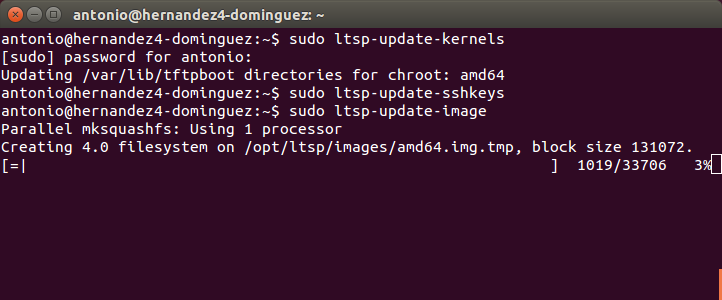

***
#Clientes ligeros con LTSP (En Linux)
##1. Introducción
En esta tarea hemos visto una herramienta bastante útil para cuando, por las circunstancias que sean, se disponen de varios equipos que carecen de unidades de almacenamiento y de unidades ópticas, que nos posibiliten el arranque por medio de  los mismos de algún sistema operativo. O también porque dichas máquinas no tienen suficientes prestaciones a nivel de rendimiento, ya sea porque están anticuadas u obsoletas. 

Nos referimos a el LTSP (Linux Terminal Server Project), en linux, o lo que también se conoce de forma más genérica como "clientes ligeros". 

##2. Configuraciones previas

Antes de comenzar esta práctica, configuraremos 3 máquinas virtulas: 2 máquinas clientes y 1 servidora del LTSP. De manera que las máquinas clientes no tengan ni unidad de almacenamiento ni unidad para discos, puesto que iniciarán vía red (PXE).  A su vez, la máquina que servirá el sistema operativo a los clientes tendrá 2 tarjetas de red de manera que una se configurará para que de salida hacia internet y otra para el servicio propio del LTSP.

En el cliente seleccionamos que inicie por red:

Quitamos unidades de almacenamiento:

Ponemos el adaptador en red interna (Hemos cambiado el tipo de adaptador puesto que el que venía por defecto nos ha dado problemas de conexión):

##3. Instalación del sistema operativo (Ubuntu 64 bits)

En este apartado realizaremos la instalación del sistema operativo, así como la configuración de las tarjetas de red y el nombre de equipo, dominio, usuario...También crearemos 3 usuarios, uno para cada cliente ligero, dentro del sistema.

Creamos los usuarios:

Cambiamos los nombres de equipo, dominio, y revisamos configuración de red, y de la unidad óptica:

	
##4. Instalar servicio LTSP
En este punto instalaremos y configuraremos los ficheros necesarios para que nuestro servidor de LTSP funcione correctamente.

Instalamos el software servidor de LTSP:

Descargamos e instalamos el servicio SSH para poder hacer uso del control remoto de la máquina:

Ahora, modificaremos 3 ficheros de configuración cuyos parámetros son esenciales para el buen funcionamiento de nuestro servidor LTSP.

###4.1. Fichero "ISC-DHCP-SERVER"

El primer fichero será el "isc-dhcp-server", alojado en la ruta "/etc/default/isc-dhcp-server". En este archivo se encuentran los datos de configuración necesarios para asignar direcciones IPs de forma dinámica a los clientes que así lo soliciten. En este caso no será exactamente este fichero el cual proporcione dichos parámetros, ya que modificaremos la ruta que tiene por defecto del fichero de configuración DHCP y pondremos el de nuestro servidor LTSP. De esta manera, será la configuración de DHCPD proporcionada por el servicio de LTSP la que establezca las configuraciones del servicio. De manera que pondremos la ruta a ese fichero: "/etc/ltsp/dhcpd.conf". Éste último también lo revisaremos y modificaremos más adelante.

Luego, si nos fijamos en la última línea vemos que no tiene una interfaz definidad por la cual se le de salida al servicio DHCP (servicio que se le dará a las máquinas clientes). Ponemos la interfaz que ya habíamos configurado en red interna y guardamos el archivo:

###4.2. Fichero "TFTPD-HPA"

Ahora, modificamos el fichero "tftpd-hpa", ubicado en la ruta "/etc/default/tftpd-hpa". Dicho fichero contiene los parámetros de los cuales se sirve el servicio tftp para proporcionar la imagen de sistema a los clientes ligeros. Modificaremos la dirección de TFTP y pondremos la de la tarjeta de red que dará salida al servicio (192.168.0.1), y que hará uso, dicho servicio, del puerto 69:

###4.3. Fichero "DHCPD.CONF"

Para terminar, tocaremos el archivo de configuración "dhcpd.conf", situado en la ruta "/etc/ltsp/dhcpd.conf". En este fichero sí se hayan los parámetros de DHCP que se usarán para la asignación de IPs a los clientes. A su vez, contiene la ruta de la imagen del sistema que les va a proporcionar por lo que tendremos que asegurarnos de que corresponde con la ubicación de la imagen que vamos a generar. Por defecto, viene establecida dicha ruta para imagenes de sistema con arquitectura de 32 bits por lo que modificando donde ponga "i386" por "amd64", resolvemos este inconveniente; puesto que la imagen que vamos a generar es de 64 bits (aunque también podríamos crearla de 32 bits):

##5. Creación de la imagen LTSP
Ahora, una vez que hemos modificado todos los ficheros de configuración necesarios, creamos la imagen del sistema que cargarán los clientes ligeros en sus equipos vía TFTP. Para ello, lanzamos el comando "ltsp-build-client" (seguido de "--arch i386", si queremos que la imagen sea de 32 bits):

En caso de que ya hayamos generado una imagen, con los siguientes comando podemos actualizar en vez de tener que volver a crearla:

<ol>
<li>ltsp-update-kernel</li>
<li>ltsp-update-sshkeys</li>
<li>ltsp-update-image</li>
</ol>

Una vez que termine, nos centraremos en verificar que los servicios que necesitamos funcionan correctamente. Para ello usamos el comando "ps -ef |grep "y el servicio":

En caso de que no esté iniciado el servicio tftp, lanzamos el siguiente comando "/usr/sbin/in.tftpd --listen --user tftp --address 192.168.0.1:69 --secure /var/lib/tftpboot":

##5. Arranque de los clientes ligeros

Comprobamos antes de iniciar el cliente ligero que los servicios de DHCP, TFTP y NBD funcionan correctamente:

Una vez hecho, iniciamos la máquina cliente y vemos si conecta y si obtiene la imagen de LTSP.

Para terminar esta práctica, se ha llevado a cabo la grabación de un vídeo en el que se muestre el correcto funcionamiento de los clientes ligeros al arrancar tomando el servicio de LTSP que le proporciona la máquina servidora:

