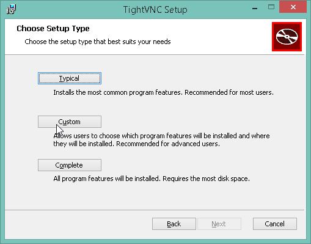
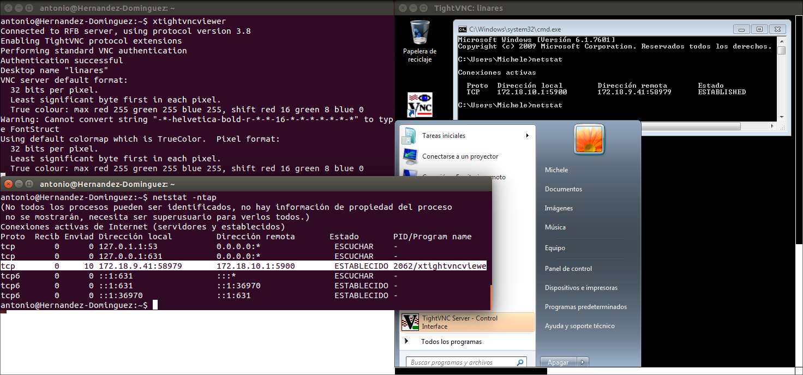
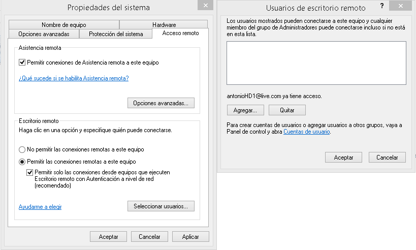
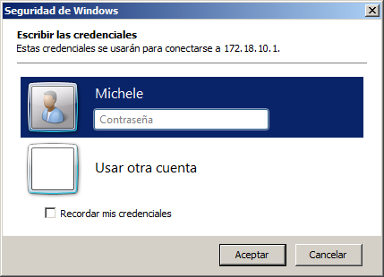
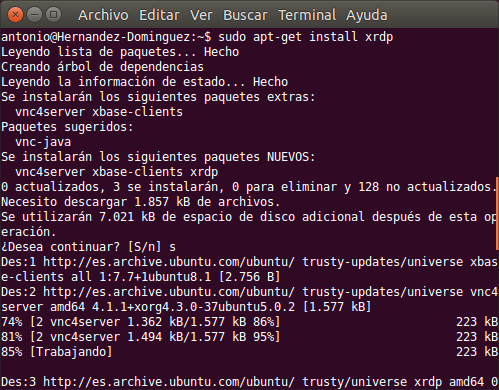
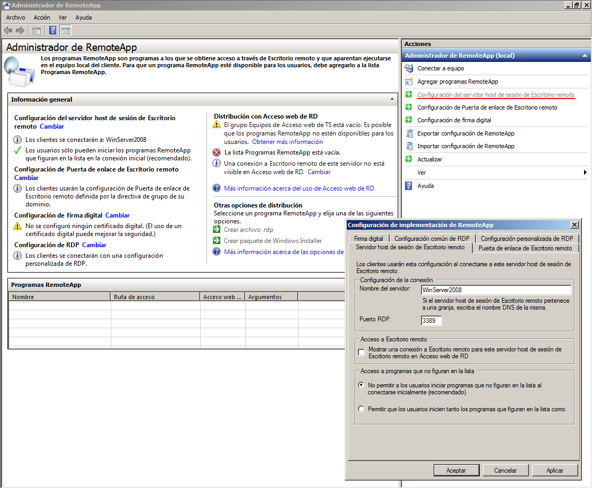
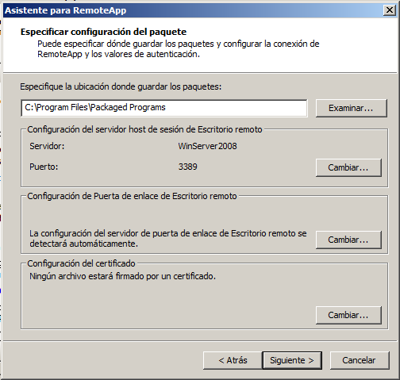
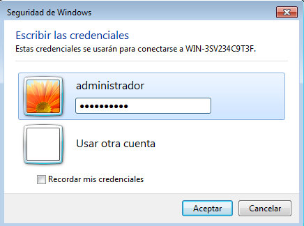

#A4.- ESCRITORIO REMOTO
###Participantes del grupo:
* Antonio Hernández Domínguez
* Michele Ignacio Linares D'onofrio
* Miriam Rodríguez Méndez

***

#1. Introducción

En esta actividad hemos utilizado varias herramientas de escritorio remoto con las que poder controlar los equipos de forma remota, instalando estos servicios en las máquinas a controlar (máquinas servidoras) y proporcionando las configuraciones necesarias para poder acceder desde los clientes (controladores) de los mismos. Resulta interesante el funcionamiento de este tipo de software si pensamos en una gran topología de red en la que convergen decenas de equipos y para la cual sólo se dispone de un único técnico (pobre de él) encargado de todos ellos... se ahorraría el engorro de realizar tareas a nivel local teniendo que desplazarse "físicamente" hasta cada equipo, de manera que el escritorio remoto le permitiría tener a sus disposición todas esas máquinas, para ser controladas y gestionadas de forma más rápida y eficiente.

#2. Conexión escritorio remoto (VNC)
En éste punto haremos uso del software de escritorio remoto "VNC" (Virtual Network Computing). Lo característico de este programa es que no impone restricciones
en el sistema operativo del ordenador servidor con respecto al del cliente; por lo que es posible compartir la pantalla de una máquina con cualquier sistema operativo 
que soporte VNC conectándose desde otro ordenador o dispositivo que disponga de un cliente VNC.

##2.1. Windows a Windows
En primer lugar, probaremos a realizar la instalación y configuraciónen un máquinas windows, y accederemos desde otra con el mismo sistema operativo. Para ello, utilizaremos
el programa "TightVNC", que descargaremos desde su página oficial: [url página oficial](http://www.tightvnc.com/download.php).
###2.1.1. Configuración servidor de escritorio remoto
Una vez descargado el fichero .msi, lo iniciamos y empezamos la instalación. Seleccionaremos la opción "custom":



Con dicha selección aprovecharemos que nos da la opción de instalar tanto el software para cliente como para servidor para implementar ambos, ya que en los posteriores apartados se utilizará el sistema windows como servidor (y veremos como se configura) y no como cliente.


###2.1.2. Conexión desde cliente Windows
Ahora, una vez instalado también en el cliente el software para escritorio remoto de "tightVNC" y establecida la configuración de red correcta (id de red.- 172.18.9.0), ponemos 
la dirección de la máquina servidora, la máquina a la que conectarnos, y hacemos click sobre "connect":

 

Lanzamos el comando ```netstat``` (network statistics) para ver las conexiones activas y ver el servicio en funcionamiento:


***

##2.2. Windows a Linux

En este apartado realizaremos la misma configuración que en el paso anterior pero en un sistema GNU/Linux.
###2.2.1. Configuración servidor de escritorio remoto
Descargamos del repositorio el paquete "tightvncserver" con el comando ```apt-get install tightvncserver```:


Luego, con el comando ```tightvncserver :1 -geometry 800x600 -depth 24```, establecemos varios parámetros del acceso/escritorio remoto; de entre ellos, una contraseña que nos proporcione una medida de seguridad para los accesos remotos que se den hacia la misma:


###2.2.2. Conexión desde cliente Windows
Después de la instalación en el servidor lo dejamos iniciado y nos situamos en la máquina que tendrá el acceso remoto a la máquina servidora; de manera que instalamos nuevamente el programa "TightVNC", y ponemos la IP, y la contraseña que habíamos establecido en el punto anterior:


Comprobamos nuevamente que el servicio está iniciado que se muestra correctamente el escritorio remoto de la máquina Linux:


***

##2.3. Linux a Windows

Ya hemos visto el funcionamiento del servicio VNC empleando como clientes equipos con sistema operativo Windows; por lo que en los siguientes 2 apartados se mostrará el mismo servicio pero utilizando, en esta ocasión, clientes con sistemas operativos GNU/Linux.

###2.3.1. Configuración servidor de escritorio remoto

Hemos empleado la máquina que ya habíamos utilizado para el cliente windows de VNC, de manera que la instalación es la misma que en aquélla; el msi de "TightVNC" nos instala el software de servidor:


Seguimos, y nos pedirá establecer una contraseña para el acceso remoto y otra contraseña para la administración del servicio de VNC:


###2.3.2. Conexión desde cliente Linux

Una vez instalado el VNC en el servidor, y con la máquina iniciada, nos situamos en el equipo Linux para:

* Primero, instalar con ```apt-get install xtightvncviewer``` (que no "tightvncserver"), el paquete para poder acceder por escritorio remoto a la máquina servidora.

* Y segundo, iniciar el mismo con el comando ```xtightvncserver```:



***

##2.4. Linux a Linux

Para acabar, y terminar con la ejemplificación de las 4 opciones posibles que se dan entre un sistema Windows y uno GNU/Linux, vamos a ver cómo conectarnos vía acceso remoto desde un cliente Linux a una máquina servidora de VNC también Linux.

###2.4.1. Configuración servidor de escritorio remoto

Como ya vimos en puntos anteriores, realizamos la instalación del paquete servidor de VNC con ```apt-get install tightvncserver```:


Y con ```tightvncserver :1 -geometry 800x600 -depth 24``` le decimos el puerto que va ocupar el servicio ":1" y le damos una contraseña a dicho acceso:


###2.4.2. Conexión desde cliente Linux

Por último, y desde la máquina cliente Linux que ya teníamos, volvemos a lanzar el comando ```xtightvncserver``` para luego introducir la contraseña que habíamos establecido en el punto anterior y conectarnos por acceso remoto:


***

#3. Conexión escritorio remoto (RDP)

En este apartado haremos uso de la herramienta de acceso remoto RDP ("Remote Desktop Protocol") específica para sistemas operativos windows (ya que es un protocolo propietario desarrollado por Microsoft) a pesar de poder hacer uso de otras como ya hemos visto; para tener acceso remoto a otras máquinas, de entre ellas, una con sistema operativo GNU/Linux.

##3.1. Windows Server a Windows 7

En windows, como ya hemos comentado, viene por defecto el software de "Conexión a Escritorio remoto", de manera que sólo tendremos que configurarlo en el equipo al que queramos acceder vía escritorio remoto y conectarnos haciéndo uso de dicha herramienta.

###3.1.1. Configuración servidor de escritorio remoto

Nos situamos en "Propiedades del sistema" y en la pestaña "Acceso remoto", seleccionamos la casilla que está debajo de la leyenda "Escritorio Remoto" --> "Permitir las conexiones remotas a este equipo". A su vez, nos da la posibilidad de establecer la condición de que sólo se permitan las conexiones desde equipos con autenticacion a nivel de red, o seleccionar los usuarios que pueden tener acceso remoto al equipo:



###3.1.2. Conexión desde cliente Windows

Con la máquina a la que nos queremos conectar iniciada, y desde el cliente, ejecutamos el programa de conexión a escritorio remoto e introducimos la IP de la máquina en cuestión:


Nos pedriá un usuario del sistema válido por lo que es aconsejable crear uno específico para dicho acceso:



Nos aparece la siguiente ventana porque no reconoce el equipo que está accediendo, no se ha generado un certificado para ese equipo. Le damos a que se conecte de todos modos y seguimos: 


Por último nos aparecerá ya la ventana del escritorio remoto:


##3.2. Windows 7 a Linux

En este caso haremos uso nuevamente del cliente windows ("Conexión a Escritorio Remoto") pero para conectarnos en esta ocasión a un equipo GNU/Linux. Para poder realizar la conexión remota entre ambas máquina necesitaremos instalar un paquete o software en la maquina servidora Linux que sea compatible con el protocolo RDP de Windows.

###3.2.1. Configuración servidor de escritorio remoto

Hemos instalado el paquete "xrdp" en la máquina Linux para que nos proporcione el servicio RDP, con el comando ```sudo apt-get install xrdp```:



No hemos tenido que realizar ningún tipo de configuración por lo que pasamos directamente a ver la conexión desde el cliente.

###3.2.2. Conexión desde cliente Windows

Como en la conexión que realizamos el en punto anterior, de Windows a Windows, utilizando el mismo software para el acceso remoto, aunque en este caso nos estemos conectándo a una máquina Linux.

Introducimos la IP del equipo al que queramos acceder mediante escritorio remoto:


Como en el caso anterior nos vuelve a salir la misma advertencia de certificado:


A partir de aquí vemos que cambia el estilo de la ventana de login con respecto al apartado anterior, debido a que estamos haciendo uso del paquete "xrdp". En la opción de módulo ponemos ```Module ="sesman-Xvnc"```,  luego introducimos un usuario y contraseña válido del sistema, y  hacemos click en "ok":


Nos aparecerá a continuación una ventana con los datos de la conexión:


Una vez que termina el proceso de conexión nos aparecerá la ventana con el escritorio remoto de la máquina linux. Para acabar, comprobamos con el comando "netstat" que efectivamente servicio que posibilita la conexión está en funcionamiento:


##3.3. Linux a Windows 7

Debido a que el protocolo RDP es específico para Windows se deben buscar paquetes que sean compatibles con éste para así poder acceder desde una máquina GNU/Linux. En este apartado veremos como realizar ésta tarea y la configuración que requiere el paquete que hemos elegido llamado "remmina".

###3.3.1. Configuración servidor de escritorio remoto

Como cuando realizamos la conexión de windows a windows, nos situamos en "Propiedades del sistema" y en la pestaña "Acceso remoto", seleccionamos la casilla que está debajo de la leyenda "Escritorio Remoto" --> "Permitir las conexiones remotas a este equipo":


###3.3.2. Conexión desde cliente Linux

En lo que se refiere a la conexión de escritorio remoto de un Linux hacia un Windows, necesitamos descargar algún software que sea compatible con el protocolo RDP de Windows, de manera que nos permita realizar la conexión remota. Hemos optado por el paquete "Remmina". En este caso, la distribución Ubuntu 14.04 lo trae instalado por defecto. Arrancamos el programa desde la terminal con el comando ```remmina``` y se nos abrirá la interfaz de dicho programa:


Hacemos click sobre la opción de "Crear un archivo de escritorio remoto" y nos aparecerá lo siguiente:


Donde pone "Servidor" introducimos la dirección IP de la máquina a la que queremos conectarnos vía remoto, en el "Nombre de usuario" escribimos uno válido del equipo servidor, y por último nos aseguramos de que el "Protocolo" sea RDP (ya que nos queremos conectar a una máquina windows).

Hacemos click en "conectar" y nos dará un certificado que deberemos aceptar para poder concluir la conexión remota:


Podemos ver como la conexión se ha realizado con éxito, ejecutando el comando "netstat".


#4. Conexión escritorio remoto (Terminal Server)

Con Terminal Server es posible establecer hasta dos conexiones remotas simultáneas e independientes, además de la propia sesión de la consola del servidor "Windows 2003 Server".

##4.1. Habilitar Escritorio Remoto

En este apartado procederemos a habilitar el Escritorio Remoto en "Windows 2003 Server", de modo que permitamos el acceso remoto al equipo "172.18.8.140", que es la IP del servidor, desde otros equipos de la red.

Añadimos dicha característica en roles, agregamos "Servidor de Terminales". Terminal Service puede tener un nombre diferente "Host de Sesión de Escritorio Remoto".

Si deseamos permitir el acceso mediante la conexión a Escritorio Remoto a otros usuarios que no sean el propio usuario "Administrador" en la pestaña "Acceso Remoto" pulsaremos sobre el botón "Seleccionar usuarios remotos...", pasando a ser mostradala siguiente ventana en la que indicaremos los usuarios a los que deseamos dar acceso. Antes de esto debemos crear dichos usuarios:


Los agregamos al acceso remoto:


Comprobamos que efectivamente están agregados:


***

##4.2. Ejecución del cliente de Escritorio Remoto

En primer lugar accederemos al equipo cliente desde el cual vamos a establecer la conexión, un equipo cliente con sistema operativo "Windows 7" en este caso, y desde el mismo lanzaremos el cliente de Conexión a Escritorio Remoto.

Al ejecutar el cliente de conexión a Escritorio remoto se mostrará la siguiente ventana, en la cual especificaremos la dirección IP o el nombre del equipo al cual nos queremos conectar de modo remoto:


He utilizado al usuario "Antonio" para establecer esta conexión al escritorio remoto. Ejecutando el comando "netstat" aparecen las conexiones:
 


Por último, conectamos desde un cliente Linux, en nuestro caso Debian 7, utilizando el usuario "michele":


Nos aparece el certificado:


Comprobamos que ambas máquinas pueden estar conectadas simultáneamente al mismo servidor:


***

#5. Aplicaciones remotas mediante RemoteApp

RemoteApp nos permitirá ejecutar aplicaciones que estén instaladas en nuestro servidor
como si lo estuvieran en nuestros equipos de escritorio, es decir, nos permite ejecutar
aplicaciones de forma remota.

##5.1. Instalación en Windows Server

Pasos para la instalación:

- En administración del servidor, nos vamos a características y agregamos una nueva caractirística.
Vamos a añadir la herramienta del host de sesión de escritorio en la ruta como se muestra en la imagen.


- Seguimos con el proceso de instalción por defecto.


- Finalizada la instalción accedemos a la consola de configuración de RemoteApp mediante la siguiente ruta:
*Inicio > Herramientas Administrativas > Servicios de Escritorio remoto > Administrador de RemoteApp.*

- En el Administrador de RemoteApp, vamos a configurar como se va conectar al equipo. Accederemos a estas configuraciones en el enlace *Configuración del servidor host de sesión de Escritorio remoto*:



- Ahora vamos a añadir una aplicación al RemoteApp para que pueda ser ejecutada de manera remota. Para ello en la consola de Administrador de RemoteApp, pulsamos sobre el enlace *Agregar programas RemoteApp*.

- Nos mostrara una ventana con una lista de aplicaciones, nosotros elgimos WordPad

 

- Como método para que el usuario ejecute esta aplicación remota, usaremos un archivo de conexión remota .rdp.


Al pulsar sobre el enlace nos aparece un nuevo asistente desde el cual podemos
cambiar las configuraciones anteriores y seleccionar el directorio donde creara el
archivo .rdp. 



***

##5.2. Comprobación en el cliente Windows 7

Los pasos para ejecutar la aplicación:

- Hacemos doble click sobre el archivo .rdp que ha generado el RemoteApp, que nos pedira un usuario y contraseña.

 

- Esperamos a que establezca conexión, y vemos que se ejecuta correctamente el programa Wordpad del servidor en nuestro cliente.


