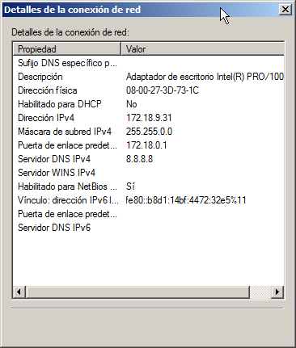
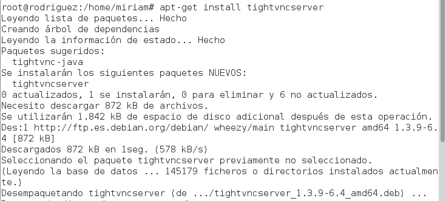
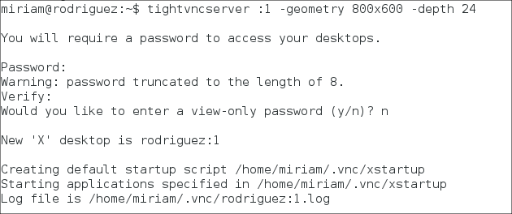
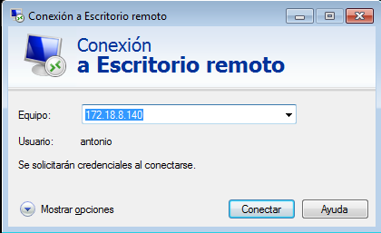
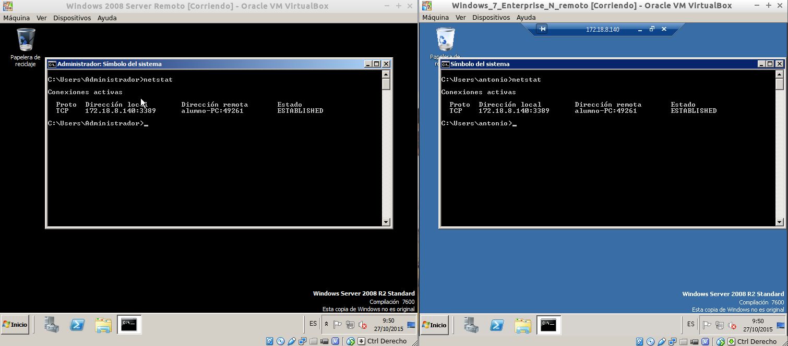
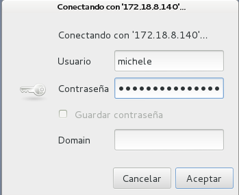

#A4.- ESCRITORIO REMOTO
###Participantes del grupo:
* Antonio Hernández Domínguez
* Michele Ignacio Linares D'onofrio
* Miriam Rodríguez Méndez

***

#1. Introducción

<p align=justify>
	En esta actividad hemos utilizado varias herramientas de escritorio remoto con las que poder controlar los equipos de forma remota, 
	instalando estos servicios en las máquinas a controlar (máquinas servidoras) y proporcionando las configuraciones necesarias para poder 
	acceder desde los clientes (controladores) de los mismos. Resulta interesante el funcionamiento de este tipo de software si pensamos en 
	una gran topología de red en la que converjan miles de equipos y sólo se disponga de un único técnico encargado de todos ellos, se ahorraría 
	el engorro de realizar tareas de forma local en cada una de esas máquinas por lo que el escritorio remoto le permite tener a sus disposición 
	todas las máquinas, que tengan instalado previamente dicho software, para ser controladas y gestionadas de forma más eficiente.
</p>
***

#2. Conexión escritorio remoto (VNC)
En éste punto haremos uso del software de escritorio remoto "VNC" (Virtual Network Computing). Lo característico de este programa es que no impone restricciones
en el sistema operativo del ordenador servidor con respecto al del cliente; por lo que es posible compartir la pantalla de una máquina con cualquier sistema operativo 
que soporte VNC conectándose desde otro ordenador o dispositivo que disponga de un cliente VNC.
***
##1. Windows a Windows
En primer lugar, probaremos a realizar la instalación y configuraciónen un máquinas windows, y accederemos desde otra con el mismo sistema operativo. Para ello, utilizaremos
el programa "TightVNC", que descargaremos desde su página oficial: [url página oficial](http://www.tightvnc.com/download.php).
###2.1.1. Configuración servidor de escritorio remoto
Una vez descargado el fichero .msi, lo iniciamos y empezamos la instalación:


Aprovecharemos que nos da la opción de instalar tanto el software para cliente como para servidor.

###2.1.2. Conexión desde cliente Windows
Ahora, una vez instalado también en el cliente el software para escritorio remoto de "tightVNC" y establecida la configuración de red correcta (id de red.- 172.18.9.0), ponemos 
la dirección de la máquina servidora, la máquina a la que conectarnos y hacemos click sobre "connect":

 

Lanzamos el comando ```netstat``` (network statistics) para ver las conexiones activas y ver el servicio en funcionamiento:


***

##2.2. Windows a Linux

En este apartado realizaremos la misma configuración que en el paso anterior pero en un sistema GNU/Linux.
###2.2.1. Configuración servidor de escritorio remoto
Descargamos del repositorio el paquete "tightvncserver" con el comando ```apt-get install tightvncserver```:



Luego, con el comando ```tightvncserver :1 -geometry 800x600 -depth 24```, establecemos los parámetros del escritorio remoto:


###2.2.2. Conexión desde cliente Windows


***

##2.3. Linux a Windows
###2.3.1. Configuración servidor de escritorio remoto


###2.3.2. Conexión desde cliente Linux

***

##2.4. Linux a Linux
###2.4.1. Configuración servidor de escritorio remoto


###2.4.2. Conexión desde cliente Linux

***

#3. Conexión escritorio remoto (RDP)

***
##3.1. Windows Server a Windows 7 
###3.1.1. Configuración servidor de escritorio remoto
###3.1.2. Conexión desde cliente Windows
***

##3.2. Windows 7 a Linux
###3.2.1. Configuración servidor de escritorio remoto
###3.2.2. Conexión desde cliente Windows
***

##3.3. Linux a Windows 7
###3.3.1. Configuración servidor de escritorio remoto
###3.3.2. Conexión desde cliente Linux
***

#4. Conexión escritorio remoto (Terminal Server)

Con Escritorio remoto es posible establecer hasta dos conexiones remotas simultáneas e independientes, además de la propia sesión de la consola del servidor "Windows 2003 Server".
***

##4.1. Habilitar Escritorio Remoto

En este apartado procederemos a habilitar el Escritorio Remoto en "Windows 2003 Server", de modo que permitamos el acceso remoto al equipo "172.18.8.140", que es la IP del servidor, desde otros equipos de la red.

Añadimos dicha característica en roles, agregamos "Servidor de Terminales". Terminal Service puede tener un nombre diferente "Host de Sesión de Escritorio Remoto".

Si deseamos permitir el acceso mediante la conexión a Escritorio Remoto a otros usuarios que no sean el propio usuario "Administrador" en la pestaña "Acceso Remoto" pulsaremos sobre el botón "Seleccionar usuarios remotos...", pasando a ser mostradala siguiente ventana en la que indicaremos los usuarios a los que deseamos dar acceso. Antes de esto debemos crear dichos usuarios:


Los agregamos al acceso remoto:


Comprobamos que efectivamente están agregados:

***

##4.2. Ejecución del cliente de Escritorio Remoto

En primer lugar accederemos al equipo cliente desde el cual vamos a establecer la conexión, un equipo cliente con sistema operativo "Windows 7" en este caso, y desde el mismo lanzaremos el cliente de Conexión a Escritorio Remoto.

Al ejecutar el cliente de conexión a Escritorio remoto se mostrará la siguiente ventana, en la cual especificaremos la dirección IP o el nombre del equipo al cual nos queremos conectar de modo remoto:



He utilizado al usuario "Antonio" para establecer esta conexión al escritorio remoto. EJecutando el comando "netstat" aparecen las conexiones:
 


Por último, conectamos desde un cliente Linux, en nuestro caso Debian 7, utilizando el usuario "michele":



Nos aparece el certificado:


Comprobamos que ambas máquinas pueden estar conectadas simultáneamente al mismo servidor:


