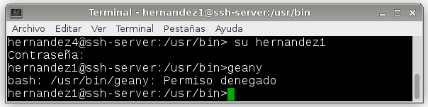

#A6.- ESCRITORIO REMOTO CON SSH

***
* Autor: Antonio Hernández Domínguez
* Curso: 2º ASIR 2015/2016
* Asignatura: Administración de Sistemas Operativos
* Unidad: Unidad 1 - "Acceso Remoto"
***

#1. Introducción

Para ésta práctica, y siguiendo conn la temática marcada por esta unidad, el "acceso remoto"; hemos empleado en essta ocasión una nueva herramienta que nos ayudará a lograr dicho fin, siendo una opción relativamente más completa y segura que otras que podas llegar a emplear (véase "Telnet"). Por ello, nos conectaremos vía SSH ("Secure SHell", en español "intérprete de órdenes seguro") a otra máquina, y veremos cómo podemos hacer uso de aplicaciones empleando dicho protocolo, y cómo podemos limitar o establecer parámetros de seguridad para los usuarios que usemos en las comunicaciones de SSH.

#2. 

##2.1. 

***

***

***