#A6.- ESCRITORIO REMOTO CON SSH

***

* Autor: Antonio Hernández Domínguez
* Curso: 2º ASIR 2015/2016
* Asignatura: Administración de Sistemas Operativos
* Unidad: 1.- "Acceso Remoto"

***

#1. Introducción

Para ésta práctica, y siguiendo conn la temática marcada por esta unidad (el "acceso remoto"), hemos empleado en esta ocasión una nueva herramienta que nos ayudará a establecer una conexión remota "segura"; siendo así una opción relativamente más completa con respecto a otras que podamos llegar a emplear (véase "Telnet"). Por ello, nos conectaremos vía SSH ("Secure SHell", en español "intérprete de órdenes seguro") a otra máquina, y veremos cómo podemos hacer uso de aplicaciones empleando dicho protocolo, y cómo podemos limitar o establecer parámetros de seguridad para los usuarios que usemos en las comunicaciones de SSH.

Para la práctica emplearemos una máquina servidor con sistema operativo GNU/Linux, distribución OpenSUSE, una máquina cliente con sistema operativo Windows 7 y otra máquina cliente también con OpenSUSE como sistema.

#2. Configuraciones de Red

En este punto realizaremos las configuraciones de red pertinentes, de manera que configuraremos nuestras máquinas con los siguientes párametros:

-Máquina servidor (OpenSUSE)

* Dirección IPv4: "172.18.9.53/16"
* Puerta de enlace: "172.18.0.1"
* Nombre de host: "ssh-server"

-Máquina cliente I (OpenSUSE)

* Dirección IPv4: "172.18.9.54/16"
* Puerta de enlace: "172.18.0.1"
* Nombre de host: "ssh-client"

-Máquina cliente II (Windows 7)

* Dirección IPv4: "172.18.9.13/16"
* Puerta de enlace: "172.18.0.1"
* Nombre de host: "ssh-client2-09"

##2.1. Máquina Servidora (OpenSUSE)

Para realizar la configuración de red de nuestra máquina servidor "OpenSUSE" emplearemos la aplicación que ya viene por defecto con el sistema llamada "YaST", la cual contiene todo lo que cabría configurar dentro de nuestro sistema:


Seleccionamos "Ajustes de red" y se nos abrirá una nueva ventana con varias opciones o pestañas de configuración:

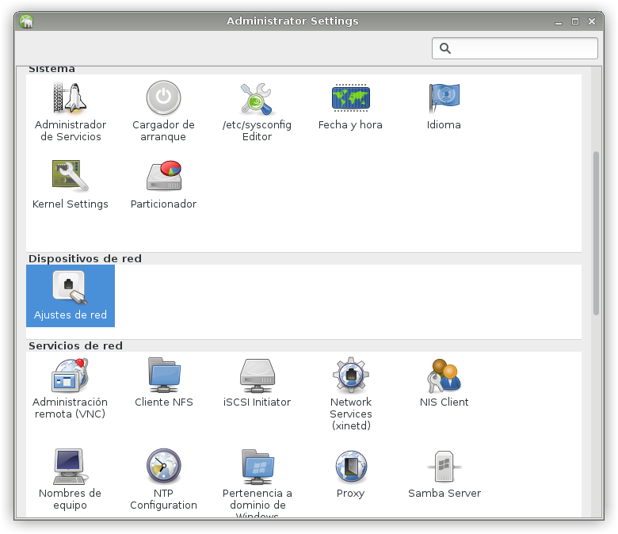

Vemos nuestra tarjeta así como algunos datos. La seleccionamos y luego hacemos click en "Editar":


Nos aparecerán 3 pestañas donde en la de "Dirección" introduciremos una dirección IPv4 estática así como un nombre de host (ssh-server):


Volviendo a la ventana anterior, nos situamos en la pestaña "Nombre de Host/DNS" y volvemos a introducir un nombre de host, un nombre de dominio (2º apellido), y una dirección IP pública de un servidor DNS que nos resuelva los nombres de IP que usemos a la hora de navegar:


Por último, en la pestaña "Encaminamiento" introduciremos la direción de la interfaz a la que se conecta nuestro servidor para realiar el encaminamiento del tráfico de información de la red y para qué dispositivo (tarjeta de red) en este caso la única que tenemos:


Lanzamos el comando ```ip a``` para ver la configuración de red final que hemos establecido. El comando ```route -n``` nos permite ver qué puertas de enlace están asociadas a qué interfaces. Y el comando ```host www.google.es``` nos permite verificar que el servidor DNS que hemos establecido resuelve correctamente el nombre "www.google.es", y nos da la ip a la que está asociado:


Dado que queremos poder establecer comunicaciones entre las 3 máquinas, y que haremos uso de los nombres que les demos a las mismas (y no sus direcciones IP), vamos a introducir los nombres de éstas junto con sus direcciones IP en el fichero ```/etc/hosts``` para que así formen parte del segmento de "búsqueda directa" de nuestro servidor DNS local. Haremos ésto para las 3 máquinas:

* 172.18.9.53 ssh-server
* 172.18.9.54 ssh-client1
* 172.18.9.13 ssh-client2-09


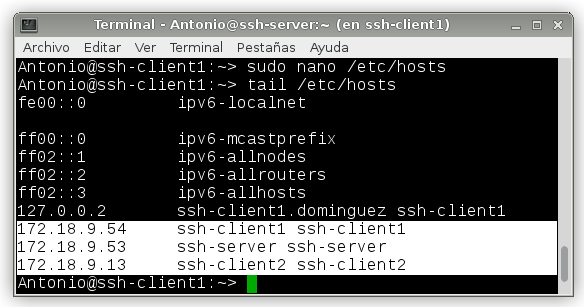


##2.2. Máquina cliente I (OpenSUSE)

Realizamos los mismos pasos que en el punto anterior para nuestro cliente, recordemos OpenSUSE también, de manera que la configuración de red se la que hemos establecido en un principio:


Dado que en OpenSUSE no viene el editor nano instalado por defecto, realizamos su instalación lanzando el comando ```sudo zypper install nano```:


Ahora volvemos a editar el fichero ```/etc/hosts``` para agregar los nombres de las máquinas:


Hacemos ```ping``` "y el nombre de cada máquina" para comprobar la comunicación entre ellas:

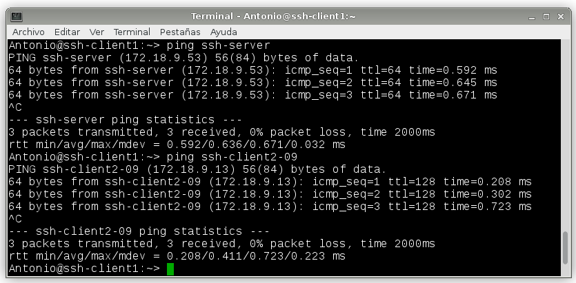


##2.3. Máquina cliente II (Windows 7)

Acabamos las configuraciones de red con la máquina cliente windows 7, donde editamos también el fichero ```C:\Windows\System32\Drivers\etc\hosts``` para agregar los nombres de nuestras máquinas asociados a sus direcciones IP:

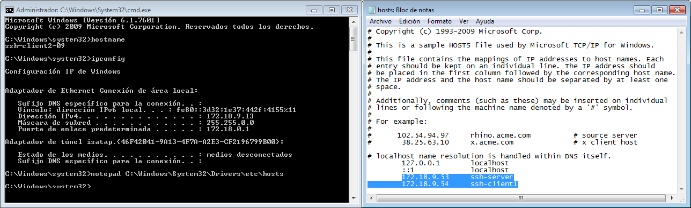

Comprobamos nuevamente las comunicaciones con el comando ```ping```:

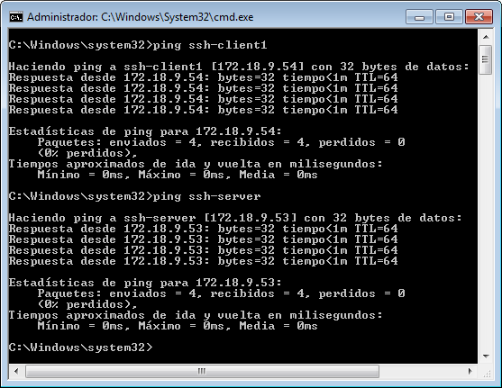

#3. Puesta en Marcha Servicio SSH

Volviendo a la máquina servidor, vamos a empezar la puesta en marcha de nuestro servicio de acceso remoto SSH. Para ello, comprobamos en primer lugar si tenemos el paquete ```OpenSSH``` instalado en nuestro servidor con el comando ```zypper search openssh```:

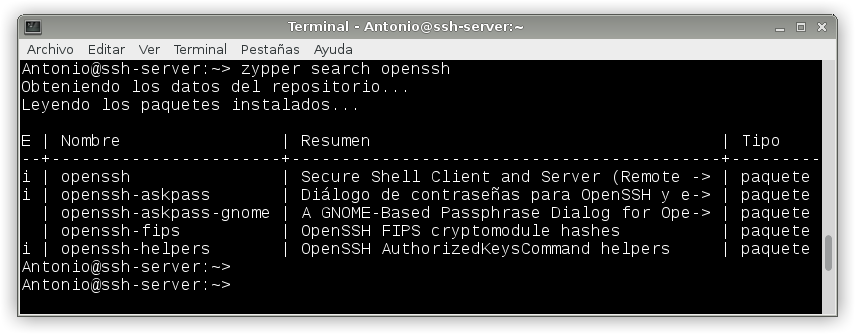

Vemos que sí, por lo que podemos empezar a configurarlo para luego hacer uso de él. Para que dicho protocolo pueda funcionar, también necesitaremos permitir su acceso desde la red en el cortafuegos de OpenSUSE, el cual viene por defecto.

Volviendo a nuestra preciada y todopoderosa aplicación "YaST", buscamos en el grupo de "Seguridad y usuarios" el icono "Cortafuegos":

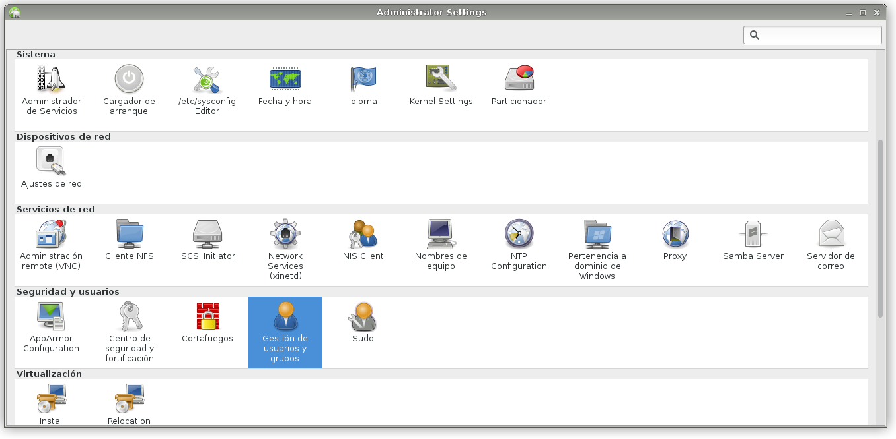

Una vez dentro del cortafuegos vamos a "Servicios autorizados" y dando en "añadir" agregamos a la lista de servicios permitidos el SSH:

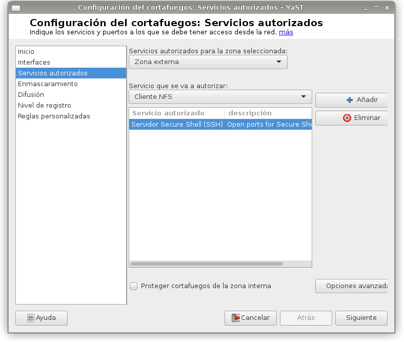

Aprovecharemos para crear 4 usuarios que nos servirán para comprobar las conexiones que hagamos desde los clientes vía SSH. Serán 4 debido a que utilizaremos a cada uno para un fin en concreto, de manera que le afecten unos u otros párametros de configuración:


Ahora, vamos a abrir una consola para ver si el servicio SSH está en funcionamiento, de manera que introducimos el comando ```systemctl status sshd```. En caso de que estuviese "inactive (dead)", como en el caso de la captura, lanzamos el comando ```sudo systemctl start sshd```. Volvemos a lanzar el comando con el parámetro ```status``` y ahora sí podemos ver que aparecer en verde "Active: active (runnig)", la ruta del programa y la fecha desde la que está en ejecución. También podemos ver más abajo, el número asignado al proceso:

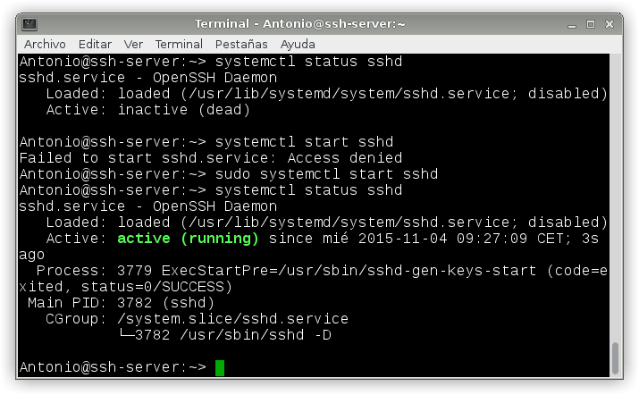

Ya una vez que tenemos el serivicio funcionando, vamos a editar el fichero ```/etc/ssh/sshd_config``` de manera que dicho servicio pueda hacer uso de claves públicas de tipo o de algoritmo "RSA" (Siglas de los criptógrafos que crearon este algoritmo), el cuál es uno de lo más extendidos dentro de los sistemas de clave pública:


Crearemos ahora el par de claves (pública y privada) para poder establecer las comunicaciones, dando la clave pública a los clientes y mantienedo de forma única y exclusiva la clave privada para la máquina servidor. Para ello, lanzamos el siguiente comando ```sudo ssh-keygen -t rsa -f /etc/ssh/ssh_host_rsa_key``` (la ruta especificada será la del fichero donde se almacenarán las claves). Podemos introducir un "passphrase" para las claves o dejar vacío y continuar. Vemos también que el algoritmo usará 2048 bits de información y que nos genera a su vez un código de seguridad MD5:

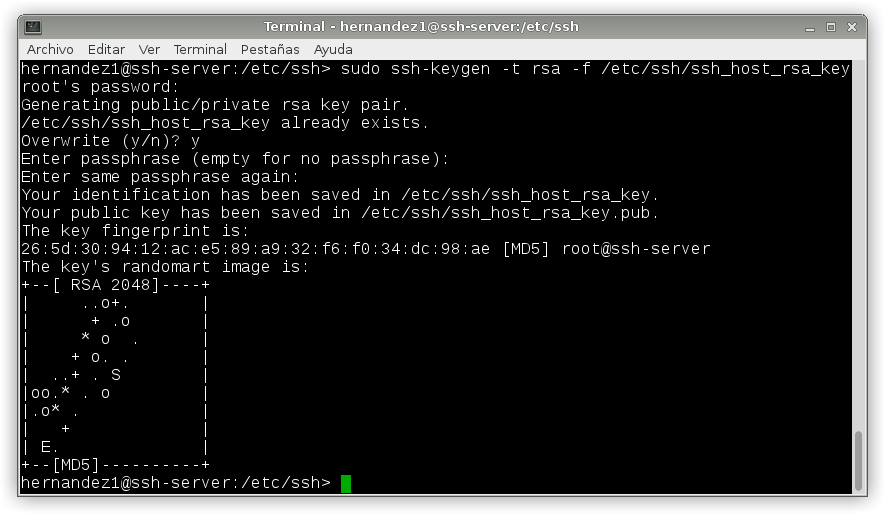

Comprobamos que en el directorio ```/etc/ssh``` nos aparecen las claves creadas. Aprovecharemos también para lanzar el comando ```sudo systemctl enable sshd``` para que arranque el servicio junto con el arranque del sistema, comprobaremos que es así fijándonos en que, al lanzar el comando ```systemctl status sshd```, en "Loaded" nos aparezca al final de la línea "enabled" y no "disabled":


Aquí finalizamos todas las configuraciones, creación de claves y creación de usuarios, que necesitaremos para ahora poder comprobar las conexiones SSH y ver distintos ejemplos de configuración que nos proporcionen distintos usos (aplicaciones remotas, restricción del acceso, personalización del prompt, etc...).

#4. Conexión y "regeneración" de claves
#4.1. Primera conexión (cliente OpenSUSE)

En este punto vamos a realizar la "PRIMERA CONEXIÓN" vía SSH desde el cliente al servidor, para ello lanzaremos el comando ```ssh hernandez1@ssh-server``` (ssh "nombreusuario"@"nombremáquinaservidor"). Si nos fijamos vemos que nos aparece un mensaje en inglés que nos dice que no se ha podido establecer la conexión, el comando sigue, nos genera un código MD5 y nos pregunta si estamos seguros de querer establecer la conexión, introducimos "yes" y nos agregará el host servidor junto con su clave pública a los host reconocidos por el sistema: 


Si ahora mostramos el contenido del fichero ```/.ssh/known_hosts``` de la máquina cliente, vemos que contiene la clave pública del servidor, así como su nombre de host y la ip:


##4.2. Regenerar la clave pública

Planteándonos la duda de ¿qué pasaría con el cliente si regeneramos en el servidor la clave pública? hemos elaborado el siguiente punto. Primero volvemos a crear la clave pública desde el servidor:


Luego, volvemos a la máquina cliente e intentamos conectarnos al servidor.
Vemos que nuestra duda queda resuelta ya que se produce el siguiente error:
 


Para poder volver a conectarnos debemos quitar la clave pública que se está empleado (la anterior) y volver a realziar la conexión para que el servidor le vuelva a proporcionar la nueva clave pública. Para borrar la clave lanzamos el comando ```ssh-keygen -f /home/Antonio/.ssh/known_hosts```. Luego, conectamos otra vez con ```ssh hernandez1@ssh-server``` y se mostrará en la consola lo mismo que en la primera conexión:


##4.3. Conexión desde cliente Windows 7

Para poder realizar conexiones SSH desde un cliente Windows descargaremos el programa "PuTTY":


Una vez que lo tengamos en funcionamiento, simplemente pondremos el nombre del servidor (recordemos que hemos agregado dicho nombre al fichero "hosts" del sistema) y el puerto del que va a hacer uso, en este caso el 22. Seleccionamos la opción de "conecction type: SSH" y hacemos click en "Open":

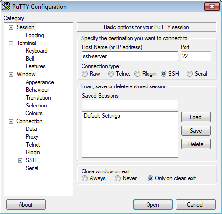

Nos aparecerá un mensaje como en el cliente OpenSUSE de que se va a establecer la conexión por primera vez, damos a que "sí":


Por último, se nos abrirá una consola donde pondremos el nombre de uno de los usuarios que habíamos creado y su contraseña; y ya tendremos una sesión de acceso remoto vía SSH iniciada:


#5. Personalización del Prompt Bash

En este punto vamos a ver como podemos personalizar nuestra consola de sesión de ssh.

Primero editaremos el fichero ```/.bashrc``` y añadiremos al final del mismo lo siguiente:

```
#Cambia el prompt al conectarse vía SSH

if [ -n "$SSH_CLIENT" ]; then
  PS1="AccesoRemoto_\e[32;40m\u@\h: \w\a\$"
else
  PS1="\[$(ppwd)\]\u@\h:\w>"
fi
```

Que cambiará el color de la consola cuando iniciemos la sesión.

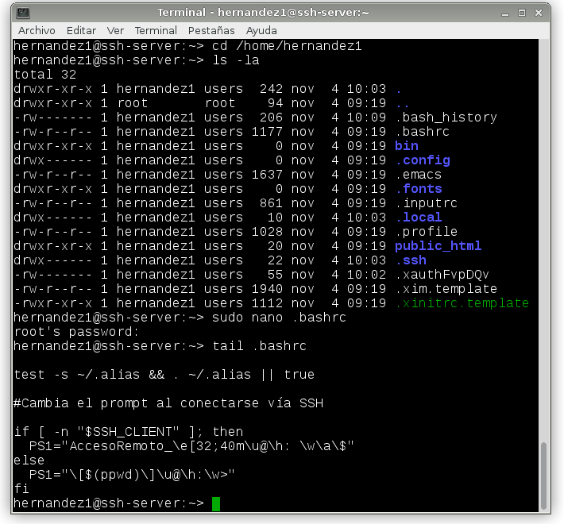

Y crearemos el fichero ```.alias```  para asociar comandos/aplicaciones a un alias. Éste el código:

```
alias c='clear'
alias g='geany'
alias p='ping'
alias v='vdir -cFl
alias s='ssh
```

Vemos por ejemplo que con la letra "g" podremos lanzar el editor Geany.


Desde el cliente iniciamos sesión con un usuario para comprobar que se pone de color verde la letra del prompt:


#6. Autenticación de claves públicas

Vamos a ver en este punto como podemos realizar la autenticación de la conexión SSH del cliente con el servidor, para un usuario en concreto, haciendo uso de claves públicas. A su vez veremos que se deshabilita la introducción de la contraseña de ese usuario, en concreto usaremos la cuenta "hernandez4".


Para quitar dicha restricción generaremos en esta ocasión una clave pública para el cliente, de manera que ambas máquinas proporcionen una clave pública a todo aquel que solicite conectarse a ella y una clave privada que usarán de forma exclusiva y que les servirá para interpretar las comuncaciones asociadas a su clave pública.

Generamos la clave pública del cliente para luego sincronizar la misma con el servidor, agregandola al fichero "authorized_keys" del usuario hernandez4 en el servidor, lanzando para ello el comando ```ssh-copy-id hernandez4@ssh-server```:

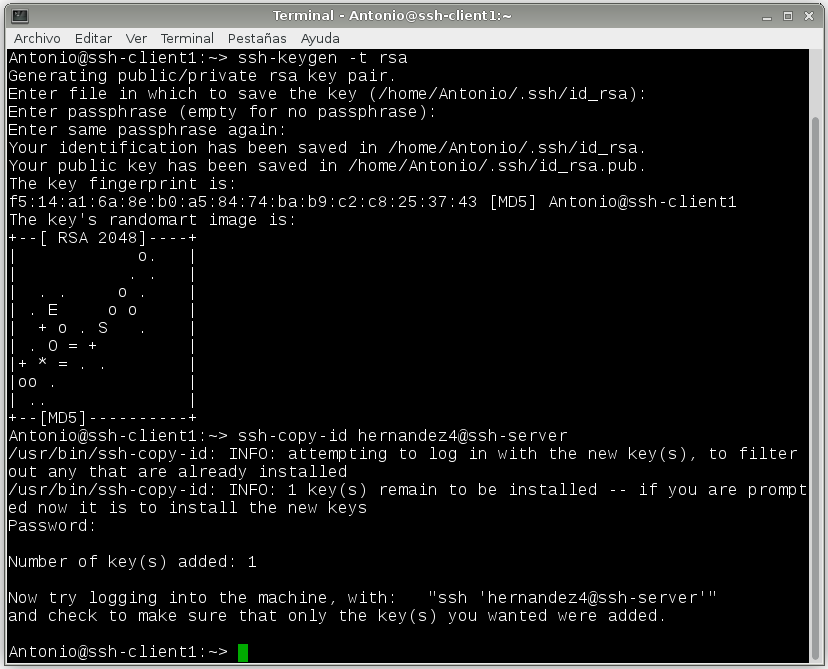

Comprobamos que iniciando con el usuario "hernandez4" no se nos solicite la introducción de contraseña pero sí con el usuario "hernandez2":


#7. Uso de SSH como túnel para X (ejecución)

Si bien hemos visto hasta ahora el servicio SSH como una manera de iniciar sesión en una máquina servidor con un cliente, también podemos ejecutar aplicaciones que se alojen en el mismo de forma remota.

Primero vamos a ejecutarla apliación desde el servidor:

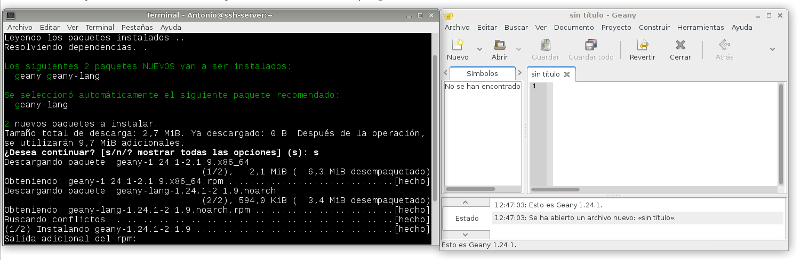

Luego, editamos el fichero ````/etc/ssh/sshd_config``` para descomentar la línea "X11Forwarding Yes", la cual nos habilita la opción de ejecutar aplicaciones del servidor vía ssh:


Desde el cliente lanzamos el comando ```ssh -X hernandez1@ssh-server``` y una vez introducida la contraseña escribimos "g" y se nos abrirá la aplicación:


Se ejecuta con lanzar "g" en la consola gracias a que en el punto anterior habíamos introducido un alias para "geany".

#8. Aplicaciones Windows nativas

Vamos a barajar en este apartado la posibilidad de ejecutar aplicaciones nativas de windows vía ssh, de manera que realizaremos las configuraciones pertinentes para ello.

En primer lugar vamos a instalar el emulador de windows "wine", en nuestra máquina servidor. Para ello nos vamos a YaST y en "Instalar/desinstalar software" se nos abrirá una ventana donde podremos buscar dicho paquete e instalarlo:

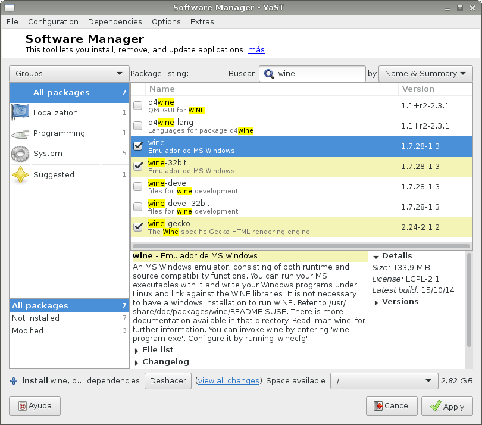

Nos pedirá que instalemos otro paquete una vez que lo iniciamos, damos que lo instale y seguimos:

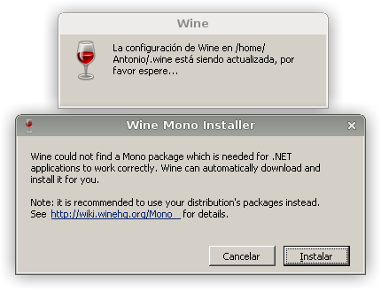

Comprobamos desde el servidor que se puede ejecutar la aplicación de windows que viene por defecto con "Wine", el bloc de notas:

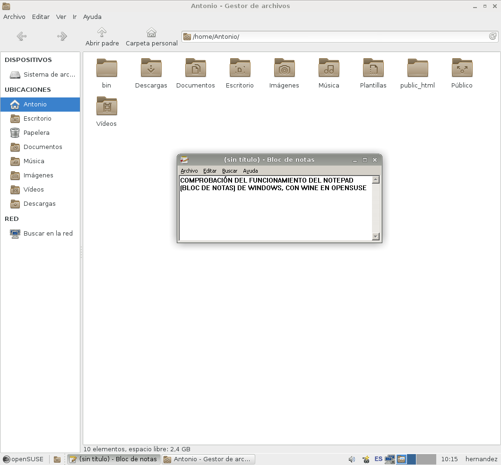

Nos vamos a la máquina cliente y con el comando ```ssh -X hernandez1@ssh-server``` iniciamos sesión. Luego, escribiendo ```notepad``` veremos que nos pide nuevamente uno de los paquetes que en el servidor también tuvimos que instalar, damos a que sí y se nos iniciará posteriormente la aplicación:

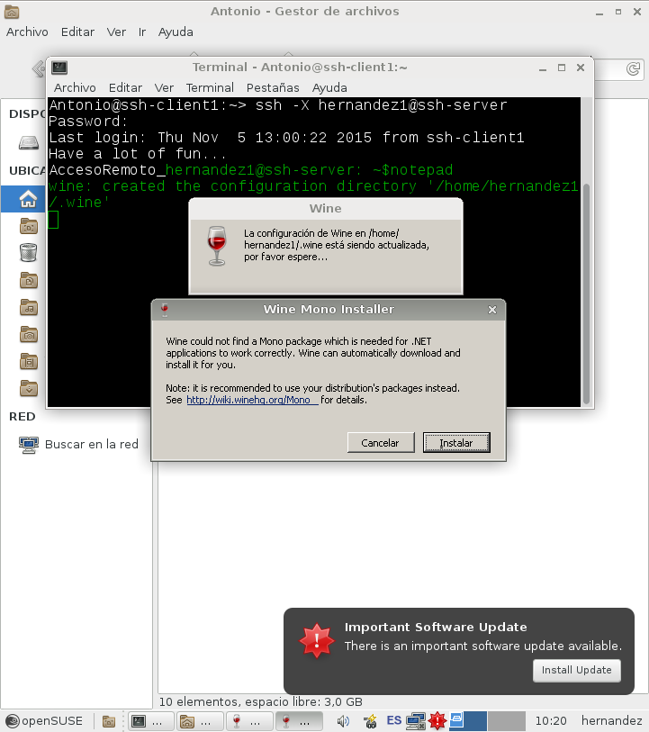
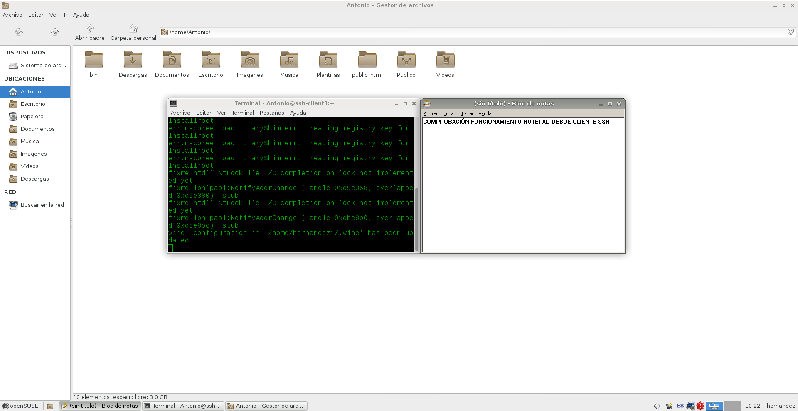

#9. Restricciones de uso

En este apartado vamos a ver que medidas de tipo restrictivas podemos implementar en nuestro servidor para que los usuarios que se vayan a conectar a él se vean afectados por éstas y limiten su uso del servicio SSH.

##9.1. Sin restricción

Con este subapartado pretendemos tener un punto de partida sobre el que fijarnos para entender mejor las siguientes restricciones que implementaremos. De manera que, con el enunciado "Sin restricción" queremos hacer referencia al inicio de sesión vía ssh que hemos venido realizando hasta el momento; introduciendo un usuario y su contraseña.

Ejemplo desde windows:


Ejemplo desde OpenSUSE:

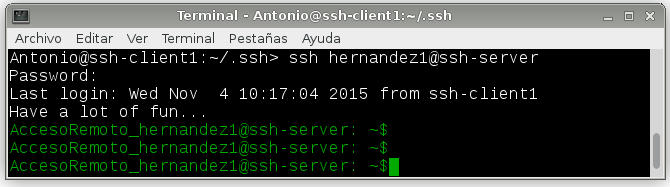

##9.2. Restricción total

En este caso vamos a emplear el uso de grupos dentro del sistema para que nos sea más fácil la inclusión o exclusión de las conexiones SSH, de manera que sólo los usuarios que pertenezcan al grupo "sshusers" podrán conectarse.

Primero copiamos por seguridad y a modo de respaldo el fichero de configuración ```/etc/ssh/ssh_config```, ya que lo editaremos para permitir al grupo que creemos. Con ```sudo groupadd -r sshusers``` creamos el grupo, y con el comando ```sudo usermod -a -G sshusers <usuario>``` lanzándolo para cada usuario, los metemos dentro de ese grupo:

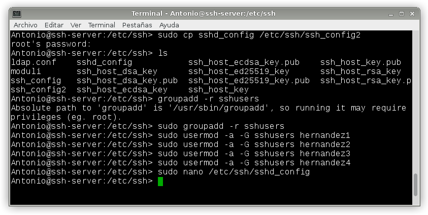

Con ```tail /etc/group``` comprobamos los miembros y el grupo generado:

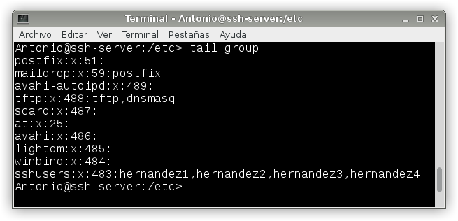

Ahora sí, editamos el fichero ```/etc/ssh/ssh_config``` y añadimos nuestro grupo después de ```AllowGroups```:


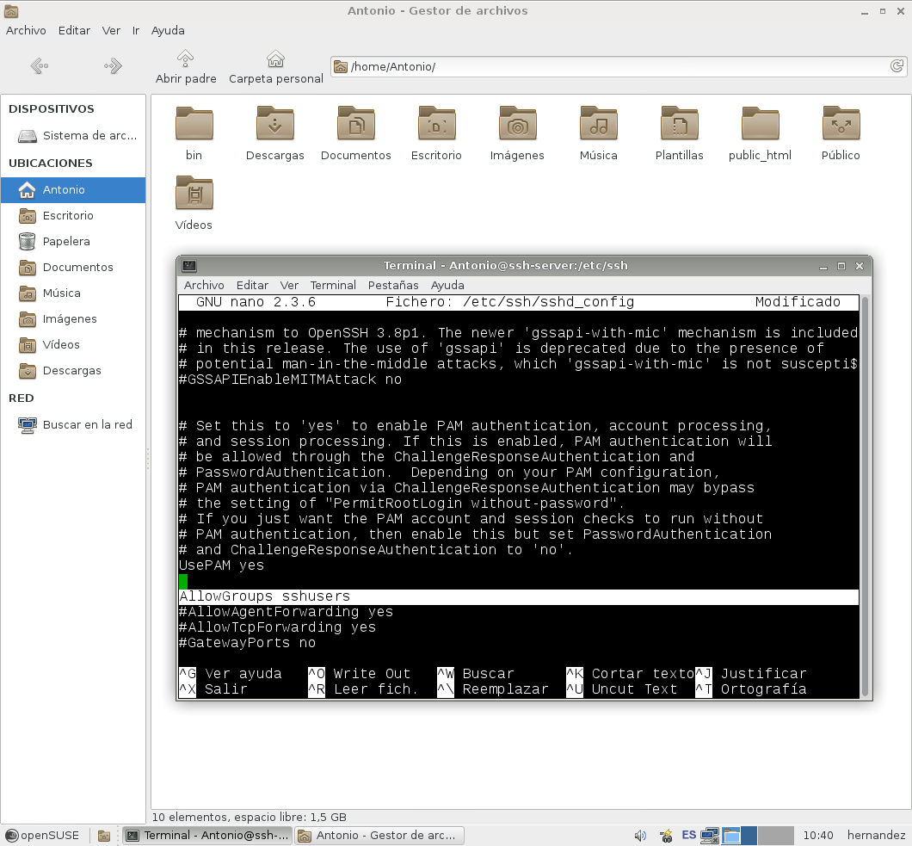

Ahora tan sólo tenemos que sacar del grupo a los usuarios que queramos restringirle la conexión SSH con el servidor. Para eliminar un usuario de un grupo tenemos el comando ```sudo gpasswd -d hernandez2 sshusers```, como podemos ver implementaremos la restricción para el usuario "hernandez2". Comprobamos nuevamente con ```tail /etc/group``` para verificar que lo hemos sacado del grupo:


Comprobamos desde el cliente dicha restricción. Veremos que por mucho que introduzcamos la contraseña correctamente no nos deja iniciar la sesión:


##9.3. Restricción en las máquinas

Antes de empezar este punto cabe decir que no se ha podido comprobar satisfactoriamente su funcionamiento, y es que no ha surtido efecto la restricción que hemos establecido.

En este caso vamos a ver como podemos restringir a las máquinas que tengan una IP no contemplada por el servidor como válida. Para ello, editaremos el fichero ```/etc/hosts.allow``` para añadir la siguiente línea:

```
ssh: ip_máquina_permitida1    ip_máquina_permitida2  ---
```


En este caso vamos a permitir sólo a los clientes que hemos usado hasta ahora (OpenSUSE/Windows 7):

```
ssh: 172.18.9.54 172.18.9.13
```

Luego reiniciamos el servicio con ```sudo systemctl restart sshd```:

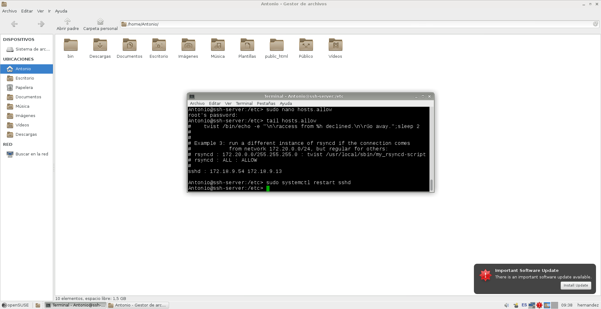

Y para completar, denegaremos el acceso al servicio SSH a todas las direcciones IP que no sean las permitidas editando el fichero ```/etc/hosts.deny```.

Para ello, añadimos la siguiente línea al final del fichero ```sshd : ALL EXCEPT LOCAL```:


##9.4. Restricción sobre usuario para aplicación

La siguiente restricción consistirá en limitar el uso de una aplicación en concreto a un usuario, de manera que no pueda ejecutarla desde su sesión de SSH.

Creamos un nuevo grupo dentro del servidor llamado "remoteapps" y añadimos un único usuario, en este caso "hernandez4":


Buscamos el fichero de ejecución de la aplicación en ```/usr/bin```. Vemos también los permisos que tiene, y los grupos a los que pertenece, en este caso vamos a usar la aplicación "geany", donde el grupo al que pertenece es "root". Para asociar dicha aplicación a nuestro grupo lanzamos el comando ```sudo chown root:remoteapps geany```:


Ahora le damos los permisos de "Lectura, Escritura y Ejecución" para el usuario propietario ("root") y de "Lectura y Ejecución" para los usuarios del grupo al que pertenece ("remoteapps") y nigúno para el resto. Para ello lanzamos el comando ```sudo chmod 750 geany```. Comprobamos los permisos ejecutando la aplicación desde el servidor con el usuario que hemos agregado al grupo "remoteapps":

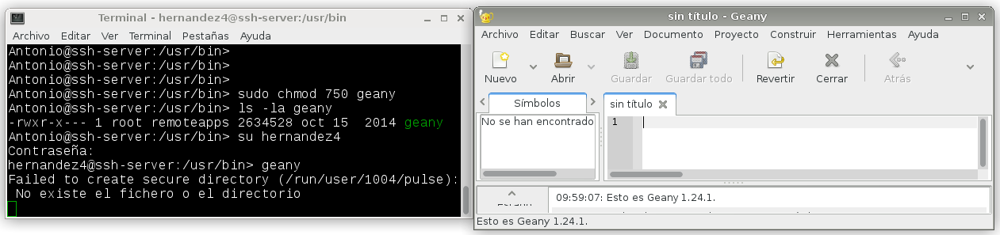

Comprobamos desde el cliente con los usarios no contemplados dentro del grupo si podemos iniciar la aplicación:


Ahora haremos lo mismo pero con el usuario validado dentro del grupo "remoteapps":

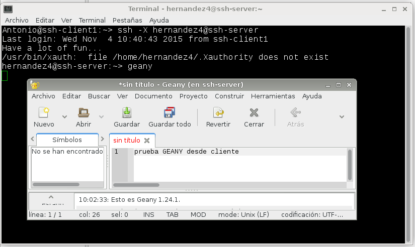