# A3.- NFS (Network File System)

***

* **Componentes:**  Antonio Hernández Domínguez - Manuel Pérez Acosta
* **Curso:** 2.º ASIR 2015/2016
* **Asignatura:** Administración de Sistemas Operativos
* **Unidad:** 2.ª Integración de Sistemas

***

## 1. Introducción

En esta tarea se ha hecho uso de otro "sistema de archivos distribuido" o "sistema de archivos de red"; en concreto, el proporcionado por el protocolo NFS (Network File System). El cual funciona a nivel de aplicación en el modelo OSI y suele ser el sistema de archivos de red que viene incluido por defecto en los Sistemas Operativos con kernel "Unix" o similar a "Unix", "Linux".

En este documento se recogen todos los pasos a seguir para implementar dicho sistema de archivos distribuido tanto en una máquina con sistema operativo Windows como en una con sistema GNU/Linux. A su vez, se ha hecho uso de clientes windows y GNU/Linux para ambos casos, esto es:

1. Un servidor NFS Windows (Windows 2008 Server Enterprise) al que nos conectamos con un Cliente Windows.

2. Un servidor NFS Linux (OpenSUSE) al que nos conectamos con un cliente Linux.

3. Comprobamos el acceso con cliente Linux al servidor NFS Windows.

4. Comprobamos el acceso con cliente Windows al servidor NFS Linux.

El desarrollo de la práctica, junto con la documentación de la misma, se ha llevado a cabo de forma conjunta por los alumnos Antonio Hernández Domínguez y Manuel Pérez Acosta. Tratando de organizar y optimizar el tiempo de realización de esta tarea, se han repartido los pasos a seguir de manera que no se excluyera a ningún integrante de la necesidad de conocer el funcionamiento del protocolo NFS en cada sistema, quedando como resultado el siguiente reparto:

* **Antonio Hernández Domínguez:**

 * Servidor NFS GNU/Linux OpenSUSE.
 * Cliente NFS Windows, para conectarnos al servidor NFS Windows.
 * Cliente NFS Windows, para conectarnos al servidor NFS GNU/Linux OpenSUSE.

* **Manuel Pérez Acosta:**

 * Servidor NFS Windows 2008 Server Enterprise.
 * Cliente NFS GNU/Linux, para conectarnos al servidor NFS GNU/Linux OpenSUSE. 
 * Cliente NFS GNU/Linux, para conectarnos al servidor NFS Windows.

## 2. Sistema Operativo Windows

### 2.1 Servidor NFS Windows

* Configuración de red del Windows 2008 Server (Enterprise):

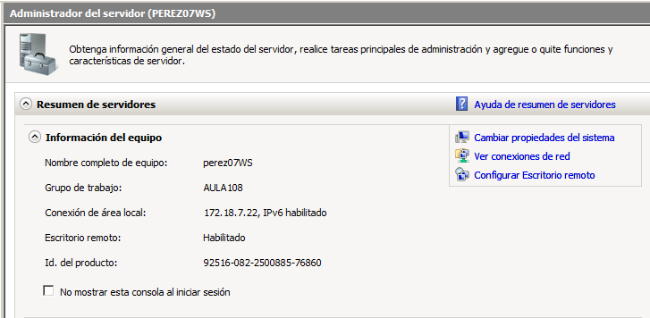

Después de configurar los parámetros de red de nuestro servidor, vamos a proceder a la instalación del servicio NFS. Para ello, accedemos a `Administrador del servidor -> Roles y características (en caso de W2008S se denominan funciones) -> Servicios de Archivo -> Servicios para NFS`.

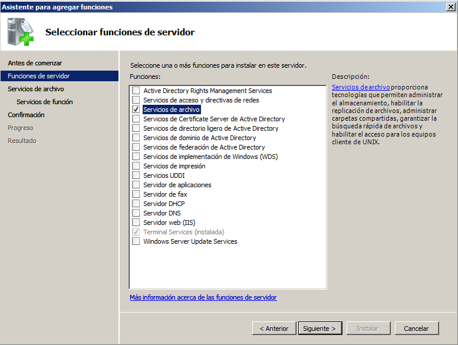
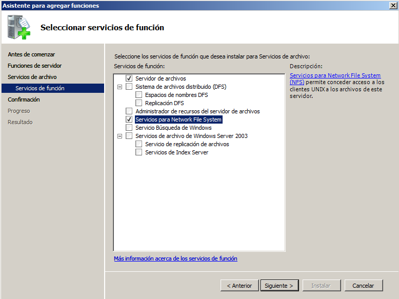

A continuación, vamos a configurar el servidor NFS:

* Creamos las carpetas `C:\export\public` y `C:\export\private`:

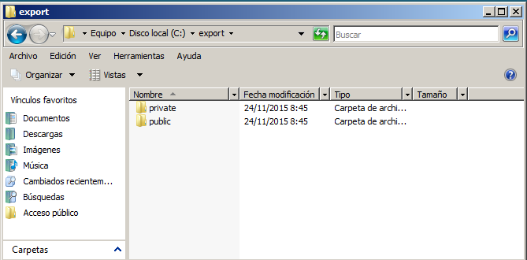

* Accedemos a `Propiedades de la carpeta public -> Compartir NFS` y la configuramos para que sea accesible desde la red en modo lectura/escritura con NFS.


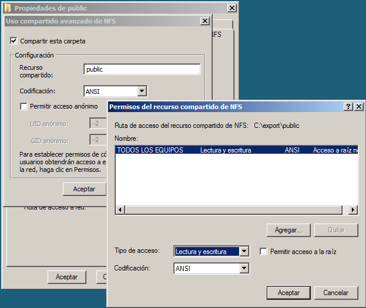

* Accedemos a `Propiedades de la carpeta private -> Compartir NFS` y la configuramos para que sea accesible desde la red en modo de sólo lectura con NFS.


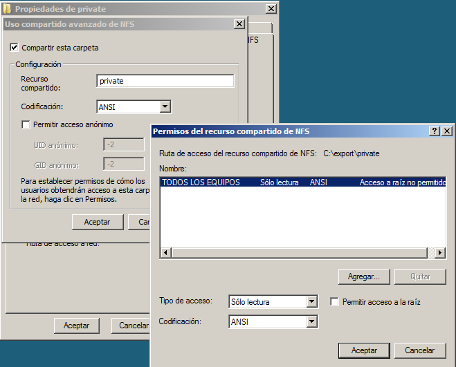

Por último, ejecutamos el comando `showmount -e 172.18.7.22` para comprobar que todo ha ido correctamente y los recursos están compartidos.

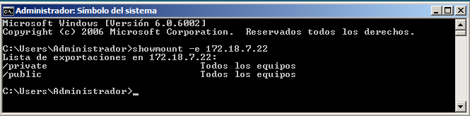

### 2.2 Cliente NFS Windows


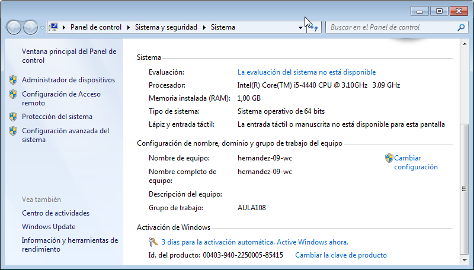
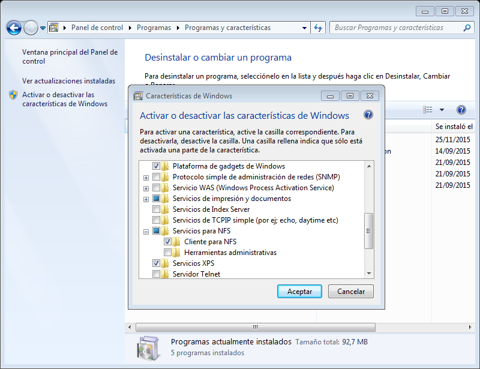
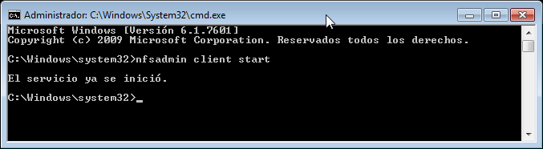
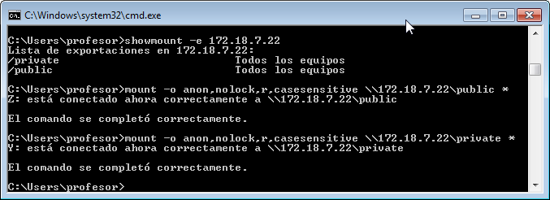
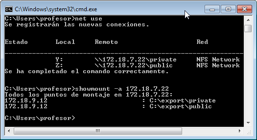

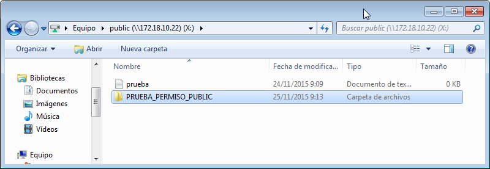


## 3. Sistema Operativo GNU/Linux (OpenSuse)

En este punto se documentan los pasos a seguir para implementar un servidor NFS en un sistema operativo GNU/Linux, distribución OpenSUSE; y las comprobaciones de uso de dicho servidor desde un cliente con mismo sistema operativo.

### 3.1 Servidor NFS OpenSUSE

Comenzamos editando el fichero `/etc/hosts` para agregar los nombres de los hosts de las máquinas clientes y del servidor. En este caso será:

*Para el cliente GNU/Linux, el nombre `nfs-client-07.perez` con dirección IPv4 `172.18.7.62`.
*Para el servidor `nfs-server-09.hernandez` con dirección IPv4 `172.18.9.52`.

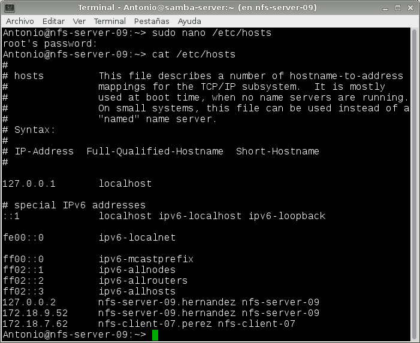

Luego, editamos las interfaces de red de manera que tenga la ip especificada:

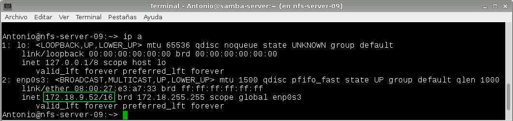

Lanzamos el comando ```sudo zypper --non-interactive install yast2-nfs-server``` para instalar el paquete NFS en nuestro sistema:

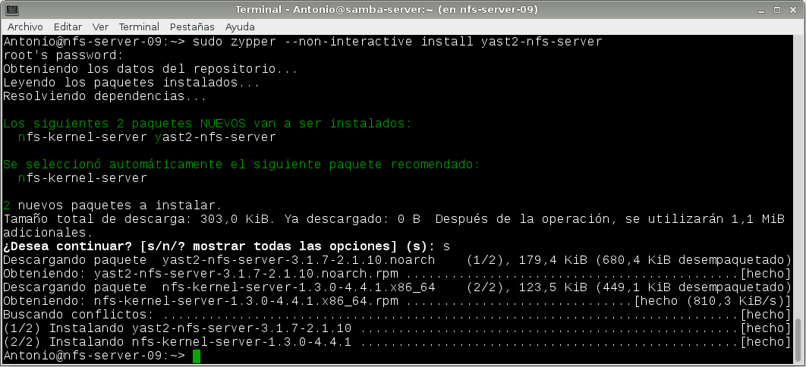

Ahora, una vez instalado nuestro servidor NFS, lo iniciamos desde la herramienta panel de control "YaST". Estableceremos que se inicie dicho servicio con el arranque del sistema, y abriremos el puerto en el cortafuegos para permitir el tráfico de este protocolo:

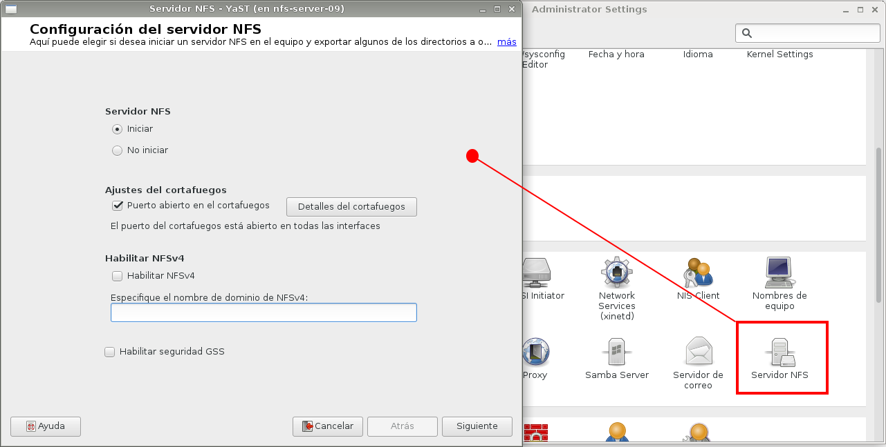

En este punto vamos a crear las carpetas físicas que asociaremos a los recursos que vamos a publicar en nuestro servidor NFS. Crearemos dos carpetas para comparar los permisos que posteriormente daremos desde el servidor nfs, la ruta será:
```/var/export/public``` y ```/var/export/private```:

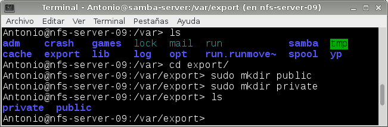

Los propietarios de las carpetas, así como los permisos asignados atenderán al siguiente esquema:

* La carpeta ```public``` no tendrá propietario "nobody" y pertenecerá a ningún grupo "nogroup". 
* La carpeta ```private``` tampoco tendrá propietario, y no estará asociado a ningún grupo. Los permisos que tendrá serán:	
 * De Lectura, Escritura y Ejecución para el propietario (7__)
 * De Lectura, Escritura y Ejecución para el grupo (_7_)
 * Y ningúno para el resto de usuarios (__0)


Volviendo al servidor NFS, vamos a publicar las carpetas que hemos creado. Para ello, hacemos click en "Añadir directorio" y ponemos la ruta física de la carpeta. Luego, en la ventana inferior hacemos click en "añadir host", para añadir a esa carpeta los host permitidos (los que tendrán acceso) y con los permisos (opciones) que queramos.

Para la carpeta "public" vamos a poner a cualquier host (*) con los permisos de lectura y escritura, de manera que sea accesible desde toda la red con dichos permisos.

* **/var/export/public** --> `* rw,siync,subtree_check`:

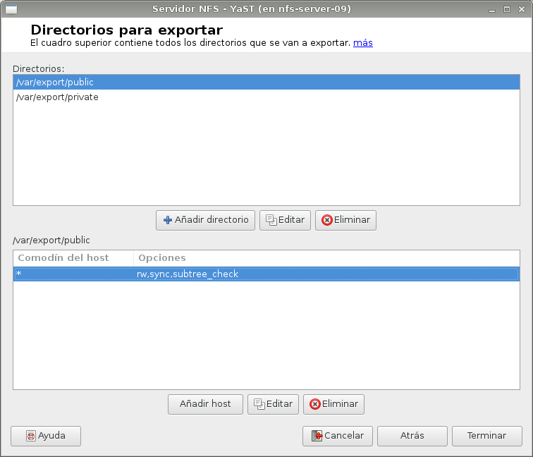

La carpeta /var/export/private, sea accesible sólo desde la IP del cliente, y sólo en modo lectura. De manera que, establecemos el host cliente `nfs-client-07.perez` mediante su ip `172.18.7.62` y los permisos, que hemos dicho que serán sólo de lectura:

* **/var/export/private** --> `172.18.7.62/32 ro,siync,subtree_check`:

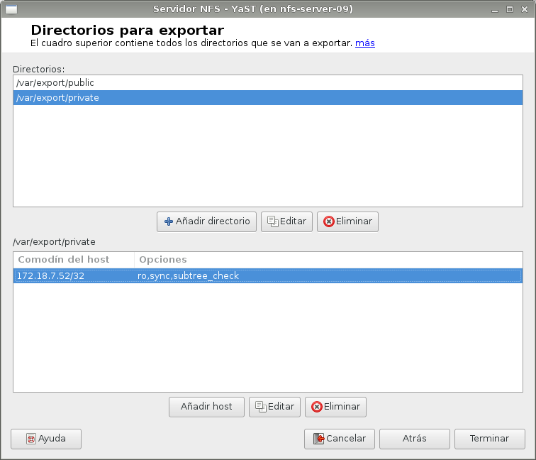

Si hacemos un `more` de la carpeta `/etc/exports` podemos ver los parámetros establecidos:


Para acabar, comprobamos que el servicio está en funcionamiento lanzando el comando `sudo systemctl status nfsserver.service`. A su vez, lanzamos el comando `sudo showmount -e localhost` para ver los directorios que hemos publicado:


### 3.2 Cliente NFS OpenSUSE

* Configuración de red del cliente OpenSuse:


* Configuración del fichero /etc/hosts (añadimos las líneas correspondientes al servidor y cliente):


En esta parte, comprobaremos que las carpetas compartidas desde el servidor son accesibles desde el cliente. El software del cliente NFS ya viene instalado en OpenSuse así que procederemos a realizar algunas comprobaciones para ver que todo funciona correctamente antes de montar los recursos.

Vamos a comprobar la conectividad entre el cliente y el servidor.

* Realizamos un ping al servidor para comprobar la conectividad `ping 172.18.9.52`:


* Realizamos un nmap para escanear que servicios se están ofreciendo al exterior `nmap 172.18.9.52 -Pn`:


* Realizamos un showmount para mostrar la lista de recursos exportados por el servidor NFS `showmount -e 172.18.9.52`:

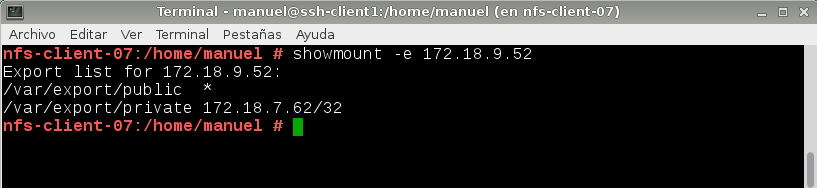

Una vez realizadas estas comprobaciones, vamos a montar y usar cada recurso compartido.

* Creamos la carpeta `/mnt/remoto/public` y montamos el recurso:

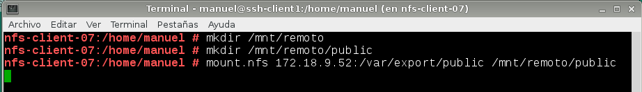


Utilizamos el comando `df -hT` para comprobar que se ha montado el recurso:


* Creamos la carpeta `/mnt/remoto/private` y montamos el recurso:

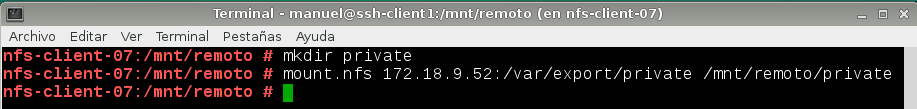

Ahora comprobamos que desde el cliente, no puedo crear nada ni escribir dentro de private (sólo lectura) pero si de public (lectura y escritura):


Para terminar las comprobaciones, mi compañero ha creado un archivo en la carpeta private en el servidor para comprobar que desde el cliente no puedo escribir dentro:

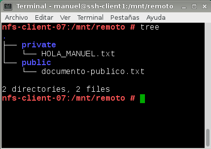

Y efectivamente, no me deja guardar la línea que he escrito dentro del fichero, por lo tanto, todo ha funcionado correctamente:

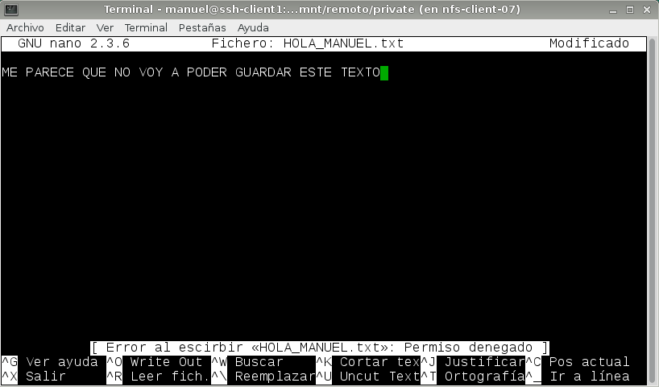

### 3.3 Montaje automático

En esta última parte de la práctica, configuramos las acciones de montaje automáticas para que cada vez que se inicie el equipo se monten las carpetas compartidas NFS. Para ello, modificamos el fichero `/etc/fstab` de la siguiente manera:


## 4. Preguntas finales

En este apartado, y a modo de desenlace para este documento, se han planteado diversas cuestiones a atender ya que hemos visto cómo podemos hacer uso de los servicios NFS en un sistema Windows y en un sistema GNU/Linux, de forma independiente. 

La cuestión ahora es: 

* ¿Se puede integrar un sistema NFS empleando como servidor una máquina Windows y como cliente de ésta una máquina GNU/Linux?

* ¿y a la inversa, un servidor NFS Linux junto con clientes Windows?

### 4.1. Cliente GNU/Linux y Servidor Windows (NFS)

Veamos primero el caso servidor Windows de NFS y cliente GNU/Linux.

* En este apartado, montamos los recursos NFS del servidor Windows en el cliente OpenSuse y comprobamos dichos recursos montados:

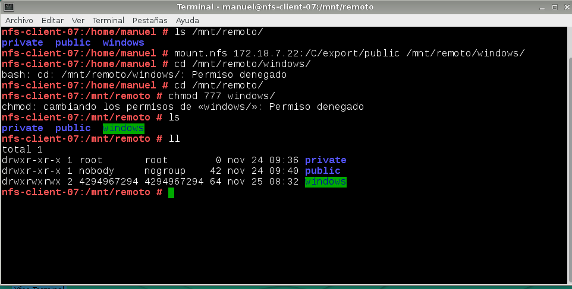

> Como vemos en la imagen, no podemos acceder a los recursos por un problema de conversión entre los dos sistemas operativos.

### 4.2. Cliente Windows y Servidor GNU/Linux (NFS)

Por último, probaremos a conectarnos con un cliente Windows al Servidor GNU/Linux que habíamos configurado en puntos anteriores.

Mostramos primero los recursos que están publicados por el servidor mediante el NFS. Para ello lanzamos el comando `showmount -e <ip_del_servidor>` --> `172.18.9.52`. Comprobamos que las carpetas "public" y "private" están disponibles para la red.

Nuevamente, haciendo uso del comando `mount -o anon,nolock,r,cassesensitive`, la ip, la ruta de la carpeta y la letra que queremos asignarle al recurso (podemos poner *), montamos la misma en nuestro sistema:

* `mount -o anon,nolock,r,cassesensitive 172.18.9.52:/var/export/private/ *`
* `mount -o anon,cassesensitive 172.18.9.52:/var/export/public/ *`

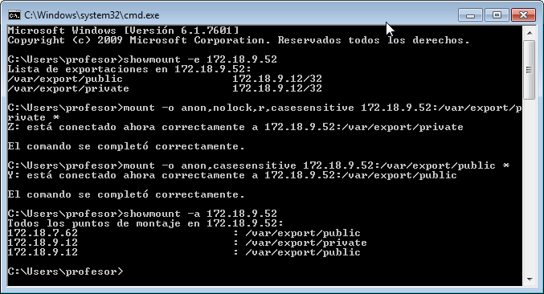

La gran diferencia con respecto a la conexión (con este cliente Windows) al servidor NFS Windows es que, para poder realizar la conexión con el servidor GNU/Linux, se ha cambiado la "sintaxis" a la hora de especificar la ruta de los recursos. En la siguiente imagen podemos apreciar que para conectarnos al servidor Windows poníamos la ruta --> `\\ip del servidor\carpeta` y para éste caso, al conectarnos al servidor NFS de la máquina OpenSUSE --> `ipdelservidor:/ruta/de/la/carpeta`:

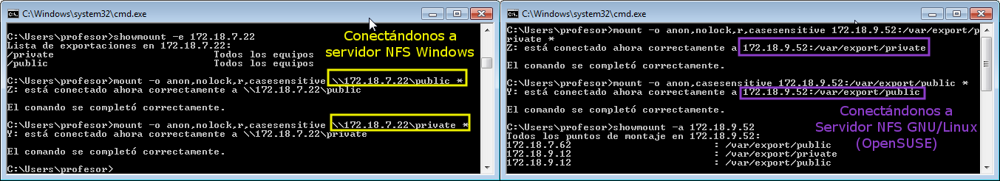

Desde las "ubicaciones de red" de nuestro sistema vemos que se han montado los directorios de forma correcta:

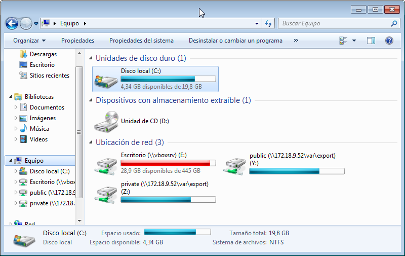

Volvemos a comprobar los permisos tratando de escribir algún fichero (en la carpeta public):


Y los permisos para la carpeta "private" (permisos sólo de lectura):

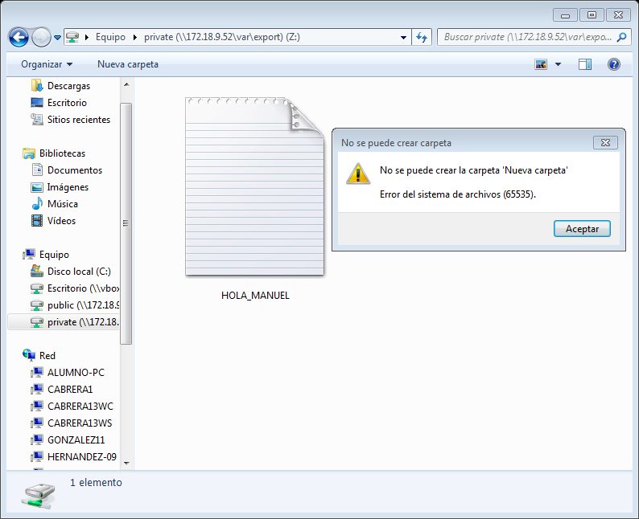

Si hacemos click con botón derecho sobre el fichero que hemos creado desde el cliente en la carpeta public vemos, en "propiedades", los modos de permisos que tiene. Para este caso hemos comprobado que podemos editar dichos permisos:


Revisamos las propiedades ahora del fichero que podemos ver (no editar) en la carpeta "private":

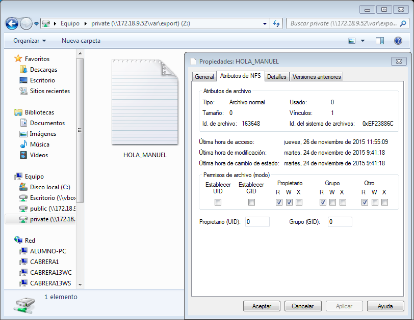

Comprobamos que tampoco podemos cambiar los modos de permiso de éste:


