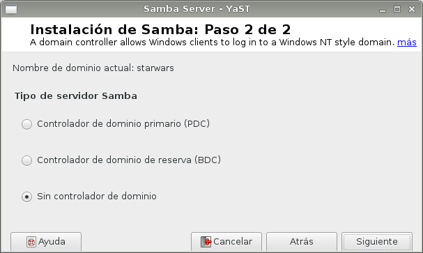

#A1.- Recursos Compartidos SMB/CIFS
***

* Autor: Antonio Hernández Domínguez
* Curso: 2º ASIR 2015/2016
* Asignatura: Administración de Sistemas Operativos
* Unidad: 2.- Integración de Sistemas

***

#1. Introducción

En esta tarea se detallan los procesos a seguir para implementar un sistema de recursos compartidos empleando el protocolo "SMB" (Server Message Block), renombrado por Microsoft a "CIFS" (Common Internet File System). 

Este protocolo de red funciona a nivel de aplicación en el modelo OSI, y nos permite compartir archivos, impresoras, unidades de almacenamiento o de disco, etc.. entre los nodos de una misma red. Se emplea en los sistemas operativos Windows por defecto y, aunque pertenezca a microsoft, también podemos implementarlo en sistemas GNU/Linux; como veremos a continuación al realizar la instalación de SAMBA (implementación libre del protocolo CIFS de Microsoft Windows) en una distribución OpenSUSE.

Como ya hemos mencionado, vamos a hacer uso de una máquina con sistema operativo GNU/Linux “OpenSUSE”, que nos hará de equipo servidor de los recursos compartidos; será la máquina en la que implementaremos el paquete SAMBA. Y como clientes de ésta, emplearemos una máquina con sistema operativo Windows, y otra también con OpenSUSE, de manera que hagan uso de los recursos compartidos publicados por la máquina servidor.

#2. Configuraciones Previas

Para empezar configuraremos el servidor OpenSUSE con el nombre de equipo “samba-server”, y añadiremos los nombres de host de las máquinas clientes, “samba-client1” y “samba-client2-09”, al fichero de sistema "/etc/hosts". Como nombre de dominio introduciremos nuestro segundo apellido (Dominguez) y como nombre de usuario y clave, nuestro nombre y número de dni, respectivamente. La ip del servidor será la ```172.18.9.53/16```:


#3. Usuarios Locales

Para hacer uso de los recursos compartidos vamos a emplear 3 grupos de usuarios a los que les daremos distintos permisos en las carpetas que compartamos, para ver su comportamiento una vez accedamos desde los clientes. La estructura de grupos/usuarios se definirá de la siguiente manera:

* Un usuario ```smbguest``` que no pertenecerá a algún grupo y que modificaremos en el fichero ```/etc/passwd```, para que nadie pueda hacer uso de él a la hora de querer entrar en nuestro sistema. 

* Grupo ```jedis```, en el que agregaremos los usuarios: ```jedi1```, ```jedi2``` y ```supersamba```.

* Grupo ```sith```, en el que agregaremos los usuarios: ```sith1```, ```sith2``` y ```supersamba```.

* Grupo ```starwars```, en el que agregaremos a todos los usuarios de los 2 grupos anteriores y al usuario ```smbguest```.

Veamos primero la creación de los grupos:


Ahora la creación de usuarios, en este caso desde YaST, aunque podíamos haberlo hecho también por comandos:


Y por último la asignación de los usuarios a cada grupo:


Finalmente, editamos el fichero ```/etc/passwd```, el cual contiene los datos que determinan quien puede acceder al sistema de manera legitima y que se puede hacer una vez dentro del sistema. En el tenemos registrados las cuentas de usuarios, asi como las claves de accesos y privilegios, entre otros datos. En esta ocasión nos interesa el que ocupa el último campo ```/bin/bash```, ya que determina el interprete de comando del que va a hacer uso ese usuario.

Editamos el fichero y en el registro del usuario ```smbguest```, último campo (recordemos que están separados por ":"), cambiamos el ```/bin/bash``` por ```/bin/false```, de manera que no pueda tener acceso a dicho interprete de comandos:


#4. Instalamos Samba

En la máquina servidor instalamos el paquete samba en caso de que éste no venga por defecto. Para ello lanzamos el comando ```apt-get install -y samba samba-common smbclient samba-doc cifs-utils```.

##4.1. Configuraciones

Ahora, buscamos desde la herramienta de panel de control YaST el servidor Samba y lo iniciamos.

Nos aparecerá la primera vez dos ventanas, una primera en la que introducimos el nombre del grupo de trabajo:


Y una segunda en la que definimos como va a ser nuestro servidor samba:



Luego, nos aparecerá una ventana con diversas pestañas donde podremos configurar el serivdor a nuestro antojo, y ver los recursos que vamos a compartir.

En primer lugar seleccionaremos dentro de la pestaña "Inicio" la opción de "Inicio del servicio" --> "Durante el arranque". Y más abajo, en la opción de "Ajustes del cortafuegos" selccionaremos la casila de "Puerto abierto en el cortafuegos" para que permita el tráfico de los paquetes que tengan que ver con las comunicaciones que se den al hacer uso del protocolo CIFS:


Más adelante volveremos a esta herramienta de entorno gráfico para ver los recursos compartidos que vamos a establecer. 

##4.2. Creación de Recursos Compartidos

En este apartado realizaremos la creación de las carpetas así como las configuraciones pertinentes para que las mismas formen parte de los recursos compartidos que queremos implementar.

Para empezar creamos la carpeta ```samba``` dentro de la ruta ```/var```. Luego, alojamos las carpetas ```public.d```, ```corusant.d``` y ```tatooine.d```. Estas carpetas serán las que formen los recursos compartidos de nuestro servidor samba, a la cuales les daremos permisos según el grupo que queramos que tenga acceso.

El esquema de pertenecia a usuario y grupo vendría a ser el siguiente:

* Public.d:
 * Pertenecerá al usuario ```supersamba``` y al grupo ```starwars```. Recordemos que éste último engloba a todos los usuarios que habíamos creado.

* Corusant.d:
 * Pertenecerá al usuario ```supersamba``` y al grupo ```siths```.

* Tatooine.d:
 * Pertenecerá al usuario ```supersamba``` y al grupo ```jedis```.


Los permisos para cada carpeta en base al usuario propietario, grupo de usuarios y resto de usuarios serán los siguientes:

* Public.d:
 * Tendrá todos los permisos (lectura, escritura y ejecución) para el usuario y grupo propietario (77_) y de lectura y ejecución para el resto de usuarios (__5).

* Corusant.d:
 * Tendrá todos los permisos (lectura, escritura y ejecución) para el usuario y grupo propietario (77_) y ninguno para el resto de usuarios (__0).

* Tatooine.d:
 *  Tendrá también todos los permisos (lectura, escritura y ejecución) para el usuario y grupo propietario (77_) y ninguno para el resto de usuarios (__0).


Para poder publicar los recursos compartidos asociados a nuestras carpetas tenemos que, o bien realizar las configuraciones necesarias a través de "YaST" --> "Samba Server", o modificar el fichero de configuración ```/etc/samba/smb.conf```, el cual contiene la información de los recursos compartidos.

Copiaremos dicho fichero en la misma carpeta asignándole otro nombre para poder tener un respaldo en caso de que nos carguemos de mala manera dicho fichero (ya sea por el poder del lado oscuro). Luego, modificamos el original y agregamos las siguientes líneas:

```

[global]
netbios name = Hernandez
workgroup = STARWARS
server string = Servidor Samba del PC 09
security = user
map to guest = bad user
guest account = smbguest

[cdrom]
path = /dev/cdrom
guest ok = yes
read only = yes

[public]
path = /var/samba/public.d
guest ok = yes
read only = yes

[corusant]
path = /var/samba/corusant.d
read only = no
valid users = @siths, @jedis

[tatooine]
path = /var/samba/tatooine.d
read only = no
valid users = jedi1, jedi2

```

Con éste código estamos estableciendo en el servidor samba que el grupo de trabajo será "starwars" (dentro de la primera etiqueta [global]), a parte de que el nombre de la máquina será nuestro primer apellido.

Luego, se establecen los parámetros necesarios para incluir las carpetas que habíamos creado como recursos compartidos, de manera que se señala cual es su ruta física, si los usuarios invitados están permitidos (en el caso de public sí) y si dicho recurso será únicamente de lectura (sólo en el caso de public). 

También se establecen los usuarios validados para cada recurso, en las líneas "valid users".


##4.3. Creación de Usuarios Samba

En este punto realizaremos el último paso para poder terminar con la configuración de nuestro servidor samba. 

Para ello, y dado que ya hemos creado los usuarios a nivel local junto con las carpetas con los permisos pertinentes y hemos configurado los recursos compartidos ligados a las mismas; es necesarios que habilitemos a los "usuarios" dentro del servidor Samba para que puedan hacer uso del mismo desde las máquinas clientes.

Con el comando ```sudo smbpasswd -a <usuario>``` agregamos las cuentas de los usuarios al servidor Samba. Lanzamos dicho comando para cada uno de los usuarios que habíamos creado:


Con ```sudo pdbedit -L``` vemos las cuentas del servidor Samba junto con su número de identificación de usuario: 


##4.4. Comprobaciones

Volviendo a la herramienta YaST --> "Samba Server", vemos los recursos compartidos que hemos definido, si tienen permisos de "sólo lectura" o si se permite el "Acceso de invitados", la ruta hacia la carpeta que apunta cada recurso, su nombre y si está activado o no: 


Para que las configuraciones que hemos realizado queden guardadas en el sistema reiniciamos el servidor samba con ```sudo systemctl stop smb``` y luego ```sudo systemctl start smb```. Para ver el estado del servidor usamos ```sudo systemctl status smb```. Vemos que sí esta iniciado:


Con el comando ```testparm``` verificamos la sintaxis del fichero de configuración del servidor Samba:


Y con ```netstat -tap``` Comprobamos que el servicio SMB/CIFS está a la escucha:


#5. Clientes Windnows

Nos vamos a la máquina cliente Windows para comprobar el acceso al servidor samba y los recursos compartidos establecidos en él.

En primer lugar cambiaremos el nombre del equipo al que ya habíamos especificado en el registro de host que hicimos en el servidor OpenSUSE, cliente ```samba-cli2-09```:


##5.1. Mediante Entorno Gráfico (GUI)

Realizaremos las conexiones primero mediante entorno gráfico y luego a través del intérprete de comandos de windows.

Nos situamos en la sección de "Red" del sistema y ponemos en la ruta del explorador de archivos la ip del equipo servidor (172.18.9.53). Nos tendrán que aparecer todos los recursos compartidos que habíamos definido:


Comprobamos que el acceso al recurso compartido de la carpeta ```public``` es libre (no nos pide la introducción de un usuario y contraseña), pero se nos deniega la creación del algún fichero:


Ahora accedemos a la carpeta ```tatooine``` con un usuario del grupo jedi, (jedi1) y comprobamos que se nos permite el acceso y la creación de algún fichero. Con el comando ```net use``` podemos ver qué conexión es la que está en ese instante activa:


Desde el servidor, lanzamos el comando ```sudo smbstatus``` para ver qué usuarios han hecho uso de los recursos compartidos y a qué carpetas han accedido. En este caso podemos ver que un usuario sith (sith1 con UID:1008) y otra jedi (jedi1 con UID:1005) han entrado a las carpetas con ruta ```/var/samba/corusant.d``` y ```/var/samba/tatooine.d```, respectivamente.

Con ```netstat -ntap``` vemos las conexiones que se están produciendo en ese instante, con información del número de proceso y nombre de programa que está estableciendo esa conexión (a parte de los que están a la escucha). las direcciones ip de los equipos que se están interconectando y los puertos de los que están haciendo uso, así como el protocolo de red empleado (tcp):

Nota jedi: el comando netstat -ntap usa el poder de la fuerza.


Volvemos a la máquina cliente y comprobamos el acceso a los distintos recursos con los distintos usuarios que habíamos definido. Comprobamos que los ```jedi``` no tienen acceso al recurso compartido ```corusant```, pero los ```siths``` sí:


Crearemos un fichero una vez dentro del recurso compartido ```corusant``` con el usuario ```sith1``` para ver si el permiso de escritura funciona correctamente. El sith1 ha generado un fichero "LISTA_COMPRA". Si nos da eror, podemos comprobar si se debe a que no se ha cerrado alguna conexión. Para cerrar las conexión SMB al servidor, usaremos el comando ```net use * /d /y```:


Tratamos también de acceder con el usuario ```smbguest``` para ver si se nos deniega correctamente el acceso:


Si no hemos iniciado el acceso a algún recurso compartido con algunos usuarios no pasa nada, en el siguiente punto los emplearemos con la máquina cliente GNU/Linux.


##5.2. Mediante Comandos

Mediante el intérprete de comandos de Windows también podemos realizar las conexiones a los recursos compartidos con nuestro usuarios. Para ello emplearemos los siguientes comandos:

* En primer lugar usamos el comando ```net use /?```, para consultar la ayuda del comando.

* Con el comando ```net view```, vemos las máquinas (con recursos CIFS) accesibles por la red.

* Con el comando ```net use P: \\ip-servidor-samba\<nombre_recurso> /USER:<usuario_validado>```  podemos establecer una conexión del rescurso especificado en la unidad P. Ahora podemos entrar en la unidad P ("p:") y crear carpetas, etc.


Para comprobar resultados, desde el servidor Samba ejecutamos nuevamente los comandos ```smbstatus``` y  ```netstat -ntap```:


#6. Cliente GNU/Linux

En este punto realizaremos las mismas comprobaciones que en el anterior pero desde un cliente GNU/Linux. Lo haremos también por entorno gráfico, en primer lugar, y luego por línea de comandos.

##6.1. Mediante Entorno Gráfico (GUI)

Si abrimos el explorador de archivos e introducimos ```smb://<direccion_ip_del_servidor>``` nos volverán a aparecer como en el caso de windows todos los recursos compartidos habilitados en el servidor Samba.

Tratamos de acceder a alguno para comprobar que si se nos solicita la introducción de un usuario o contraseña o no (en el caso de public no). Comprobamos el acceso nuevamente con el usuario invitado para verificar que se éste se deniegue:


Entramos en el recurso compartido ```corusant``` con el usuario ```supersamba``` (recordemos que pertenecía a los grupos jedis y siths), y comprobamos que podemos crear algún fichero (LISTA_COMPRA_DARTH_MAUL):


Entramos al recurso ```tatooine``` con el usario ```jedi2``` y creamos una carpeta:


Accedemos al recurso ```public``` y tratamos de crear algún fichero. Vemos que efectivamente no tenemos permisos de escritura (el espíritu de Quin-Gon deniega esta "perturbacion en la fuerza"):


##6.2. Mediante Comandos

Realizaremos en esta ocasión las conexiones a través de la línea de comandos.

En primer lugar lanzamos el comando ```smbclient --list <ip_servidor_samba>``` para mostrar los recursos SMB/CIFS del servidor. Vemos que aparece nuestro servidor ```HERNANDEZ-09``` y los recursos que comparte:


Y con ```smbtree``` desde el servidor vemos algunas de las máquinas, junto con sus recursos compartidos, que existen en la red a la que está adherida nuestra máquina servidor:


##6.3. Montaje Automático

En este último apartado crearemos primero, en local, la carpeta ```/mnt/samba-remoto/courusant``` para luego montar dicha carpeta como recurso compartido de Samba Server.

Para montar dicha carpeta lanzamos el comando ```sudo mount -t cifs //172.18.9.53/courusant /mnt/samba-remoto/courusant -o username=sith1```.

Por último comprobamos que se ha montando dicha carpeta con el comando ```df -hT```. Vemos que efectivamente el recurso ha sido montado:


Creamos un fichero para ver si todo funciona correctamente. Vemos que el fichero lo creamos desde el cliente y que aparece en el servidor:


Si queremos que la carpeta se monte con el arranque del sistema (puesto que ahora, si reiniciamos, se desmontaría la carpeta) editamos el fichero ```/etc/fstab``` y agregamos la ip de nuestro servidor junto con el nombre del recurso, luego la ruta física del servidor donde se aloja la carpeta en cuestión y el usuario que tiene acceso a la misma con su clave. Quedaría algo así ```//172.18.9.53/coursant /mnt/samba-remoto/corusant cifs username=sith1, password=1234```. Reiniciamos la máquina para comprobar que efectivamente se realiza el montaje de la carpeta:


Lanzamos nuevamente el comando ```df -hT``` para comprobar que se ha montando automaticamente la carpeta del recurso compartido con el arranque del sistema:


#7. Preguntas Finales

* ¿Las claves de los usuarios en GNU/Linux deben ser las mismas que las que usa Samba?

No tienen porqué ser las mismas dado que, cuando se agregan los usuarios al servidor Samba, podemos introducir otra contraseña que no sea la misma que emplea el usuario en el sistema a nivel local.

* ¿Puedo definir un usuario en Samba llamado sith3, y que no exista como usuario del sistema?

No, puesto que debe estar definido dentro del sistema para que pueda acceder a las carpetas que en él se contemplan, y que se publican a través de los recursos compartidos.

* ¿Cómo podemos hacer que los usuarios sith1 y sith2 no puedan acceder al sistema pero sí al samba? (Consultar /etc/passwd)

Si modificamos en el fichero ```/etc/passwd```, su penúltimo campo ```/home/sith1/2```, por el de la ruta del recurso compartido que se ha implementado en el servidor samba, por ejemplo ```/var/samba/corusant.d```, entiendo que éstos sólo podrán hacer uso de ésta carpeta, denegando así el acceso al resto del sistema.

* Añadir el recurso [homes] al fichero smb.conf según los apuntes. ¿Qué efecto tiene?

Se emplea para configurar los parámetros necesarios para compartir la carpeta home (carpeta donde se almacena el perfil y todos los documentos) de algún usuario.

De esta manera creamos "perfiles móviles", de forma que cuando se identifique el usuario en cualquiera de los PCs de la red, se mapee de forma automática su perfil y tenga acceso a su carpeta home. Es útil para cuando un usuario se cambia de forma continua de equipo y no se quiere estar transportando todos los datos de ese usuario de una máquina a otra.


