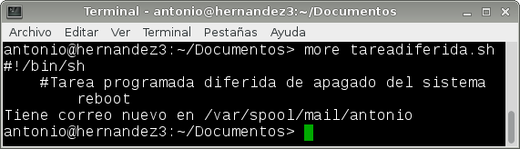

# A1.- Tareas Programadas

***

* **Autor:**  Antonio Hernández Domínguez
* **Curso:** 2.º ASIR 2015/2016
* **Asignatura:** Administración de Sistemas Operativos
* **Unidad:** 4.ª Automatización de Tareas

***

## 1. Introducción

	En la práctica planteada para comenzar esta 4.ª unidad, la cual trata sobre la **"Automatización de Tareas"**, hemos definido una serie de procesos que se ejecutarán de forma autónomo con base a unos parámetros o condiciones de tiempo preestablecidos.

	Dichos procesos, denominados "Tareas Programadas", son susceptibles de ser clasificados según la condición de tiempo a la que obedezcan en 3 grupos bien diferenciados, siendo éstos los siguientes:

	* **Tareas programadas diferidas**

	Éstas basan su condición de tiempo en el momento exacto que nosotros definamos, es decir, si queremos que se ejecute un proceso un día, hora o minuto concreto, y sólo una única vez, emplearemos éste tipo de tarea programada.

	* **Tareas programadas periódicas**

	Si queremos que una tarea se realice "periódicamente", ya sea cada mes, semana, día, etc... haremos uso de éste grupo de tareas. Un ejemplo muy común es el programado de una tarea de copia de seguridad o análisis de virus que se ejecute, por ejemplo, todos los domingos del mes.

	* **Tareas programadas asíncronas**

	En caso de que no tengamos claro el momento exacto pero sí el perido de tiempo en el que queremos que se ejecute (o se vuelva a ejecutar) un proceso, utilizaremos las tareas asíncronas. Éstas se definen siguiendo el mismo esquema que en las periódicas con la salvedad de que no se especficará un momento exacto de ejecución, sino que le diremos el periodo comprendido entre una ejecución y la siguiente y ésta se realizará en el momento que pueda, teniendo en cuenta dicho periodo.

	Par terminar esta parte introductoria cabe decir que hemos empleado un sistema operativo GNU/Linux, en concreto OpenSUSE 13.2, y un sistema operativo Windows 7 Enterprise; en los cuales hemos planificado 3 tareas programadas para cada sistema, contemplando para ello el hacer uso de una de cada tipo, cubriendo así todas las posibilidades para ambos sistemas.

## 2. Tareas Programadas en OpenSUSE

### 2.1. Configuraciones Previas

* IP: 172.18.9.51
* Máscara de red: 255.255.0.0
* Gateway: 172.18.0.1
* Servidor DNS: 8.8.4.4
* Nombre de equipo: hernandez3
* Nombre de dominio: dominguez
* Tarjeta de red VBox en modo puente.

### 2.2. Tarea Programada Diferida

### 2.3. Tarea Programada Periódica

### 2.4. Tarea Programada Asíncrona

* * *

## 3. Tareas Programadas en Windows 7 Enterprise

### 3.1. Configuraciones Previas

IP: 172.18.9.11
Nombre de equipo: hernandez1
Máscara de red: 255.255.0.0
Gateway: 172.18.0.1
Servidor DNS: 8.8.4.4
Grupo de trabajo: AULA108
Tarjeta de red VBox en modo puente.

### 3.2. Tarea Programada Diferida

En Windows 7 para abrir el programador de tareas hacemos Panel de control -> Herramientas administrativas -> Programador de tareas.

### 3.3. Tarea Programada Periódica

### 3.4. Tarea Programada Asíncrona
