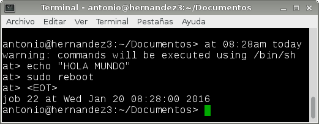
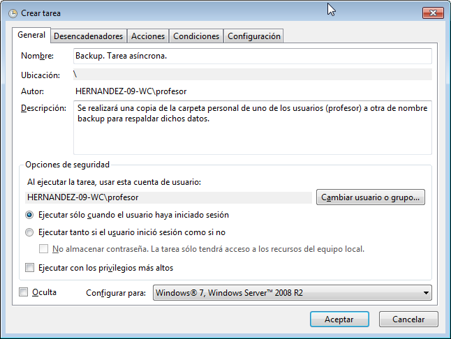
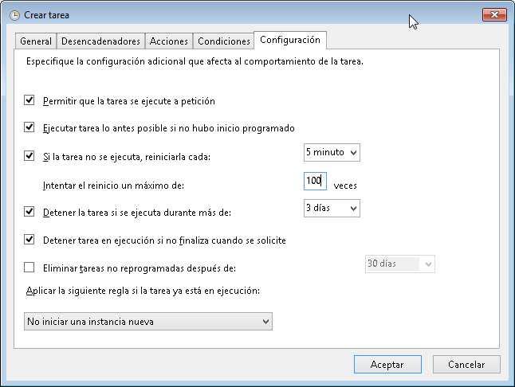

# A1.- Tareas Programadas

***

* **Autor:**  Antonio Hernández Domínguez
* **Curso:** 2.º ASIR 2015/2016
* **Asignatura:** Administración de Sistemas Operativos
* **Unidad:** 4.ª Automatización de Tareas

***

## 1. Introducción

En la práctica planteada para comenzar esta 4.ª unidad, la cual trata sobre la **"Automatización de Tareas"**, hemos definido una serie de procesos que se ejecutarán de forma autónoma con base a unos parámetros o condiciones de tiempo preestablecidos.

Dichos procesos, denominados **"Tareas Programadas"**, son susceptibles de ser clasificados según la condición de tiempo a la que obedezcan, dando como resultado 3 grupos bien diferenciados, siendo éstos los siguientes:

* **Tareas programadas diferidas**

Éstas basan su condición de tiempo en el momento exacto que nosotros definamos, es decir, si queremos que se ejecute un proceso un día, hora o minuto concreto, y sólo una única vez, emplearemos éste tipo de tarea programada.

* **Tareas programadas periódicas**

Si queremos que una tarea se realice "periódicamente", ya sea cada mes, semana, día, etc... haremos uso de éste grupo de tareas. Un ejemplo muy común es el programado de una tarea de copia de seguridad o análisis de virus que se ejecute, por ejemplo, todos los domingos del mes.

* **Tareas programadas asíncronas**

En caso de que no tengamos claro el momento exacto pero sí el periodo de tiempo en el que queremos que se ejecute (o se vuelva a ejecutar) un proceso, utilizaremos las tareas asíncronas. Éstas se definen siguiendo el mismo esquema que en las periódicas con la salvedad de que no se especficará un momento exacto de ejecución, sino que le diremos el periodo comprendido entre una ejecución y la siguiente, y ésta se realizará en el momento que pueda, teniendo en cuenta dicho periodo.

Dichas tareas pueden basarse en la ejecución de un programa que tengamos instalado en nuestro sistema o en ejecutar un script que nosotros mismos elaboremos y que en él se recojan los procesos que creamos convenientes, según la tarea que prentendamos definir.

Para terminar esta parte introductoria cabe decir que hemos empleado un sistema operativo GNU/Linux, en concreto OpenSUSE 13.2, y un sistema operativo Windows 7 Enterprise; en los cuales hemos planificado 3 tareas programadas para cada sistema, contemplando para ello el hacer uso de una de cada tipo, cubriendo así todas las posibilidades para ambos sistemas.


## 2. Tareas Programadas en OpenSUSE

Empezaremos definiendo las tareas programadas en OpenSUSE, empleando para ello los comandos `at` para las tareas diferidas, el fichero `/etc/crontab" para las tareas periódicas y, para las tareas asíncronas, las carpetas `cron` --> `cron.hourly`, `cron.daily` y `cron.monthly`.

### 2.1. Configuraciones Previas

Siguiendo los parámetros definidos en el esquema que vemos a continuación vamos a configurar nuestra máquina:

* IP: 172.18.9.51
* Máscara de red: 255.255.0.0
* Gateway: 172.18.0.1
* Servidor DNS: 8.8.4.4
* Nombre de equipo: hernandez3
* Nombre de dominio: dominguez
* Tarjeta de red VBox en modo puente.

Vemos los parámetros previos definidos:


A su vez, instalaremos o nos aseguraremos de que tenemos instalado los servicios `SSH`:


### 2.2. Tarea Programada Diferida

Ahora sí, configuraremos una primera tarea programada de tipo `diferida` que se ejecutará en el momento exacto que establezcamos. Para ello hacemos uso de un script para intérpretes de comandos shell (el empleado en sistemas Unix) con el siguiente código:

```
#!bin/sh
	#Tarea programada diferida de apagado del sistema
		sudo shutodwn
```

Luego, para lanzar la tarea programada escribiremos `at` <el momento en el que queremos que se ejecute> < <y el nombre o ruta del script a ejecutar>; en nuestro caso quedaría de la siguiente manera `at 08:35am today < tareadiferida.sh`. Nos aparecerá un mensaje de tipo "Warning" con el aviso de que se ejecutará el script en cuestión, donde especificará en la siguiente línea la fecha y hora de dicha ejecución.


En este caso nos hemos topado con un error al lanzar el comando `at`, el cual nos indica que el demonio de este comando no está funcionando por lo que escribimos ``sudo atd` para que arranque el demonio del programa y podamos establecer nuesta tarea diferida:


Si no queremos hacer uso de un script, podemos lanzar el comando `at` en la terminal con los parámetros de fecha y hora en que queremos que se ejecute la tarea, y nos aparececerá una nueva línea debajo en la que introducir los procesos que queramos que se ejecuten para esa tarea; cuando terminemos de definir la líneas simplemente pulsamos la combinación de teclas `ctrl+d` y finalizamos la creación de la tarea:




### 2.3. Tarea Programada Periódica

Pasamos ahora a definir una tarea programada mediante el uso del comando `crontab` o del fichero asociado al mismo `/etc/crontab`.

Este comando, o el fichero del mismo, nos permite programar tareas para realizarlas a ciertas horas, ciertos días de la semana, del mes, del año, etc... Con este comando, cada usuario puede definir sus propias tareas programadas, lanzandolo cada desde su sesión y siguiendo la siguiente sintáxis:

* `crontab -l` Mostrar las tareas programadas por el usuario.

* `crontab -e` Editar el fichero crontab. Con esto editaremos el fichero de configuración de crontab de cada usuario para poder modificar las tareas programadas.

* `crontab -r` Eliminar el fichero crontab corriente.

* `crontab -u <usuario>` Aplicar una de las opciones anteriores para un usuario determinado. Sólo root puede hacerlo.


A su vez, éste comando tiene una sintáxis específica que deberemos respetar, de manera que:

* Introduciremos una línea para cada tarea que queramos programar. 

* Y para cada línea respetaremos la composición predefinida de seis campos separados por espacios o tabuladores; estos campos son, en orden: minuto, hora, dia, mes, año, comando.

Un ejemplo sería:

* Lanzamos el comando `crontab -e` para que se nos abra el editor del fichero crontab.

* Y agregamos las siguientes líneas:

* * `#Hacer una copia de seguridad del directorio documentos cada día a las 00:00`

* * `0 0 * * * tar -czf docs-'date -I'.tar.gz /home/antonio/documentos/`

Si queremos definir una tarea periódica para todo el sistema, existe un fichero del que sólo puede hacer uso el usuario `root` destinado a tal fin; el fichero `/etc/crontab`.
Editándolo de forma manual podemos introducir en él las tareas que queremos definir. Este fichero tiene la misma sintáxis específica que en el caso del comando, con la salvedad de que después de los parámetros de tiempo agregaremos `root` como un campo más, para en el siguiente poner el comando a ejecutar.

En nuestro caso hemos optado por hacer uso de esta última opción para definir una tarea periódica del sistema.

En la captura podemos ver que se genera un script con el nombre `tareaperiodica.sh` con el siguiente código:

```
#!bin/sh
	#Añade la fecha/hora a un fichero
	date >> /home/antonio/cron.log
```

Para luego darle permisos de ejecución y lanzarlo desde la terminal para comprobar previamente que funciona de forma correcta:


Ahora, editamos el fichero `/etc/crontab` para agregar las siguientes líneas:

* `#TAREA PROGRAMADA PARA EJECUTARSE CADA 5 MIN`
* `0-59/5 * * * * root /home/antonio/Documentos/tareaperiodica.sh`

Si nos fijamos en el primer campo de la 2º línea que hemos introducido (campo minutos), podemos ver que se ha definido para que se ejecute cada 5 minutos de reloj, dividiendo el total de minutos (0-59) entre 5. Con lo cual se ejecutará 12 veces por hora, a todas horas, todos los días, todos los meses y todos los años; puesto que hemos puesto * en el resto de campos.


Si nos vamos ahora al fichero `/home/antonio/cron.log`, en el que el script va a guardar la fecha y hora, vemos que efectivamente hay un registro cada 5 min:


### 2.4. Tarea Programada Asíncrona


***

## 3. Tareas Programadas en Windows 7 Enterprise

Para definir tareas programadas en Windows, emplearemos la herramienta administrativa `Programador de Tareas` que podemos encontrar en "Panel de control -> Herramientas administrativas -> Programador de tareas".

Para éste sistema se emplea un entorno gráfico, diferenciándose drásticamente con respecto a la programación de tareas en los sistemas GNU/Linux.

### 3.1. Configuraciones Previas

IP: 172.18.9.11
Nombre de equipo: hernandez1
Máscara de red: 255.255.0.0
Gateway: 172.18.0.1
Servidor DNS: 8.8.4.4
Grupo de trabajo: AULA108
Tarjeta de red VBox en modo puente.


### 3.2. Tarea Programada Diferida

En Windows 7 para abrir el programador de tareas hacemos Panel de control -> Herramientas administrativas -> Programador de tareas.


***


### 3.3. Tarea Programada Periódica


### 3.4. Tarea Programada Asíncrona








