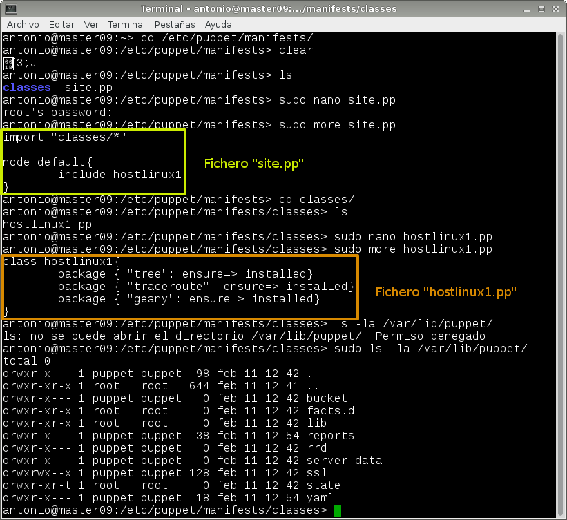

# A3.- Puppet-OpenSUSE

***

* **Autor:**  Antonio Hernández Domínguez
* **Curso:** 2.º ASIR 2015/2016
* **Asignatura:** Administración de Sistemas Operativos
* **Unidad:** 4.ª Automatización de Tareas

***

## 1. Introducción

Una vez que hemos visto como podemos automatizar tareas con el uso de **"Tareas Programadas"** vamos ahondar un poco más en este tema empleando otro tipo de herramientas que nos faciliten, en esta ocasión, la administración de un gran número de máquinas utilizando para ello una única.

Esto resulta interesante si pensamos en los problemas con los que nos encontramos cuando tenemos la tarea de administrar diferentes máquinas; problemas como:

* El uso de ficheros que se repiten por las distintas máquinas, dando lugar a varias versiones de un mismo archivo y la poca portabilidad (o ninguna) entre distintos sistemas o versiones del mismo.

* La gestión manual e individual de cada máquina; el gestionar ordenador por ordenador y la pérdida de tiempo que ello conlleva.

* La gestión de infinitas copias de seguridad o mas bien una por máquina.

* Y por último, la **escabilidad** en la administración de un conjunto de equipos que, al verse incrementado por más máquinas, da como resultado tener una mayor carga de trabajo o mantenimiento.


En la práctica planteada, y con idea de solventar todos los inconvenientes ya mencionados, vamos a hacer uso de un **gestor de o herramienta de gestión de configuraciones centralizada**.

DEFINICIÓN GESTOR DE CONFIGURACIONES CENTRALIZADA


Para ésta tarea haremos uso de 3 máquinas de las cuáles; 2 tendrán un sistema operativo GNU/Linux cuya distribución será OpenSUSE 13.2 --donde una hará de master y la otra de cliente-- , y 1 última máquina cliente con Windows 7.

## 2. Máquina Master OpenSUSE

Para la máquina master, empezaremos definiendo los parámetros de red y nombres de host necesarios para que las 3 máquinas se comuniquen haciéndo uso de sus nombres de host. Para ello, editaremos el archivo con ruta `/etc/hosts` donde definimos, asociándo las direcciones IPv4, los nombres que tienen las máquinas.

Luego pasaremos a montar nuestro **gestor de configuraciones centralizado** `PUPPET`, y a ver las distintas configuraciones que necesitamos establecer para su funcionamiento. De entre estas, destacaremos las referidas a los ficheros en los que alojamos las órdenes que se traducirán posteriormente en los clientes Puppet.

### 2.1. Configuraciones Previas

Siguiendo los parámetros definidos en el esquema que vemos a continuación vamos a configurar nuestra máquina master:

* IP: 172.18.9.100
* Máscara de red: 255.255.0.0
* Gateway: 172.18.0.1
* Servidor DNS: 8.8.4.4
* Nombre de equipo: master09
* Nombre de dominio: hernandez
* Tarjeta de red VBox en modo puente.

Vemos los parámetros previos definidos:

### 2.2. Comprobaciones de las Configuraciones


### 2.3. Instalación Servidor Puppet


## 3. Máquina Cliente OpenSUSE


### 3.1. Configuraciones Previas

Siguiendo los parámetros definidos en el esquema que vemos a continuación vamos a configurar nuestra máquina cliente OpenSUSE:


* IP: 172.18.9.101
* Máscara de red: 255.255.0.0
* Gateway: 172.18.0.1
* Servidor DNS: 8.8.4.4
* Nombre de equipo: cli1alu09
* Nombre de dominio: hernandez
* Tarjeta de red VBox en modo puente.

### 3.2. Comprobaciones de las Configuraciones

Vemos los parámetros previos definidos:


### 3.3. Instalación del cliente Puppet y Certificados
### 3.4. Primera versión del fichero pp




#### 3.4.1. Fichero hostlinux1.pp
#### 3.4.2. Fichero site.pp
#### 3.4.3. Comprobación primer fichero pp

### 3.5. Segunda versión del fichero pp
#### 3.5.1. Fichero hostlinux2.pp
#### 3.5.2. Fichero site.pp
#### 3.5.3. Comprobación segundo fichero pp

## 4. Máquina CLiente Windows 7

### 4.1. Configuraciones Previas

Siguiendo los parámetros definidos en el esquema que vemos a continuación vamos a configurar nuestra máquina cliente OpenSUSE:


* IP: 172.18.9.102
* Máscara de red: 255.255.0.0
* Gateway: 172.18.0.1
* Servidor DNS: 8.8.4.4
* Nombre de equipo: cliente2alu09
* Tarjeta de red VBox en modo puente.

### 4.2. Comprobaciones de las Configuraciones

Vemos los parámetros previos definidos:

### 4.3. Instalación del cliente Puppet y Certificados
### 4.4. Tercera versión del fichero pp
#### 4.4.1. Fichero hostwindows3.pp
#### 4.4.2. Fichero site.pp
#### 4.4.3. Comprobación tercer fichero pp


### 4.5. Cuarta versión del fichero pp (hostwindows4.pp)
#### 4.5.1. Fichero hostwindows4.pp
#### 4.5.2. Fichero site.pp
#### 4.5.3. Comprobación cuarto fichero pp


### 2.2. Tarea Programada Diferida

```
#!bin/sh
	#Tarea programada diferida de apagado del sistema
		sudo shutodwn
```
### 2.3. Tarea Programada Periódica

### 2.4. Tarea Programada Asíncrona

## 3. Tareas Programadas en Windows 7 Enterprise

### 3.2. Tarea Programada Diferida

### 3.3. Tarea Programada Periódica

### 3.4. Tarea Programada Asíncrona
