# A3.- Puppet-OpenSUSE

***

* **Autor:**  Antonio Hernández Domínguez
* **Curso:** 2.º ASIR 2015/2016
* **Asignatura:** Administración de Sistemas Operativos
* **Unidad:** 4.ª Automatización de Tareas

***

## 1. Introducción

Una vez que hemos visto como podemos automatizar tareas con el uso de **"Tareas Programadas"** vamos ahondar un poco más en este tema empleando otro tipo de herramientas que nos faciliten, en esta ocasión, la administración de un gran número de máquinas utilizando para ello una única.

Esto resulta interesante si pensamos en los problemas con los que nos encontramos cuando tenemos la tarea de administrar diferentes máquinas; problemas como:

* El uso de ficheros que se repiten por las distintas máquinas, dando lugar a varias versiones de un mismo archivo y la poca portabilidad (o ninguna) entre distintos sistemas o versiones del mismo.

* La gestión manual e individual de cada máquina; el gestionar ordenador por ordenador y la pérdida de tiempo que ello conlleva.

* La gestión de infinitas copias de seguridad o mas bien una por máquina.

* Y por último, la **escabilidad** en la administración de un conjunto de equipos que, al verse incrementado por más máquinas, da como resultado tener una mayor carga de trabajo o mantenimiento.


En la práctica planteada, y con idea de solventar todos los inconvenientes ya mencionados, vamos a hacer uso de un **gestor de o herramienta de gestión de configuraciones centralizada**. Dichos gestores nos permiten administrar de forma declarativa la configuración de un gran número de sistemas, pudiéndo ser éstos diferentes entre sí.

Para el documento que hemos desarrollado, vamos a ver como hacer uso de uno de los más empleados a día de hoy por grandes compañías (ligadas a un alto volumen de gestión de datos); **Puppet**. Y es que éstas empresas tienen una gran carga de trabajo con respecto a la administración y mantenimiendo de máquinas servidores, donde el elevado número de equipos puede llegar a ser abrumador. De entre las que cabe destacar podemos mencionar: Google, Twitter, Oracle, Dell, Bolsa de Nueva York, Universidad de Stanford, etc.


>Puppet, la cuál está escrita en ruby, fue diseñada para administrar la configuración de sistemas similares a Unix y a Microsoft Windows de forma declarativa. El usuario describe los recursos del sistema y sus estados utilizando el lenguaje declarativo que proporciona Puppet. Esta información es almacenada en archivos denominados manifiestos Puppet. Puppet descubre la información del sistema a través de una utilidad llamada Facter, y compila los manifiestos en un catálogo específico del sistema que contiene los recursos y la dependencia de dichos recursos, estos catálogos son ejecutados en los sistemas de destino.
>

Para acabar esta parte introductoria, mencionar que haremos uso de 3 máquinas de las cuáles:

* 2 tendrán un sistema operativo GNU/Linux cuya distribución será OpenSUSE 13.2 --una hará de master y la otra de cliente--.

* Y 1 última máquina cliente con Windows 7.

## 2. Máquina Master OpenSUSE

Para la máquina master, empezaremos definiendo los parámetros de red y nombres de host necesarios para que las 3 máquinas se comuniquen haciéndo uso de la resolución de nombres (DNS). Para ello, editaremos el archivo con ruta `/etc/hosts` donde definimos, asociándo las direcciones IPv4, los nombres que tienen las máquinas.

Luego pasaremos a montar nuestro **gestor de configuraciones centralizado** `PUPPET`, y a ver los distintos parámetros que necesitamos establecer para su funcionamiento. De entre estos, destacaremos las configuraciones referidas a los ficheros `.pp` en los que alojaremos las órdenes, `de forma declarativa,` que se traducirán posteriormente en los clientes Puppet.

### 2.1. Configuraciones Previas

Siguiendo los parámetros definidos en el esquema que vemos a continuación vamos a configurar nuestra máquina master:

* IP: 172.18.9.100
* Máscara de red: 255.255.0.0
* Gateway: 172.18.0.1
* Servidor DNS: 8.8.4.4
* Nombre de equipo: master09
* Nombre de dominio: hernandez
* Tarjeta de red VBox en modo puente.


### 2.2. Comprobaciones de las Configuraciones

Vemos los parámetros previos definidos, como los nombres de host:


Y las configuraciones de red y nombre de host del equipo master:


 Hacemos ping a las máquinas cliente mediante su nombre:


### 2.3. Instalación Servidor Puppet

En es te punto instalaremos el servidor puppet y lo configuraremos para su puesta en marcha. Empezamos descargando e instalando el paquete `puppet-server` lanzando el comando `sudo zypper install puppet-server puppet-vim:`


Una vez instalado comprobamos el estado del servidor puppet, y probamos a lanzar alguno de los siguientes comando en caso de que no esté iniciado:

* `sudo systemctl status puppetmaster` --> Para ver el estado del servicio.

* `sudo systemctl enable puppetmaster` --> Para habilitar el arranque automático.

* `sudo systemctl start puppetmaster` --> Para arrancar el servicio. Al lanzar este comando se creará el directorio /etc/puppet/manifests.

* `sudo systemctl restart puppetmaster` --> Para reiniciar el servidor.

* `sudo systemctl stop puppetmaster` --> Para parar el servidor.

Una vez que lo tengamos activo, comprobaremos en la ruta donde se ha instalado el servidor si existen las carpetas necesarias para poner en marcha el servidor puppet. Dado que lo acabamos de instalar, la carpeta `/etc/puppet/` sólo contendrá la carpeta vacía `manifest` y el archivo `auth.conf`, por lo que crearemos el siguiente árbol de carpetas y ficheros:

* `/etc/puppet/files` --> carpeta **files** que alojará los ficheros que se podrán descargar por el resto de máquinas puppet.

* `/etc/puppet/files/readme.txt` --> fichero **readme.txt** que usaremos como ejemplo para verlo desde el resto de máquinas puppet.

* `/etc/puppet/manifest/classes` --> será la carpeta que aloje los distintos ficheros con las órdenes para las distintas configuraciones que queramos tener.

* `/etc/puppet/manifest/site.pp` --> el fichero `site.pp` será el archivo princupal de configuración de órdenes para los agentes/nodos puppet.

* `/etc/puppet/manifest/classes/hostlinux1.pp` --> será nuestro primer ejemplo de configuración.


Vemos el árbol de carpetas y ficheros definido para el funcionamiento de puppet:


Hemos decidio terminar aquí con el apartado de la máquina master para que se entiendan mejor las configuraciones de los ficheros .pp que vamos a definir a continuación para los clientes. Se hará mención en los momentos que se precise del uso del equipo master; que serán cuando se produzca el intercambio de certificados entre la máquina servidor y la máquina cliente, y para cuando queramos definir un fichero .pp (manifiesto), los cuáles como ya hemos visto se alojan en el servidor.

## 3. Máquina Cliente OpenSUSE

Comenzaremos, como con la máquina anterior, definiendo los parámetros de red necesarios para su comunicación con el equipo servidor.

### 3.1. Configuraciones Previas

Siguiendo los parámetros definidos en el esquema que vemos a continuación vamos a configurar nuestra máquina cliente OpenSUSE:


* IP: 172.18.9.101
* Máscara de red: 255.255.0.0
* Gateway: 172.18.0.1
* Servidor DNS: 8.8.4.4
* Nombre de equipo: cli1alu09
* Nombre de dominio: hernandez
* Tarjeta de red VBox en modo puente.

### 3.2. Comprobaciones de las Configuraciones

Vemos los parámetros previos definidos:


Volvemos a hacer las comprobaciones de los nombres de host haciéndo ping a las otras máquinas:

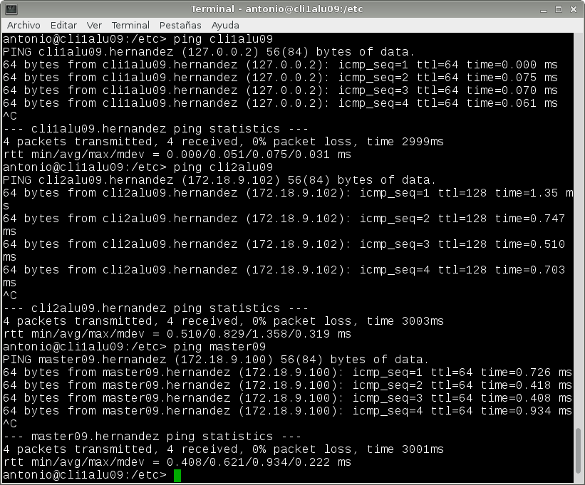

Y vemos por último los datos de nuestra máquina cliente:

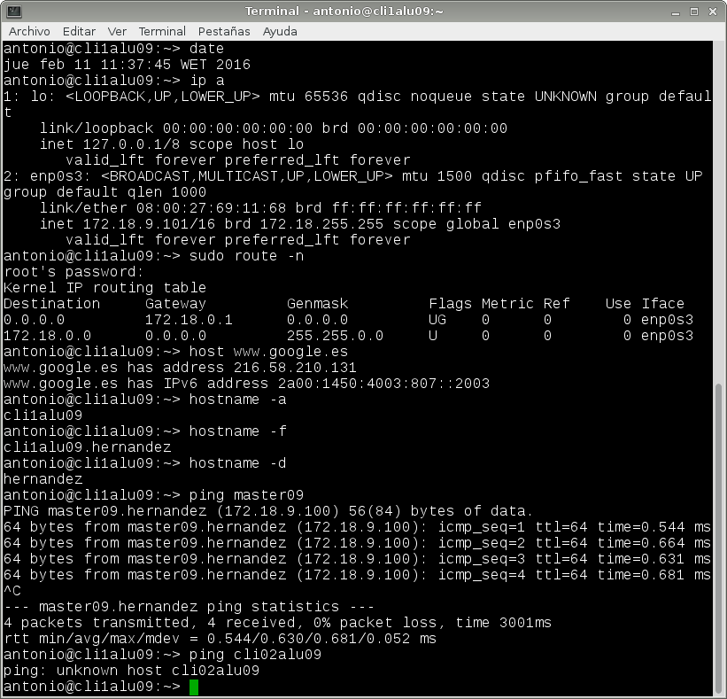

### 3.3. Instalación del cliente Puppet

Instalaremos ahora el agente puppet para que nuestra máquina tome los valores que definamos en los manifiestos del equipo servidor puppet:

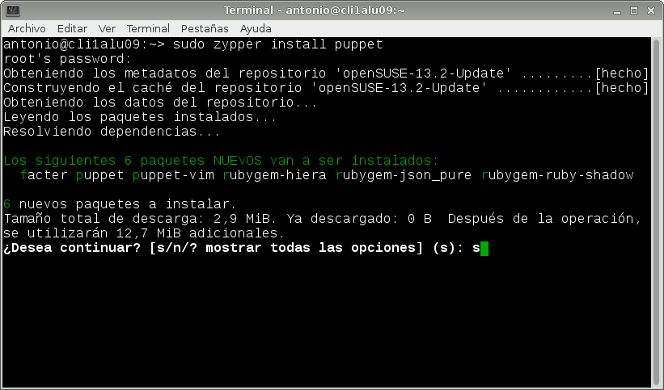

Una vez instalado, y dado que la máquina tiene que saber quién es el equipo maestro, nos situamos en la ruta `/etc/puppet` y editamos el fichero `puppet.conf` para introducir las siguientes líneas debajo de la etiqueta `[main]`:

```
[main]
	# The puppet log directory.
    # The default value is '$vardir/log'.
		server=master09.hernandez
        ...
```

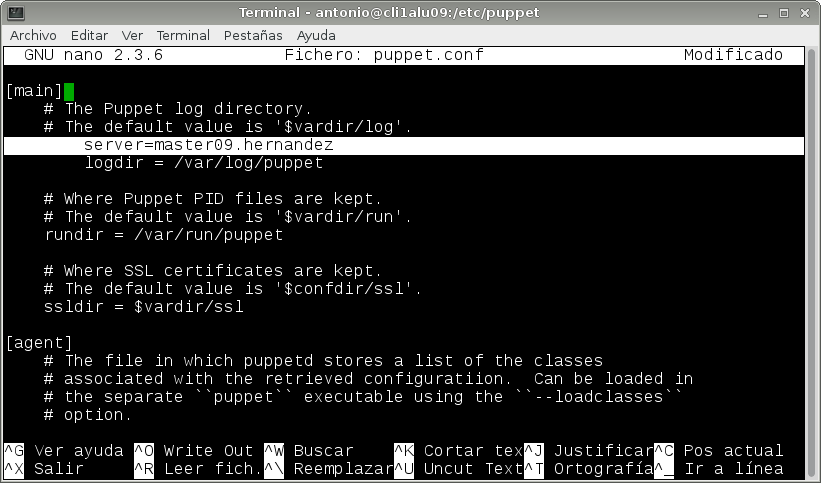

Luego, lanzaremos los siguientes comandos para poner en marcha el cliente puppet y comprobar que está en funcionamiento:

* `systemctl status puppet` --> Ver el estado del servicio puppet.

* `systemctl enable puppet` --> Activar el servicio en cada reinicio de la máquina.

* `systemctl start puppet` --> Iniciar el servicio puppet.

* `systemctl status puppet` --> Ver el estado del servicio puppet.

* `netstat -ntap` --> Muestra los servicios conectados a cada puerto.

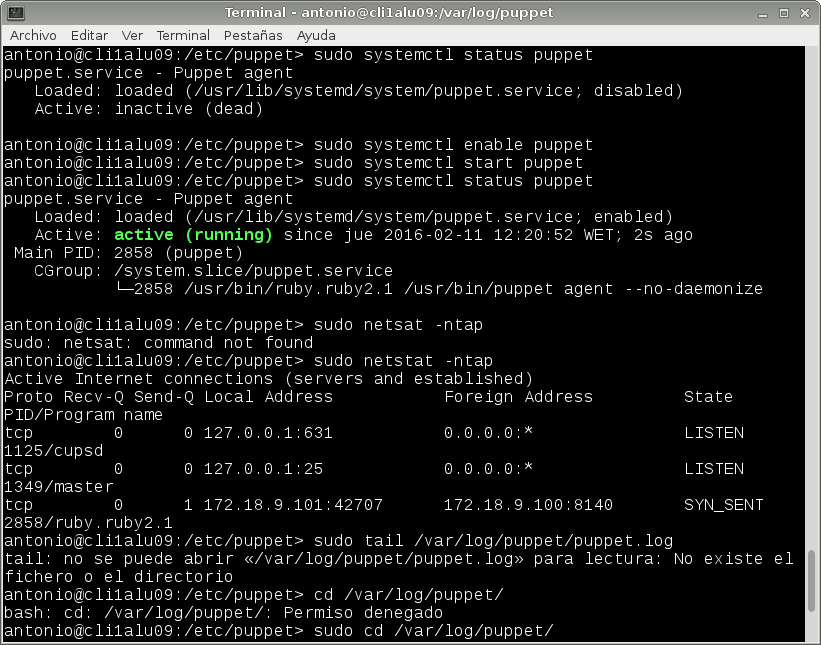


### 3.4. Intercambio de Certificados

Cuando instalamos el agente puppet y lo iniciamos, el propio cliente manda automáticamente una petición de intercambio de certificados a la máquina master. Por ello, nos volvemos a situar en el equipo donde hemos montado nuestro `puppetmaster` para aceptar dicha petición. Primero lanzamos el comando `sudo puppet cert list` para mostrar las peticiones de certificado:


Para aceptar la petición lanzamos el comando `sudo ppupet cert sign` seguido del nombre de host de la máquina emisora de la petición:

>nota: En este punto cabe destacar la importancia de los puntos iniciales de este documento --las configuraciones de red y de nombres de host--, puesto que es fundamental que dichos nombres se hayan introducido correctamente en ambas máquinas y que éstas sean capaces de ocmunicarse empleándo esos nombres.
>


Si queremos ver el certificado otorgado, introducimos el comando `sudo puppet cert print` junto con el nombre de la máquina cliente en cuestión:


### 3.5. Primera versión del fichero .pp

Dado que ya lo tenemos todo listo para comenzar a administrar nuestra máquina cliente a través del puppetmaster, vamos a definir un primer fichero .pp que llamaremos `hostlinux1.pp`, en el cuál definiremos las órdenes que queremos que se traduzcan y se ejecuten en el cliente. Editaremos también el fichero `site.pp` para establecer a qué máquina se le debe asignar qué configuración (fichero hostlinux1.pp); dado que sólo tenemos una máquina cliente y un único fichero de configuración asociaremos a ambos y comprobaremos así el funcionamiento del gestor puppet.

#### 3.5.1. Ficheros hostlinux1.pp y site.pp

Empezamos editando el fichero `/etc/puppet/manifests/site.pp`, en el que introducimos las siguientes líneas:

```
import "classes/*"

node default{
	include hostlinux1
}
```

Lo que significa que:

* Todos los ficheros de configuración del directorio classes se añadirán a este fichero.

* Todos los nodos/clientes van a usar la configuración hostlinux1.

Luego, editamos el fichero `/etc/puppet/manifests/hostlinux1.pp` para añadir las siguiente líneas:

```
class hostlinux1 {
  package { "tree": ensure => installed }
  package { "traceroute": ensure => installed }
  package { "geany": ensure => installed }
}
```

Lo que significa que se van a instalar los paquetes `tree, traceroute y geany` en la máquina asociada a esta configuración, en este caso, la máquina cliente OpenSUSE.


Para que los parámetros definidos se ejecuten, reiniciamos el servicio en el master con `systemctl restart puppetmaster`. Y
Comprobamos que el servicio está en ejecución de forma correcta con `systemctl status puppetmaster` y `netstat -ntap`:

>Nota: Abrir el cortafuegos para el servicio.
>

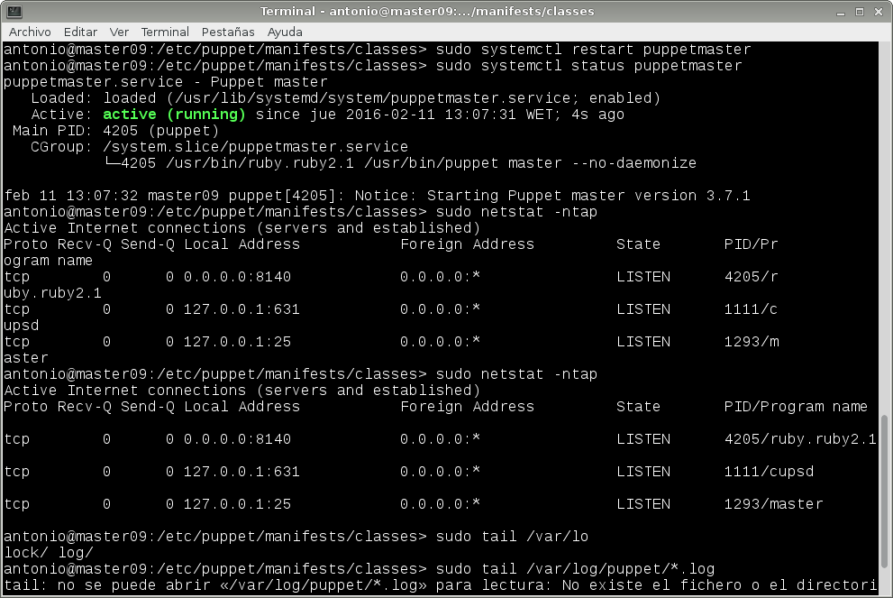

#### 3.5.2. Comprobación primer fichero .pp

Si todo ha salido bien, deberían de estar instalados los paquete correspondientes en la máquina cliente; para comprobarlo nos situamos en ésta y hacemos uso del comando `sudo zypper search` seguido del nombre del paquete que queremos buscar y vemos si se han instalado:

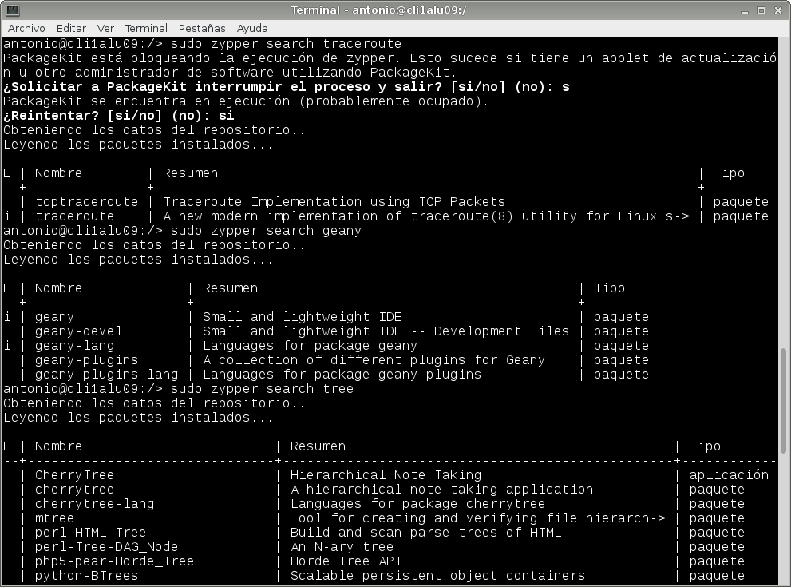

### 3.6. Segunda versión del fichero .pp

Puesto que existen infinidad de parámetros que podemos introducir en las configuraciones de los ficheros .pp para que sean tomadas por los clientes de puppet, vamos a definir un nuevo fichero (hostlinux2.pp) para nuestra máquina cliente OpenSUSE en el cuál se creen usuarios, grupos y carpetas personales.

#### 3.6.1. Ficheros hostlinux2.pp y site.pp

Volvemos al equipo maestro y creamos el fichero `hostlinu2.pp`, a la vez que editamos el `site.pp` para que la máquina cliente tome en esta ocasión el fichero nuevo.

Las órdenes que vamos a introducir en el fichero `hostlinux2.pp` serán las siguientes:

```
class hostlinux2 {
  package { "tree": ensure => installed }
  package { "traceroute": ensure => installed }
  package { "geany": ensure => installed }

  group { "jedy": ensure => "present", }
  group { "admin": ensure => "present", }

  user { 'obi-wan':
    home => '/home/obi-wan',
    shell => '/bin/bash',
    password => 'kenobi',
    groups => ['jedy','admin','root'] 
  }

  file { "/home/obi-wan":
    ensure => "directory",
    owner => "obi-wan",
    group => "jedy",
    mode => 750 
  }

  file { "/home/obi-wan/share":
    ensure => "directory",
    owner => "obi-wan",
    group => "jedy",
    mode => 750 
  }

  file { "/home/obi-wan/share/private":
    ensure => "directory",
    owner => "obi-wan",
    group => "jedy",
    mode => 700 
  }

  file { "/home/obi-wan/share/public":
    ensure => "directory",
    owner => "obi-wan",
    group => "jedy",
    mode => 755 
  }

/*
  package { "gnomine": ensure => purged }
  file {  '/opt/readme.txt' :
    source => 'puppet:///files/readme.txt', 
  }
*/

```

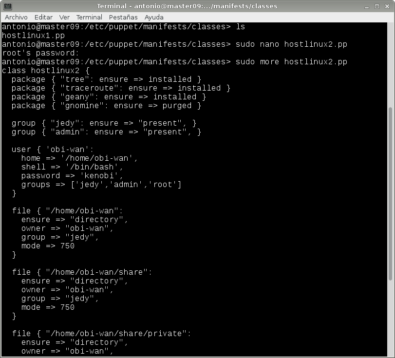

Y editamos el fichero `site.pp` con las mismas líneas que en el primer fichero .pp (hostlinux1.pp) pero, cambiando esta vez de clase; seleccionando así la nueva que hemos creado:


Volvemos a reiniciar el servidor `puppetmaster` para comprobar, yendo a la máquina cliente, que se han ejecutado los parámetros que hemos definido:

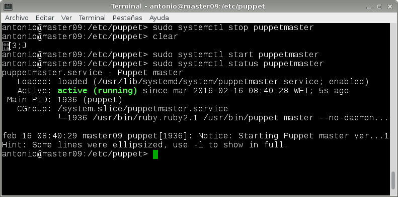

#### 3.6.2. Comprobación segundo fichero .pp

Reiniciar el agente puppet en la máquina cliente y lanzamos el comando `sudo systemctl status puppet -l` para ver el estado y las líneas de información de lo que se ha traído del servidor. Comprobamos que se han ejecutado correctamente:

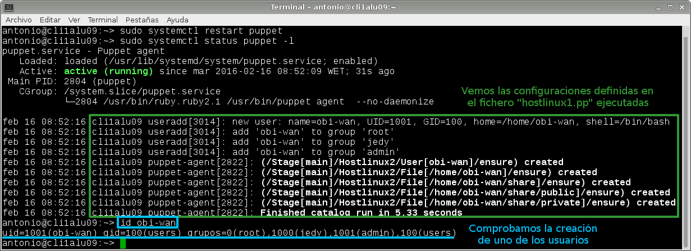

Vemos los grupos creados:

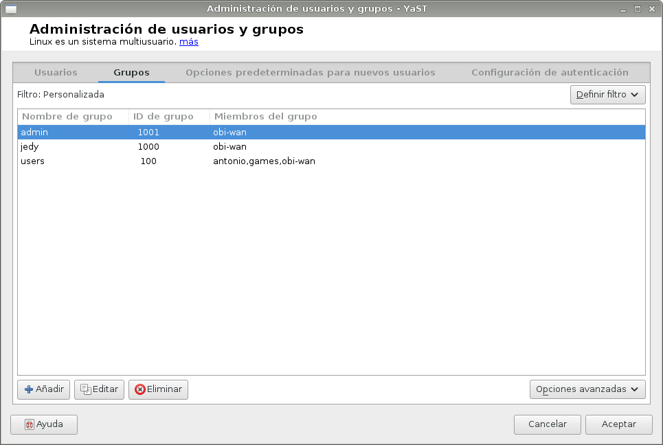

Los usuarios:

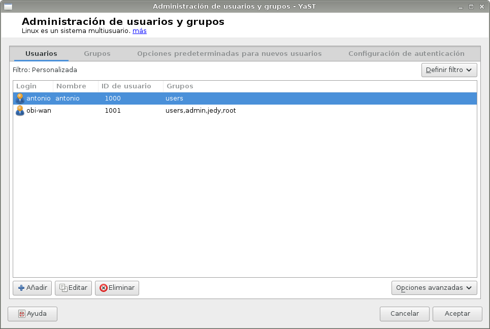

Y la carpeta del usuario:

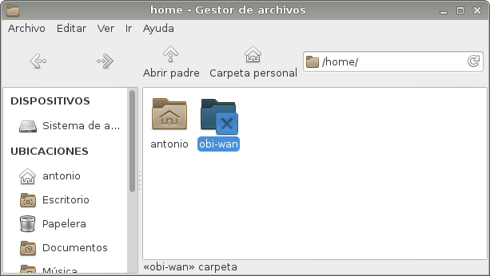


## 4. Máquina CLiente Windows 7

En éste punto realizaremos los mismos pasos que con la máquina cliente OpenSUSE pero en un equipo con Windows 7. Configuraremos los parámetros de red y los nombres de host para luego pasar a la instalación del agente puppet; crearemos a su vez 2 nuevos ficheros .pp que asociaremos a ésta máquina cliente windows, y que usaremos para comprobar que el cliente funciona correctamente.

### 4.1. Configuraciones Previas

Siguiendo los parámetros definidos en el esquema que vemos a continuación vamos a configurar nuestra máquina cliente OpenSUSE:

* IP: 172.18.9.102
* Máscara de red: 255.255.0.0
* Gateway: 172.18.0.1
* Servidor DNS: 8.8.4.4
* Nombre de equipo: cliente2alu09
* Tarjeta de red VBox en modo puente.

### 4.2. Comprobaciones de las Configuraciones

Como con las dos máquinas anteriores (master y cliente 1), definimos los nombres de las 3 en el fichero de host para poder resolver sus nombres de ip. En este caso, los sistemas windows tienen el fichero `hosts` en la ruta `C:\Windows\System32\drivers\etc`. Lo editamos de la siguiente manera y lo guardamos:

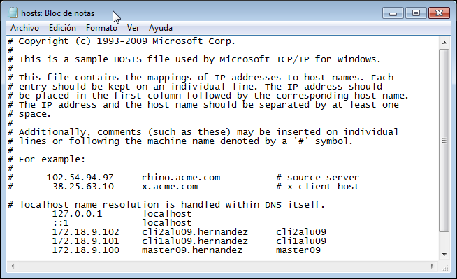

Vemos la configuración de nuesta máquina cliente windows:

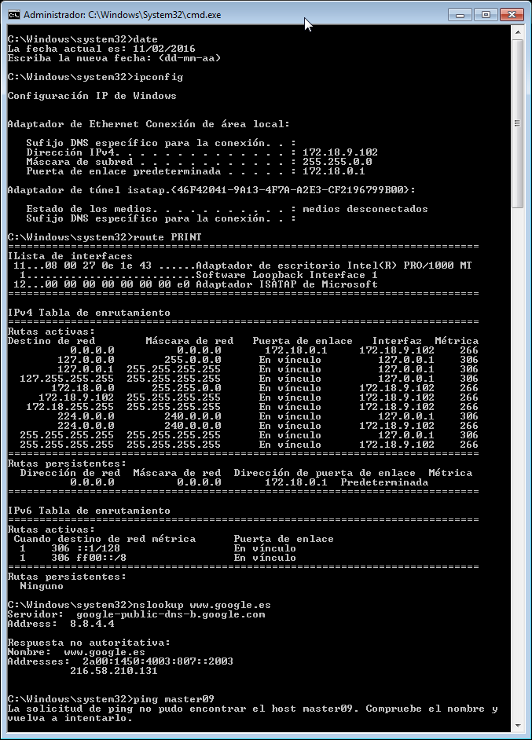

Hacemos ping nuevamente al resto de máquinas para ver que la resolución de nombres funciona:

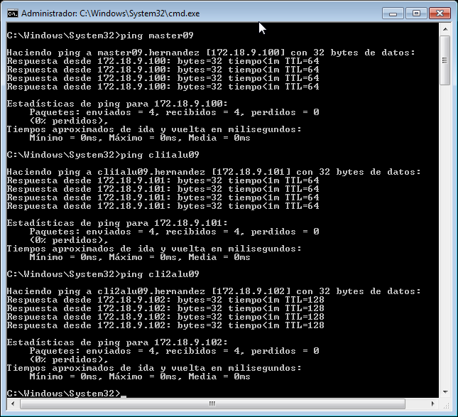

### 4.3. Instalación del cliente Puppet

Una vez introducidos todos los parámetros de red correctamente, pasamos a instalar el cliente puppet en el sistema:

>Nota: Es importante que instalemos la misma versión que hemos instalado en el equipo maestro.
>

Para ver la versión que tenemos instalada en el master, lanzamos el comando `facter` y buscamos el paquete puppet:


Durante la instalación nos pedirá en un momento dado introducir el nombre de host de la máquina servidor donde hemos montado nuestro `puppetmaster`:

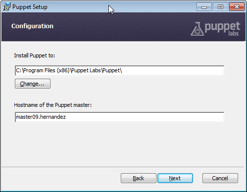

Al instalarlo, y como ya vimos en el caso del cliente OpenSUSE, se enviará una petición de certificado a la máquina maestra.

### 4.4. Intercambio de Certificados

Nos situamos en la máquina donde tenemos el `puppetmaster` instalado y aceptamos el certificado que hemos solicitado para la máquina cliente windows:

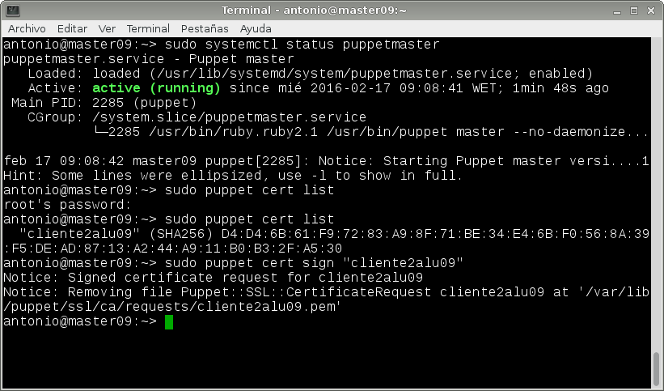

### 4.5. Tercera versión del fichero .pp

Una vez que tenemos los equipos configurados correctamente, vamos a crear otro fichero .pp para nuestro cliente windows.

#### 4.5.1. Ficheros hostwindows3.pp y site.pp

Como ya hemos hecho en los puntos anteriores, generamos el nuevo fichero `hostwindows3.pp` con las órdenes que queremos que se ejecuten en el cliente; y editamos el `site.pp` para asociar dichas configuraciones a la máquina en cuestión.

Para éste fichero `hostwindows.pp` hemos añadido las siguiente líneas:

```
class hostwindows3 {
  file {'C:\warning.txt':
    ensure => 'present',
    content => "Hola Mundo Puppet!",
  }
}
```

Donde definimos la creación de un fichero en la ruta `C:\,` cuyo nombre será `warning.txt` y que contendrá la frase `hola Mundo Puppet!`.

El fichero `site.pp` esta vez lo editamos respetando los parámetros definidos para el nodo cliente OpenSUSE, eliminando el `default` del primer nodo y habilitándo debajo otro para el cliente windows. Quedando de la siguient manera:

```
import "classes/*"

node 'cli1alu09.hernandez' {
  include hostlinux2
}

node 'cliente2alu09' {
  include hostwindows3
}
```


Reiniciamos el `puppetmaster` para que éste tome los nuevos valores introducidos:


#### 4.5.2. Comprobación tercer fichero .pp

Ejecutamos ahora como administradores la consola del cliente puppet y lanzamos el comando `agent --server master09.hernandez --test`. De ésta manera el cliente interpreta la configuración que definimos en el fichero `hostwindows3.pp` y la ejecuta:

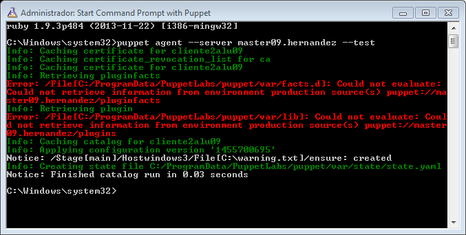

Comprobamos que nos aparece el fichero `warning.txt` y con el texto que habíamos definido:

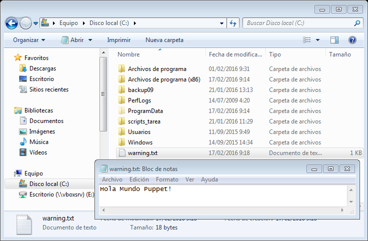

Una vez lo hemos comprobado, lanzamos los siguientes comandos para ver información a cerca del cliente puppet:

* `puppet agent --configprint server`, debe mostrar el nombre del servidor puppet.

* `puppet agent --server master30.vargas --test` Comprobar el estado del agente puppet.

* `puppet agent -t --debug --verbose` Comprobar el estado del agente puppet.

* `facter` Para consultar datos de la máquina windows, como por ejemplo la versión de puppet del cliente.

* `puppet resource user <nombre-usuario>` Para ver la configuración puppet del usuario.

* `puppet resource file c:\Users` Para ver la configuración puppet de la carpeta.

#### 4.5.3. Segunda parte del fichero hostwindows3.pp

Estableciéndo una nueva configuración para el fichero `hostwindows3.pp` vamos a crear usuarios en el sistema. Las líneas que hemos definido esta vez son las siguientes:

```
class hostwindows3 {
  user { 'darth-sidius':
    ensure => 'present',
    groups => ['Administradores']
  }

  user { 'darth-maul':
    ensure => 'present',
    groups => ['Usuarios']
  }
}
```

Luego, reiniciamos el equipo maestro:

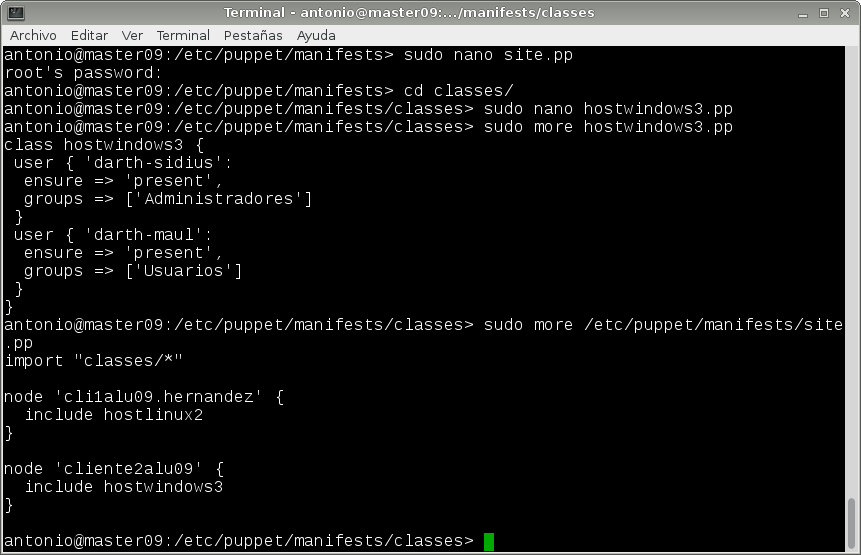

Lanzamos nuevamente el comando `agent --server master09.hernandez --test` desde el cliente windows y vemos si efectivamente se han creado los usuarios:

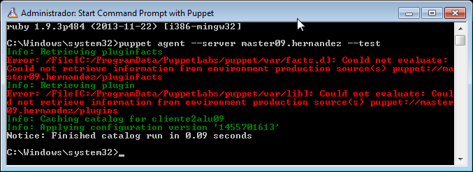

Vemos que sí se han creado:

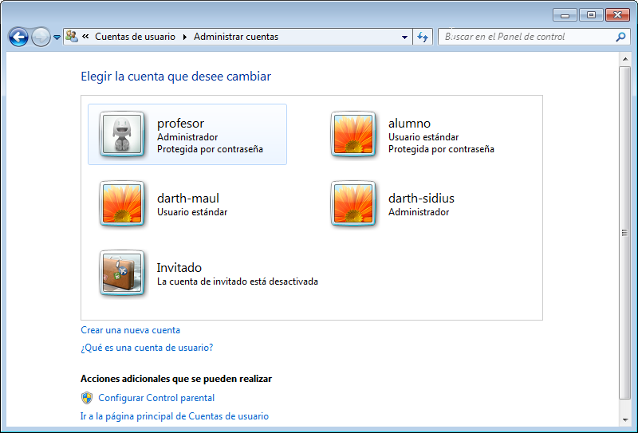

### 4.6. Cuarta versión del fichero pp (hostwindows4.pp)

Para acabar ésta tarea hemos creado un cuarto fichero .pp en el que definir nuevos parámetros para ver su ejecución en el cliente.

#### 4.6.1. Ficheros hostwindows4.pp y site.pp

El fichero con las órdenes a interpretar por el cliente tendrá las siguientes líneas:

* En una primera parte creamos 2 usuarios

```
class hostwindows4{
 user{'Antonio':
 ensure => 'present',
 groups => ['Usuarios']
 }

 user{'yoda':
 ensure => 'present',
 groups => ['Usuarios']
 }
```
* Y en una segunda, 2 carpetas asociadas a esos usuarios con los permisos que hemos creído convenientes: 

```
file{'C:\Users\anto':
   owner => ['Antonio'],
   group => ['Usuarios'],
   mode => 644;
}

file{'C:\Users\yoda':
   owner => ['yoda'],
   group => ['Usuarios'],
   mode => 644;
  }
}
```

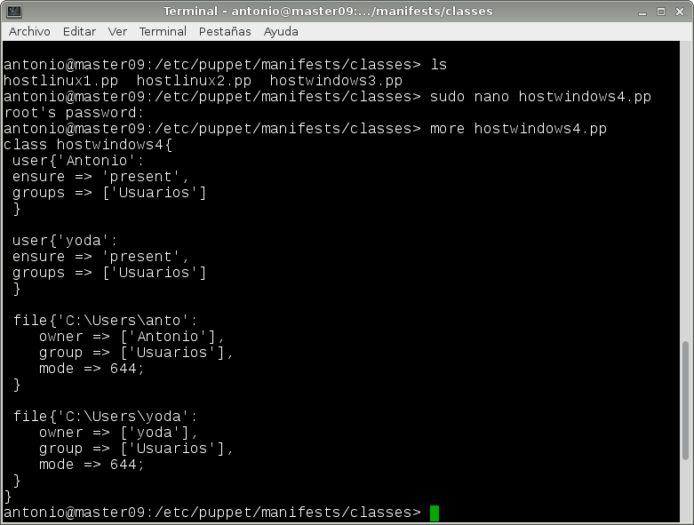

Editamos el fichero `site.pp` para asociar el nuevo fichero a la máquina windows y reiniciamos nuevamente el `puppetmaster` para que tome los parámetros definidos:

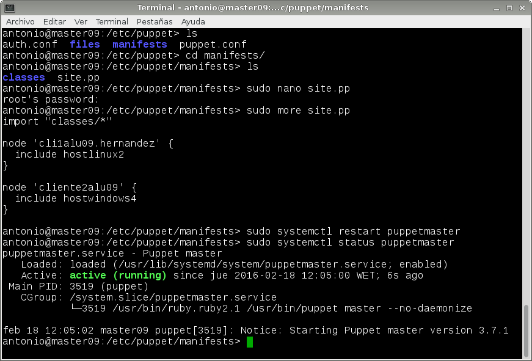

#### 4.6.2. Comprobación cuarto fichero .pp

Hacemos lo propio con el cliente windows, reiniciando el agente puppet paa comprobar que se recogen las configuraciones definidas en el servidor:

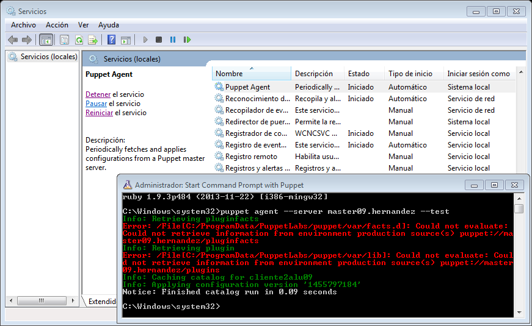

Y comprobamos que los usuarios se han creado correctamente:

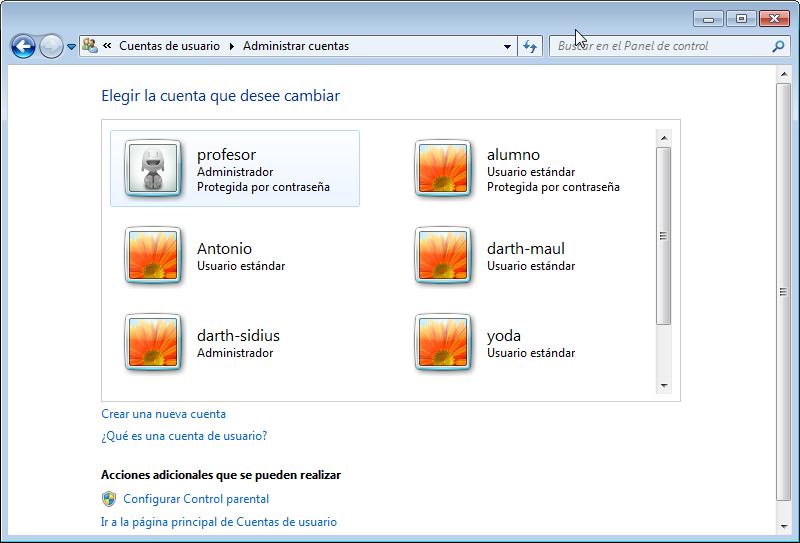


