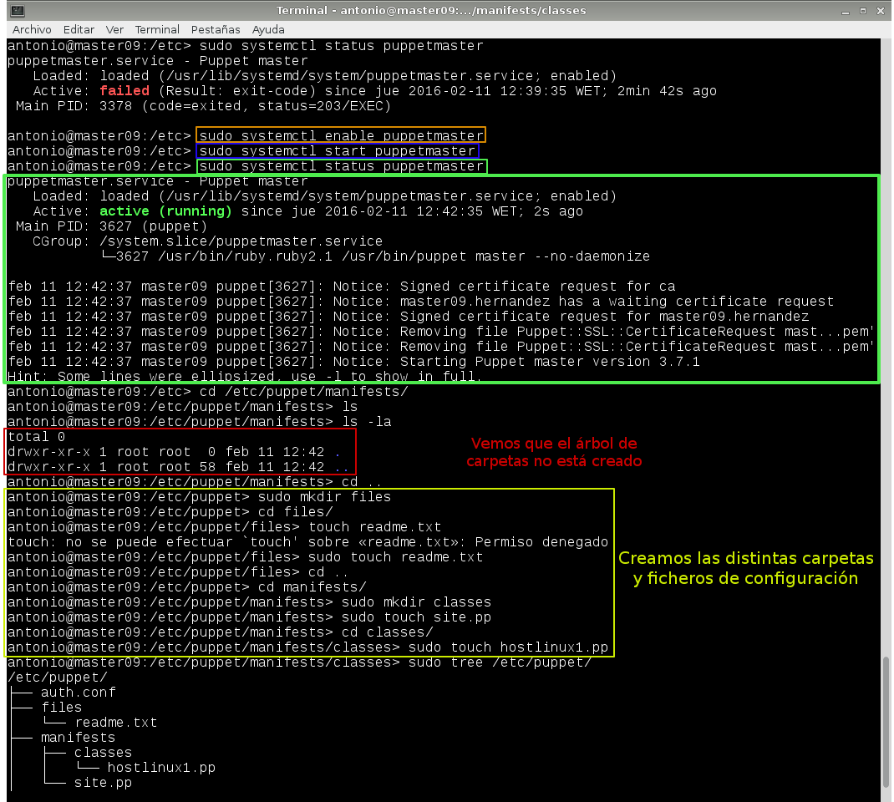
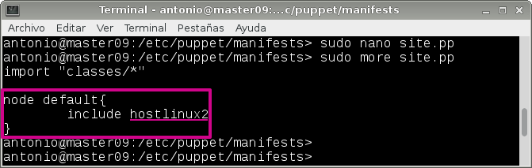

# A3.- Puppet-OpenSUSE

***

* **Autor:**  Antonio Hernández Domínguez
* **Curso:** 2.º ASIR 2015/2016
* **Asignatura:** Administración de Sistemas Operativos
* **Unidad:** 4.ª Automatización de Tareas

***

## 1. Introducción

Una vez que hemos visto como podemos automatizar tareas con el uso de **"Tareas Programadas"** vamos ahondar un poco más en este tema empleando otro tipo de herramientas que nos faciliten, en esta ocasión, la administración de un gran número de máquinas utilizando para ello una única.

Esto resulta interesante si pensamos en los problemas con los que nos encontramos cuando tenemos la tarea de administrar diferentes máquinas; problemas como:

* El uso de ficheros que se repiten por las distintas máquinas, dando lugar a varias versiones de un mismo archivo y la poca portabilidad (o ninguna) entre distintos sistemas o versiones del mismo.

* La gestión manual e individual de cada máquina; el gestionar ordenador por ordenador y la pérdida de tiempo que ello conlleva.

* La gestión de infinitas copias de seguridad o mas bien una por máquina.

* Y por último, la **escabilidad** en la administración de un conjunto de equipos que, al verse incrementado por más máquinas, da como resultado tener una mayor carga de trabajo o mantenimiento.


En la práctica planteada, y con idea de solventar todos los inconvenientes ya mencionados, vamos a hacer uso de un **gestor de o herramienta de gestión de configuraciones centralizada**.


## 2. Tareas Programadas en OpenSUSE

Empezaremos definiendo las tareas programadas en OpenSUSE, empleando para ello los comandos `at` para las tareas diferidas, el fichero `/etc/crontab` para las tareas periódicas y, para las tareas asíncronas, las carpetas `cron` --> `cron.hourly`, `cron.daily` y `cron.monthly`.

### 2.1. Configuraciones Previas

Siguiendo los parámetros definidos en el esquema que vemos a continuación vamos a configurar nuestra máquina:

* IP: 172.18.9.51
* Máscara de red: 255.255.0.0
* Gateway: 172.18.0.1
* Servidor DNS: 8.8.4.4
* Nombre de equipo: hernandez3
* Nombre de dominio: dominguez
* Tarjeta de red VBox en modo puente.

Vemos los parámetros previos definidos:








### 2.2. Tarea Programada Diferida

```
#!bin/sh
	#Tarea programada diferida de apagado del sistema
		sudo shutodwn
```
### 2.3. Tarea Programada Periódica

### 2.4. Tarea Programada Asíncrona

## 3. Tareas Programadas en Windows 7 Enterprise

### 3.2. Tarea Programada Diferida

### 3.3. Tarea Programada Periódica

### 3.4. Tarea Programada Asíncrona