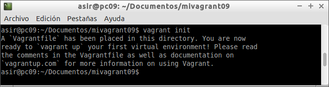

# A4.- Vagrant

***

* **Autor:**  Antonio Hernández Domínguez
* **Curso:** 2.º ASIR 2015/2016
* **Asignatura:** Administración de Sistemas Operativos
* **Unidad:** 4.ª Automatización de Tareas

***

## 1. Introducción

Siguiendo en la línea de estudiar herramientas que hagan de la vida de los "SysAdmins" una feliz existencia; vamos a explicar, con el siguiente informe, el uso de un nuevo software que nos permita montar, configurar y hacer uso de máquinas virtuales, de una manera más rápida y "automatizada". La herramienta a la que hacemos alusión se denomina **"Vagrant"**.
	
Para poder comenzar con el desarrollo de éste texto se hace indispensable partir de la definición de ésta herramienta; y tener así, una idea de lo que vamos a ver a continuación:
	
>Vagrant es una herramienta para la creación y configuración de entornos de desarrollo virtualizados. Originalmente se desarrolló para VirtualBox y sistemas de configuración tales como Chef, Salt y Puppet. Sin embargo desde la versión 1.1 Vagrant es capaz de trabajar con múltiples proveedores, como VMware, Amazon EC2, LXC, DigitalOcean, etc.2 Aunque Vagrant se ha desarrollado en Ruby se puede usar en multitud de proyectos escritos en otros lenguajes, tales como PHP, Python, Java, C# y JavaScript.
>
	
## 2. Primeros Pasos con Vagrant
### 2.1. Instalación






### 2.2. Creando un nuevo proyecto







### 2.3. Obtención de un Box (imagen o caja)









### 2.4. Iniciando la máquina







## 3. Configurando Vagrant
### 3.1. Carpetas sincronizadas
### 3.2. Redireccionamiento de los puertos




### 3.3. Otras Configuraciones

## 4. Aprovisionando nuestras máquinas
### 4.1. Aprovisionamiento mediante script









### 4.2. Aprovisionamiento mediante Puppet









## 5. Creando nuestros Box
