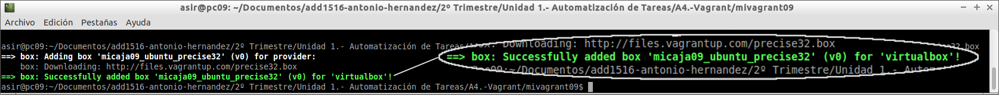

# A4.- Vagrant

***

* **Autor:**  Antonio Hernández Domínguez
* **Curso:** 2.º ASIR 2015/2016
* **Asignatura:** Administración de Sistemas Operativos
* **Unidad:** 4.ª Automatización de Tareas

***

## 1. Introducción

Si en tareas anteriores estudiábamos herramientas para la automatización de tareas; en la que se nos presenta en esta ocasión no va a ser diferente.
Vamos a estudiar, con el siguiente informe, el uso de una nueva herramienta que nos permita
montar máquina virtuales de forma sencilla; proporcionándonos una mayor rapiez de implementación y 
configuración de nuestros sistemas, y viéndose el tiempo de trabajo (o mantenimiento de esas máquinas) reducido a una ínfima parte del que solemos emplear al crear y configurar nuestras máquinas de forma 'manual'. Dicha herramienta es 'Vagrant'.
	
Para poder comenzar con el desarrollo de éste texto se hace indispensable partir de una definición de ésta herramienta que nos de una idea de lo que vamos a hacer con ella:
	
>Vagrant es una herramienta para la creación y configuración de entornos de desarrollo virtualizados.
Originalmente se desarrolló para VirtualBox y sistemas de configuración tales como Chef, Salt y Puppet. 
Sin embargo desde la versión 1.1 Vagrant es capaz de trabajar con múltiples proveedores, como VMware, Amazon EC2, LXC, DigitalOcean, etc.2 Aunque Vagrant se ha desarrollado en Ruby se puede usar en multitud de proyectos escritos en otros lenguajes, tales como PHP, Python, Java, C# y JavaScript.
>
	
## 2.
## 3.
## 4.

