# A4.- Vagrant


***


* **Autor:**  Antonio Hernández Domínguez

* **Curso:** 2.º ASIR 2015/2016

* **Asignatura:** Administración de Sistemas Operativos

* **Unidad:** 4.ª Automatización de Tareas


***


## 1. Introducción


Siguiendo en la línea de estudiar herramientas que hagan de la vida de los "SysAdmins" una feliz existencia; vamos a explicar, con el siguiente informe, el uso de un nuevo software que nos permita montar, configurar y hacer uso de máquinas virtuales, de una manera más rápida y "automatizada". La herramienta a la que hacemos alusión se denomina **"Vagrant"**.

Para poder comenzar con el desarrollo de éste texto se hace indispensable partir de la definición de ésta herramienta; y tener así, una idea de lo que vamos a ver a continuación:

>Vagrant es una herramienta para la creación y configuración de entornos de desarrollo virtualizados. Originalmente se desarrolló para VirtualBox y sistemas de configuración tales como Chef, Salt y Puppet. Sin embargo desde la versión 1.1 Vagrant es capaz de trabajar con múltiples proveedores, como VMware, Amazon EC2, LXC, DigitalOcean, etc.2 Aunque Vagrant se ha desarrollado en Ruby se puede usar en multitud de proyectos escritos en otros lenguajes, tales como PHP, Python, Java, C# y JavaScript.
>

## 2. Primeros Pasos con Vagrant

En este apartado comenzaremos a ver los distintos pasos que debemos seguir para la instalación y puesta en marcha del software Vagrant; y que éste pueda trabajar junto a nuestra virtualizadora. 

### 2.1. Instalación

Para empezar, descargamos el paquete adecuado desde la página oficial de [HashiCorp](https://www.vagrantup.com/downloads.html), teniéndo en cuenta el sistema sobre el que lo vamos a instalar:


### 2.2. Creando un nuevo proyecto

Una vez instalado, abrimos una terminal desde la que vamos a crear una carpeta para nuestro proyecto. Luego, lanzamos el comando `vagrant init` situándonos previamente en la carpeta creada. Con ésto se nos genera un fichero `Vagrantfile` con el que vamos a gestionar nuestra máquina:

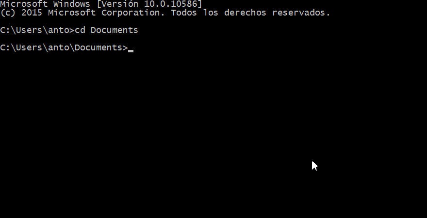

Nos aparecerá el siguiente mensaje informativo:


Éste sería el aspecto inicial del fichero `Vagrantfile`:


### 2.3. Obtención de un Box (imagen o caja)

Ahora, necesitamos obtener una imagen (caja, box) de un sistema operativo. Para ello, empleamos el comando `vagrant box add nombredelamáquina` y la ruta desde la que nos queremos descargar dicho box -esa ruta puede ser un enlace a un fichero en internet o a un fichero que tengamos en local-.

Por el momento vamos a descargarnos un box desde la página oficial de vagrant; el comando lanzado para nuestro box quedaría de la siguiente manera.

`vagrant box add micaja09_ubuntu_precise32 http://files.vagrantup.com/precise32.box`

>Nota: Box, caja o imagen de vagrant; son los sistemas "pelados" que vamos a emplear como base de nuestra máquina virtual.
>

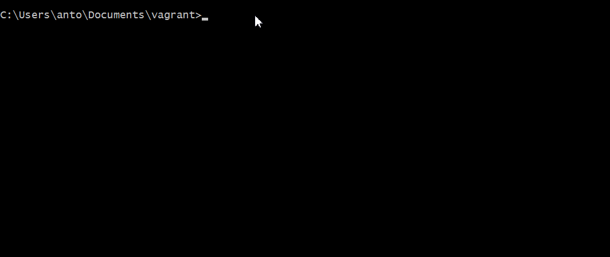

Nos fijamos que al finalizar la ejecución del comando aparece el siguiente mensaje con el nombre del `box` entre comillas. Es importante quedárnos con el nombre que le hemos dado para poder luego iniciar la máquina:


Vemos ahora, antes de seguir, el árbol de directorios que tenemos hasta el momento:

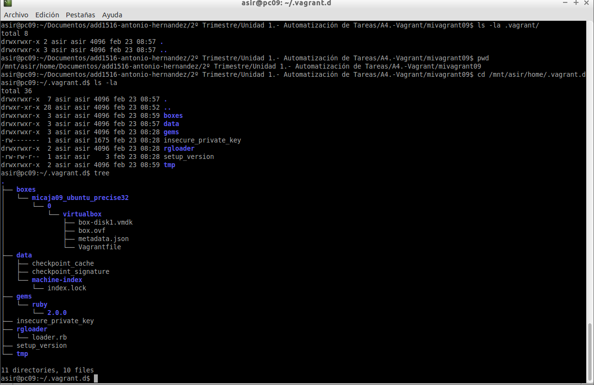

### 2.4. Iniciando la máquina

En éste punto vamos a iniciar el box que nos hemos descargado, como una máquina virtual. Cabe decir que la virtuailzadora será `VirtualBox`, con vagrant sólo gestionamos las máquinas.
Para arrancar la máquina tenemos que editar el fichero `Vagrantfile` y añadir el nombre del box que le habíamos dado cuando lo descargamos:

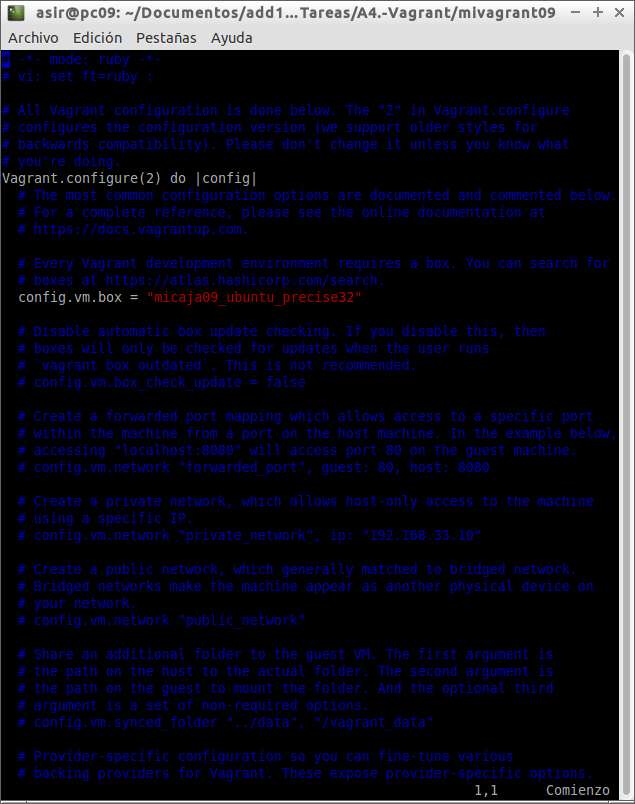

Una vez editado, lanzamos el comando `vagrant up` dentro de la carpeta donde tenemos el fichero `vagrantfile`:


Una vez terminado el comando, si nos vamos al administrador de virtualbox podemos ver que la máquina aparece, y en ejecución:


Puesto que no dispone de entorno gráfico la máquina que hemos creado, nos conectámos mediante el protocolo `SSH` a la máquina en cuestión (comando `<usuarioválidodelamáquina> ssh`--> `vagrant ssh`):

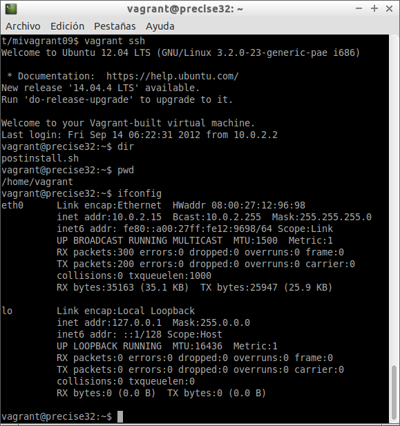

## 3. Configurando Vagrant

Ya hemos visto como descargar un box e implementar una máquina virtual partiéndo de éste; a la vez que hemos entrado a dicha máquina mediante el uso de terminal y SSH. Ahora, y puesto que apenas hemos tocado el fichero `Vagrantfile`, vamos a modificarlo para agregarle distintas configuraciones que nos permitan ver como cambia nuestra máquina según qué parámetros.

### 3.1. Carpetas sincronizadas

La carpeta del proyecto que contiene el Vagrantfile comparte los archivos entre el sistema anfitrión y el virtualizado, esto nos permite compartir archivos fácilmente entre los ambientes.

Para identificar la carpeta compartida dentro del ambiente virtual, lo que hacemos es:

```
vagrant up
vagrant ssh
ls /vagrant
```
Esto nos mostrará que efectivamente el directorio /vagrant dentro del ambiente virtual posee el mismo Vagrantfile que se encuentra en nuestro sistema anfitrión. Cualquier archivo que coloquemos en este directorio será accesible desde cualquiera de los 2 extremos.


### 3.2. Redireccionamiento de los puertos

Uno de los casos más comunes cuando tenemos una máquina virtual es la situación que estamos trabajando con proyectos enfocados a la web, y para acceder a las páginas no es lo más cómodo tener que meternos por terminal al ambiente virtual y llamarlas desde ahí, aquí entra en juego el enrutamiento de puertos.

Modificar el fichero Vagrantfile, de modo que el puerto 8080 del sistema anfitrión será enrutado al puerto 80 del ambiente virtualizado.

```
config.vm.network :forwarded_port, host: 8080, guest: 80
```


### 3.3. Otras Configuraciones

Puesto que no existen límites, aparentemente, en las distintas combinaciones de configuración que podemos agregar a nuestro fichero `Vagrantfile`, vamos a estudiar una pocas que nos sirvan como base para otras posibles configuraciones que se nos ocurran:

Ejemplo para configurar la red:

```
  config.vm.network "private_network", ip: "192.168.33.10"
```

Ejemplo para configurar las carpetas compartidas:

```
  config.vm.synced_folder "htdocs", "/var/www/html"
```

Ejemplo, configurar en Vagrantfile la conexión SSH de vagrant a nuestra máquina:

```
  config.ssh.username = 'root'
  config.ssh.password = 'vagrant'
  config.ssh.insert_key = 'true'
```

Ejemplo para configurar en Vagrantfile la ejecución remota de aplicaciones gráficas instaladas en la máquina virtual, mediante SSH:

```
  config.ssh.forward_agent = true
  config.ssh.forward_x11 = true
```

## 4. Aprovisionando nuestras máquinas

Avanzando un poco más dentro del mundo **Vagrant**, veremos ahora cómo podemos "aprovisionar" nuestras máquinas mediante el uso de scripts de configuración, que definiremos para que se ejecuten automáticamente al iniciar la máquina; ó, con el uso de **Puppet**  (mendiante los "manifiestos" y las "clases") y cuya herramienta --gestora de configuraciones centralizada-- ya vimos en tareas anteriores.

### 4.1. Aprovisionamiento mediante script

Empezaremos definiendo un script con extensión `.sh` puesto que la máquina virtual tiene un sistema GNU/Linux cuya terminal es de tipo 'bash'; en el que añadimos las órdenes que queremos que se ejecuten en nuestra máquina. Para el ejemplo que se nos plantea vamos a montar un servidor HTTP apache con un fichero html al que le agregamos algunas líneas y que mostraremos luego para verificar que se ha ejecutado correctamente el script:

```
#!/usr/bin/env bash

    apt-get update
    apt-get install -y apache2
    rm -rf /var/www
    ln -fs /vagrant /var/www
    echo "<h1>Actividad de Vagrant</h1>" > /var/www/index.html
    echo "<p>Curso201516</p>" >> /var/www/index.html
    echo "<p>Nombre-del-alumno</p>" >> /var/www/index.html
```

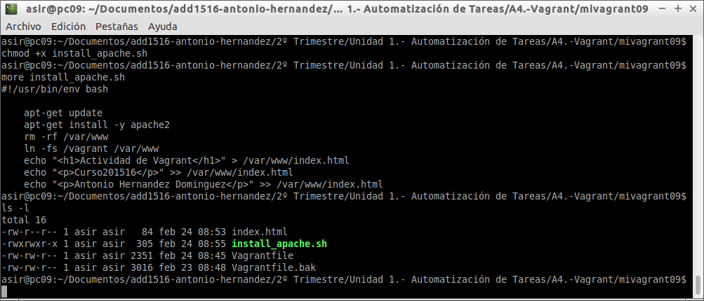

Luego, para que el script se ejecute cuando arranquemos la máquina con `vagrant up`, tenemos que modificar el fichero `Vagrantfile` para especificar la ruta y el nombre del mismo script de la siguiente manera:

```
config.vm.provision :shell, :path=>"install_apache.sh"
```

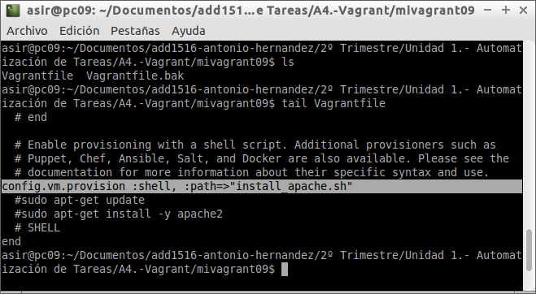

Arrancamos la máquina si ésta no estaba en ejecución ó, si se diese el caso de que SÍ; podemos lanzar el comando `vagrant reload` para que recarrgue los parámetros definidos en el fichero `vagrantfile`:


Una vez termine de recargarse o de iniciarse la máquina, nos conectámos a través de nuestro navegador para ver que tódo ha salido bien:

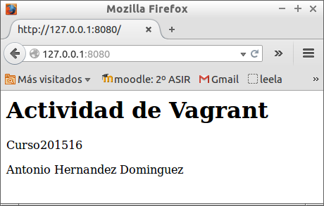

### 4.2. Aprovisionamiento mediante Puppet

Ahora vamos a emplear `puppet` para definir fichero `.pp` que sean tomados en consideración por el fichero `vagrantfile` y que las configuraciones que contega se ejecuten.

Empezamos definiendo un fichero `.pp` al que hemos llamado en nuestro caso `vagpuppet.pp` con los párametros que querámos que se reviertan en nuestra máquina --éste fichero vendría a ser como el script del apartado anterior--, y luego volvemos a editar el archivo `vagrantfile` para que se tenga en cuenta la existencia de éste y se ejecute:

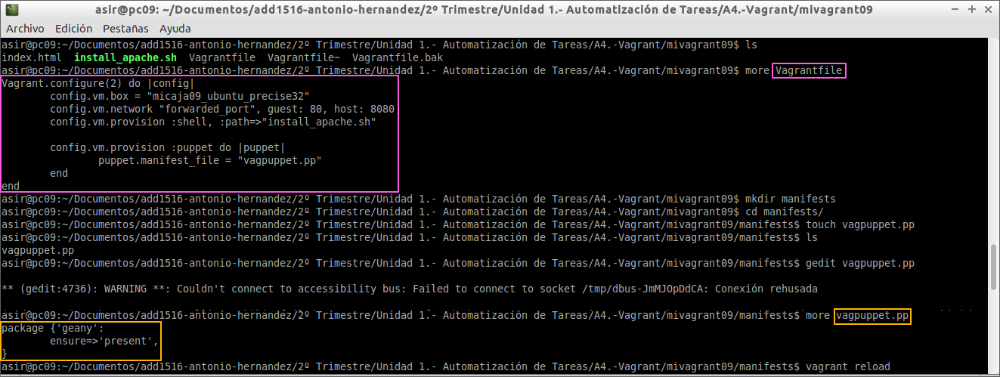

Recargamos nuevamente la máquina y vemos que en esta ocasión nos aparece un mensaje en el que se nos advierte de que la máquina 'ya está o ha sido aprovisionada'; por lo que si queremos que tome las nuevas configuraciones tenemos que lanzar el comando `vagrant provision`:


Una vez lanzado el comando vemos qué, ahora sí, toma la configuración definida vía 'Puppet', y que ejecuta el fichero `vagpuppet.pp`:


Volvemos a conectarnos vía `ssh` a la máquina virtual y comprobamos que la configuración que habíamos introducido en el fichero `vagpuppet.pp` se ha ejecutado; en este caso era la instalación de 'geany':

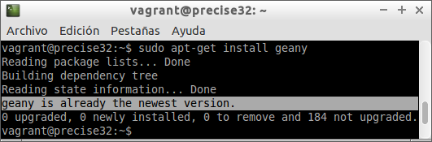

#### 4.2.1. Otros ejemplos (Vagrant+Puppet-->MySQL Server)

Ejemplo para montar un servidor MySQL desde cero, pasando por la creación de una base de datos hasta la implantación de un usuario dentro del propio servidor para su gestión ([enlace al fichero](https://github.com/AntonioHD/add1516-antonio-hernandez/blob/master/2%C2%BA%20Trimestre/Unidad%201.-%20Automatizaci%C3%B3n%20de%20Tareas/A4.-Vagrant/mysql.pp)):

```
class { '::mysql::server':
    root_password => 'strongpass',
    remove_default_accounts => false,
    restart => true
    override_options => {
      mysqld => { bind-address => '0.0.0.0'} //permitir conexiones entrantes desde cualquier ip
    }
  }

//crear una base de datos llamada `mydb`, un usuario y asignarle una contraseña
  mysql::db { 'mydb':
      user     => 'admin',
      password => 'secret',
      host     => '192.168.33.1',
    }

//asignarle todos los permisos al usuario que acabamos de crear
  mysql_grant { 'admin@192.168.33.1/*.*':
	require => Class['::mysql::server']
    ensure     => 'present',
    options    => ['GRANT'],
    privileges => ['ALL'],
    table      => '*.*',
    user       => 'admin@192.168.33.1',
  }
```

## 5. Creando nuestro propio Box

En caso de que quisiésemos obtener un box a partir de una máquina que ya hayamos creado y tengamos en funcionamiento, con todos el software, parámetros de red, configuraciones, etc... que éste tuviese, ¿Cómo lo haríamos?. En el siguiente punto se detallan los pasos a seguir para el fin que hemos planteado, en nuestro caso hemos optado por gener un 'box' a partir de una máquina virtual con **Debian8**.

### 5.1. Usuarios y Claves

Para que vagrant pueda hacer uso de la máquina virtual, y exportar ésta como un box de vagrant; es necesario tener un usuario de nombre **'vagrant'** cuya contraseña también sea **'vagrant'**, y que a su vez pertenezca al grupo de administradores de la máquina en cuestión. Por otro lado, como vagrant utiliza las conexiones `ssh` para tener acceso a las máquinas, se hace necesario instalar dicho servicio para luego definir una claves que serán utilizadas a la hora de realizar la conexión.

Empezamos definiendo el usuario dentro de la máquina, recordemos que el sistema es un GNU/Linux Debian 8 por lo que con `useradd -m vagrant` creamos el usuario y la carpeta `home` del mismo. Luego, creamos una carpeta oculta `.ssh` donde vamos a alojar las claves para el intercambio de las mismas con la máquina anfitrión. Le damos los permisos correspondientes a la carpeta y al fichero con las claves y terminamos:


Para que el usuario `vagrant` no tenga nigún tipo de problemas a la hora de realizar las gestiones pertinentes dentro de la máquina lo añadimos al grupo de administradores editando el fichero `/etc/sudoers.d`. Si lanzamos el comando `visudo` podemos editar directamente dicho fichero. Agregamos la siguiente línea `vagrant ALL=(ALL:ALL) ALL` debajo de la del usuario root y lo guardamos:


Para mayor seguridad con respecto a la "no" obstaculización del usuario vagrant, vamos a cambiar también la contraseña del administrador (root) para que sea `vagrant`:


Comprobamos ahora que tenemos las `Guest Additions` de virtualbox instaladas, para que no tengamos límites a la hora de arrancar la máquina en VirtualBox mediante vagrant y apagamos la máquina:

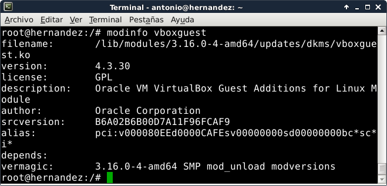

###5.2. Exportar la máquina como box

Ahora, vovliendo a la máquina anfitrión, vamos a lanzar los comandos necesarios para que se exporte la máquina como box de vagrant.

Creamos en primer lugar una carpeta donde alojar el fichero del box que se va a generar.Nos situamos en la carpeta para luego, con el comando `vagrant package --base ` y el nombre de la máquina (en nuestro caso quedaría --> `vagrant package --base Debian8`), exportar la máquina:

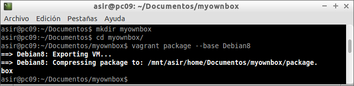

Comprobamos que se ha generado el fichero `package.box` y ya podemos hacer uso de nuestro box o caja de vagrant para crear, en base a dicho fichero, las máquinas virtuales que queramos:


###5.3. Usando nuestro propio Box

Como ya hicimos en los apartados iniciales de éste documento, vamos a lanzar los comandos necesarios para agregar un box (y a hacer uso del mismo) para implementar una nueva máquina virtual; con la salvedad de que en éste caso será la caja que hemos creado la elegida para tal cometido. Creamos primero una carpeta donde alojar los ficheros que se van a compartir con la máquina y donde se alojará el fichero `vagrantfile` de la misma. Luiego, nos situamos dentro de la misma y lanzamos el comando `vagrant box add <nombrequequeramosdarle> y <rutadelfichero.box>`, lo que en nuestro caso quedaría --> `vagrant box add debianbyvagrant /mnt/asir/home/Documentos/myownbox/package.box`:


Vemos que se ha agregado correctamente por lo que luego sólo tenemos que lanzar el comando `vagrant init` para que se genere el fichero `Vagrantfile`, y editar el mismo para que cuando lancemos el comando `vagrant up` en la carpeta del fichero, arranque la máquina en cuestión:

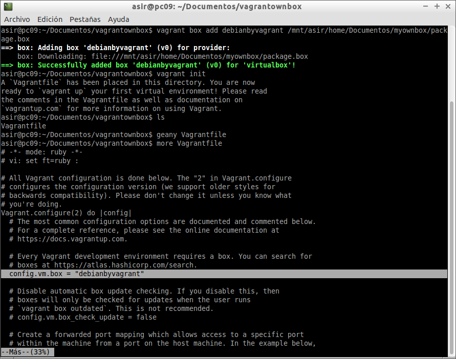

Lanzamos el comando y comprobamos que efectivamente la máquina se ha iniciado:

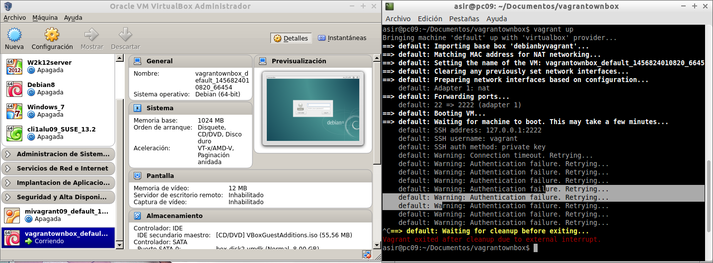

En nuestro caso nos ha aparecido un error a la hora de conectarse vagrant con la máquina mediante ssh porque no hemos deshabilitado la introducción de contraseña a la hora de iniciar el sistema. Aún así, y para lo que se plantea discernir en éste punto, no es relevante; puesto que la máquina está operativa y se ha evidenciado el correcto funcionamiento del box que habíamos generado.