# 1. Procesos

Un programa (estático) es un conjunto de instrucciones y datos que se encuentran almacenados en un
fichero ordinario. Cuando un programa es leído por el sistema operativo y cargado en memoria para
ejecutarse, se convierte en un **proceso** (dinámico). A los procesos, el sistema operativo les asigna recursos
para que puedan ejecutarse correctamente. Entre estos recursos podemos citar: memoria, CPU,
dispositivos de entrada-salida etc.

Cada proceso en Linux tiene asociado un número que lo identifica. Este número es asignado por el
núcleo, y se denomina identificador de proceso o PID (Process IDdentifier). Además del PID, los
procesos tienen asignado otro número denominado PPID (Parent PID), que identifica al proceso “padre”
del proceso en cuestión. Un proceso “padre” puede tener varios “hijos” pero cada “hijo” sólo tiene un
“padre”.

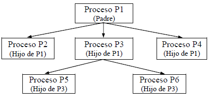

## 1.1. Procesos en “primer plano” y en “segundo plano”

Un sistema operativo Linux tiene la posibilidad de ejecutar una orden en primer plano (foreground) y
una o más órdenes en segundo plano (background), originando cada una de ellas uno o más procesos.
El procesamiento en “segundo plano” está indicado para comandos que cumplen las siguientes
condiciones:

* Tiempo de ejecución grande. Así se pueden ejecutar inmediatamente otros comandos tanto en “primer
plano” como en “segundo plano”.
* No interactúan con el usuario. No necesiten entradas procedentes del teclado.
* No producen salida en pantalla. O si la producen se redirigen a un fichero (para conservarla) o al
dispositivo nulo (para eliminarla).
* No requieren prioridad alta. El kernel asigna menor prioridad a los procesos en “segundo plano”.
La ejecución de una orden en “segundo plamo” origina una tarea (trabajo).


# 2. Servicios

Un servicio es un programa que se ejecuta en segundo plano, fuera del control interactivo de los usuarios del sistema ya que carecen de interfaz con estos.

El sistema generalmente inicia los demonios durante el arranque, siendo las funciones más comunes de estos las de ofrecer servicios a otros programas, ya sea respondiendo a las peticiones que llegan a través de la red o atendiendo a procesos que se ejecutan en el mismo sistema, así como responder ante cierta actividad del hardware 
- Por ejemplo:
-  *acpid* maneja el apagado del sistema cuando el usuario pulsa el botón de encendido del equipo. 
-  *Cron* ejecutar tareas planificadas.

**init**

El servicio individual más importante en un sistema UNIX es provisto por init. init es el primer proceso que se inicia en todo sistema UNIX, siendo la última acción que el núcleo realiza al arrancar. Cuando init comienza su ejecución, continúa con el proceso de arranque del sistema, realizando varias tareas de inicio (chequear y montar sistemas de archivos, iniciar demonios, etc.). 

Directorio *init.d*

En el directorio */etc/init.d* (puede ser */etc/rc.d/init.d*) se encuentran los scripts que permiten controlar los servicios y su ejecución. 

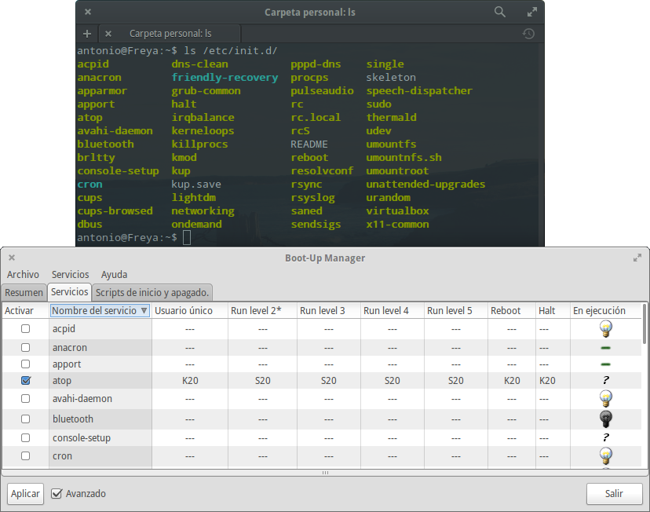

Cada uno de éstos shells aqui existentes aceptan, casi de manera general, los parámetros:

	start
   	stop
   	restart
   	status

Algunos aceptan más, y pocos aceptan menos. Los parámetros suelen ser muy descriptivos (iniciar, detener, reiniciar y estatus del servicio). Así pues, para reiniciar nuestro servidor Apache en Ubuntu bastaría con escribir:

`/etc/init.d/servicio parametro`

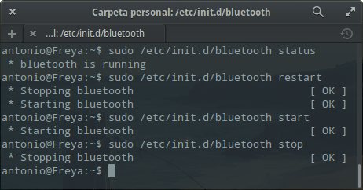

Comando `service`

Este comando, presente en la mayoría de distros, nos permite de igual manera interactuar con los servicios instalados en nuestro equipo, su sintaxis:

`service servicio parametro`

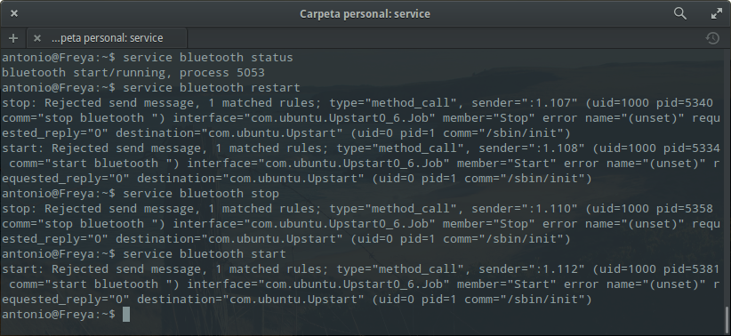


## 3. Comandos para procesos

**top**

El comando top es un clásico para mostrar los recursos usados por tu sistema y así poder ver cual de ellos consume más.

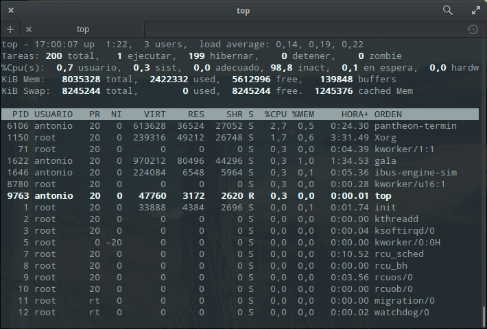

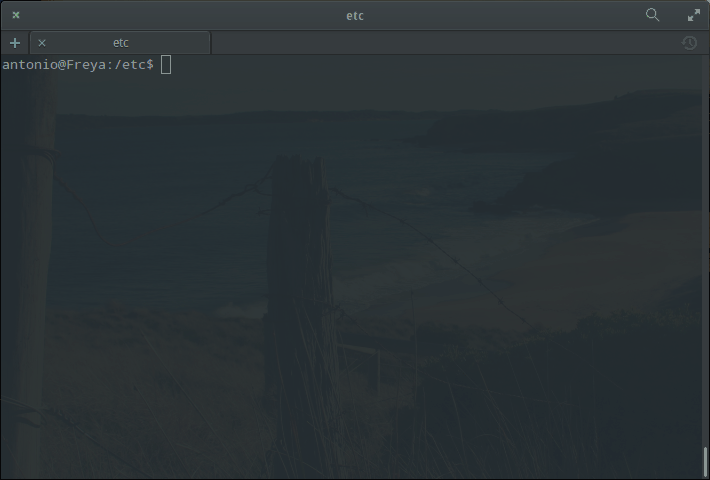


**htop**

Es un “top” mejorado, no suele venir instalado en las distribuciones Linux. Sobre todo es más fácil de interpretar que su hermano top y además puedes realizar operaciones como parar un proceso usando las teclas.

Puedes instalarlo así en caso de no tenerlo en tu sistema:
	
`sudo apt-get install htop`

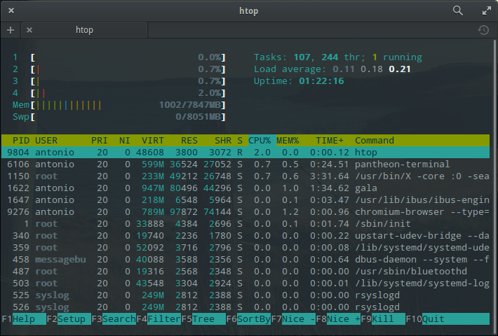

**ps**

El comando más usado (y universal) para manipular procesos en Linux. Muestra todos los procesos y además puedes realizar operaciones con ellos. Recuerda que puedes enlazarlos con otros comandos (por ejemplo con “grep” para buscar un proceso específico) usando las famosas pipes o tuberías. Ejemplo para buscar procesos de Firefox:
	
ps -A | grep firefox

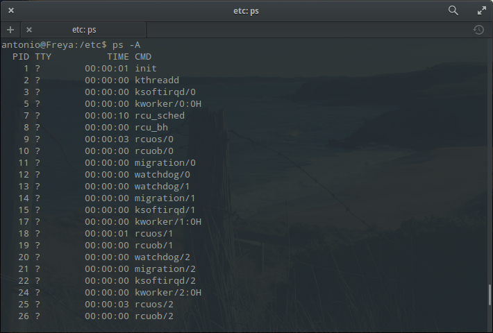


**pstree**

Visualiza todos los procesos en forma de árbol para mostrar sus dependencias.

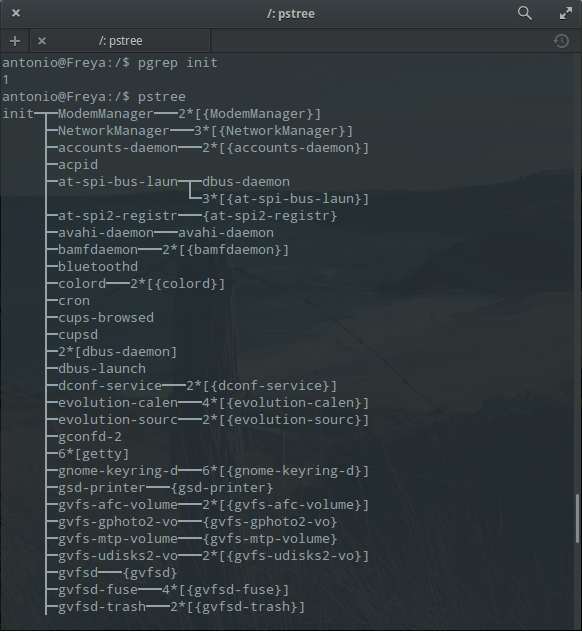

**kill**

Comando para matar o parar un proceso, funciona dando su ID.

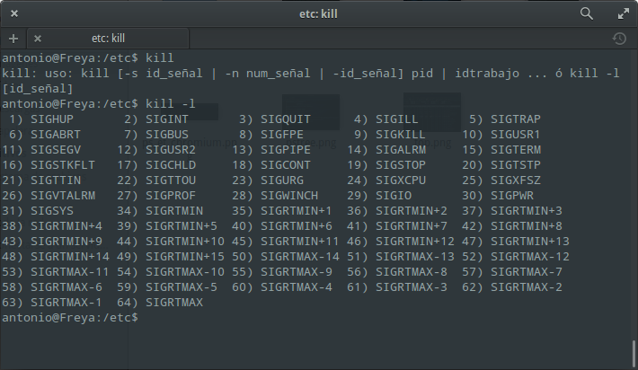

**pgrep**

Devuelve el ID del proceso que coincide con la búsqueda:
	
pgrep init


**pkill & killall**

Estos comandos pueden matar procesos dando el nombre del mismo. 

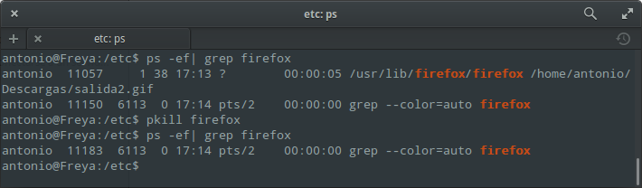

**renice**

Este comando cambia el valor “nice” de un proceso en ejecución. El valor “nice” determina la prioridad del proceso. Un valor de -19 es de muy alta prioridad, mientras que un valor 19 es de baja prioridad. Por defecto el valor es el 0. Necesita el PID del proceso:
	
renice 19 PID

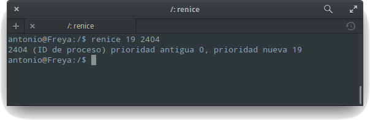

**xkill**

Si ejecutas este comando desde un terminal en modo gráfico, el cursor cambiará a un símbolo “X” y con él podrás matar cualquier programa gráfico abierto que tengas en tus escritorios (si no quieres  matarlo, haz click con el botón derecho). 

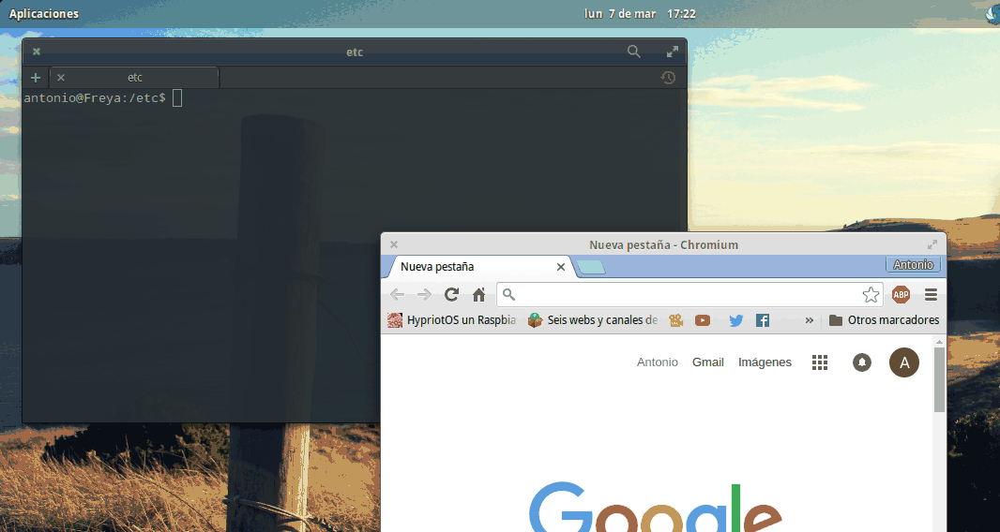

**atop**

Monitor de procesos en ASCII en tiempo real donde muestra CPU, memoria, capas de red, usuario, prioridad, etc para cada proceso activo.

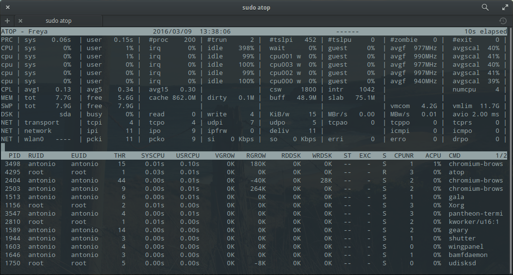

## 4. Práctica creación de un servicio

En éste último apartado vamos a ver los pasos a seguir para crear nuestro propio servicio mediante la definición de 2 script en Ruby:

* Uno que ejecute una serie de comandos, dicho script será nuestro **demonio**.

* Y otro para controlar el funcionamiento (inicio/parada) de dicho demonio.

A su vez tendremos 2 ficheros más:

* Uno que crearemos para registrar las salidas de los comandos que va a ejecutar el script demonio.

* Y otro fichero de estado que creará el script al iniciarse y tomará de referencia para continuar con su ejecución (será la condición del bucle).

### 4.1. Script demonio

Lo primero que vamos a hacer es crear el script en la ruta `/usr/local/bin`; la elección de dicha ruta no se ha hecho al azar puesto que, los ejecutables suelen alojarse en las carpetas `bin` de los sistemas GNU/Linux (entre otras carpetas), y más concretamente en dicha ruta para diferenciar los ejecutables propios del sistema de los que defina el usuario. El script se llamará `kupd`.

El script se va a encargar de recoger varios datos del sistema para agregarlos luego a un fichero `.log` que vamos a crear más adelante para dicho fin. Las líneas del script serán las siguientes:

```
#!/usr/bin/ruby
#
# Filename: /usr/local/bin/kupd
# Version: 1

#Definimos las variables a emplear
ALUMNO="Antonio"
MAQUINA=`hostname`
DIRCONF="/etc/kup"
LOGFILE=DIRCONF+"/kup.log"

#Creamos un fichero en la ruta /etc/kup con el nombre "running"
system("touch #{DIRCONF}/running")

#Mostramos un mensaje por pantalla del inicio del script
system("echo \"Iniciando el log...\" > #{LOGFILE}")

#Definimos un bucle infinito con la condición de existencia del fichero "running"
while File.exists?(DIRCONF+"/running") do
	message="#{ALUMNO}@#{MAQUINA} #{$0}: "+Time.now.to_s
	system("echo \"#{message}\" >> #{LOGFILE}")
	sleep 1
end
```


Le damos al fichero permisos de ejecución:

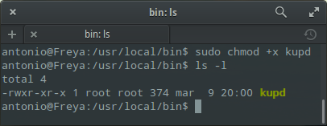

## 4.2. Fichero Log

Una vez hemos creado el script, pasamos a definir la carpeta `/etc/kup`, y un fichero `/etc/kup/kup.log` para que el script almacene en este las líneas de texto que ya hemos mencionado:

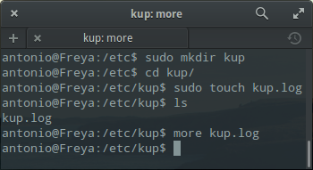

Es importante que éste fichero tenga también los permisos correspondientes, puesto que el script va a editar dicho fichero.

### 4.3. Funcionamiento de nuestro demonio

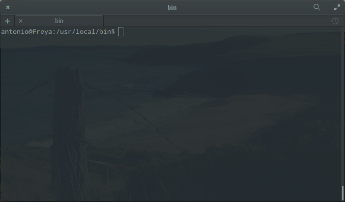

Una vez tenemos los 2 ficheros en orden, ejecutamos el script en segundo plano con la siguiente línea:

`/usr/local/bin/kupd &`

Una vez ejecutado, hacemos un `cat` del fichero `/etc/kup/kup.log` para ver si efectivamente se estan añadiéndo las líneas correspondientes:

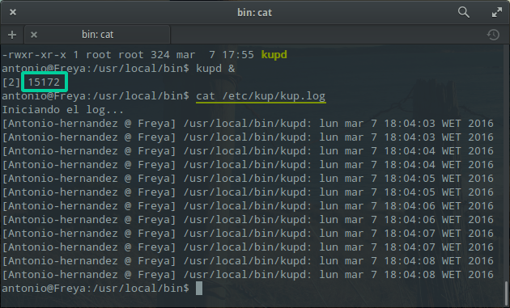

Comprobamos a su vez que está en ejecución --fijándonos en el número de proceso asignado (PID)-- haciéndo un `ps -ef| grep kupd`.

Para parar el proceso, hacemos un borrado del fichero de estado que crea el propio script al ejecutarlo y comprobamos que efectivamente éste se detiene:

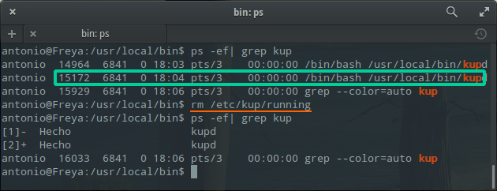

### 4.4. Script de control

Para que el proceso que hemos definido sea un servicio, vamos a crear un script de control que se ejecutará con el arranque del sistema; y que se encargará de definir el comportamiento de nuestro proceso.

Crearemos dicho script en `/etc/init.d/kup`. Como ya hemos dicho, será un script que controlará el inicio/parada de nuestro demonio, al estilo System V.

El contenido de dicho fichero estará basado en el `/etc/init.d/skeleton` que viene por defecto con el sistema (aunque éste este escrito en bash); y nos servirá de guía para definir nuestro script de control. Las líneas serán las siguientes:

```
#!/usr/bin/ruby
### BEGIN INIT INFO
# Provides: kup
# Default-Start: 2 3 4 5
# Default-Stop: 0 1 6
### END INIT INFO
#File: /etc/init.d/kup

option=ARGV.first

def show_status
if File.exists?("/etc/kup/running") then
	puts "Service KUP is running"
else 
	puts "Service KUP is stopped"
end
end

if option=="start" then
	system("/usr/local/bin/kupd &")
elsif option=="stop" then
	system("rm /etc/kup/running")
elsif option=="status" then
	show_status
else
	puts "Modo de uso: #{$0} [start|stop|status]"
end
```

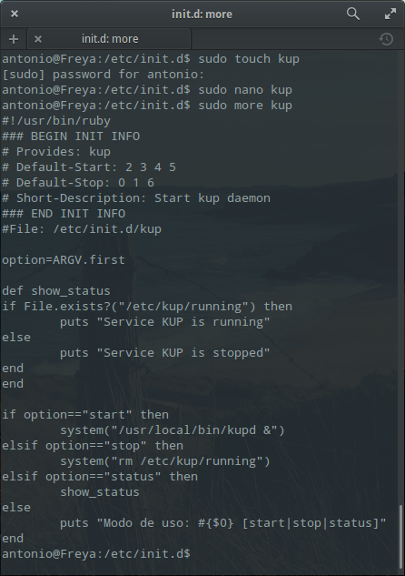

Le damos permisos de ejecución al script:

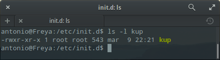

### 4.5. Funcionamiento de nuestro servicio

Probaremos ahora que el guión de inicio/parada funciona correctamente con nuestro servicio, mediante el comando `/etc/init.d/kup [start|stop|status]`:

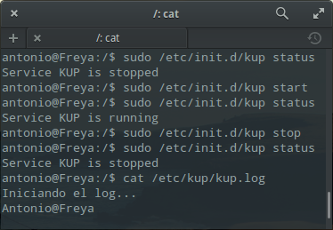

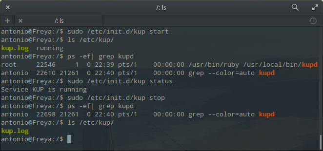


