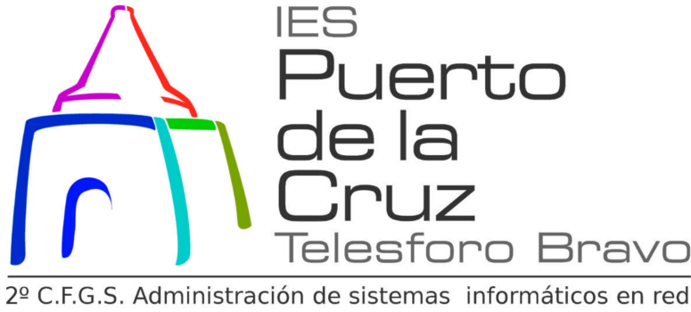

***
***
#1. Introducción

	En esta actividad hemos ahondado un poco más en la realización de instalaciones "desatendidas", práctica que ya realizamos, pero que en esta ocasión emplearemos un sistema windows en vez de uno GNU/Linux. Con la imagen de un sistema operativo "windows 7 Enterprise" crearemos nuevamente nuestro fichero de control o, en este caso, "archivo de respuesta". En él recogeremos todos los datos que nos interesen para la configuración de nuestro sistema y, posteriormente, lo añadiremos a nuestra imagen iso de instalación.

##1.1.

#2.

	Para realizar la creación de nuestro fichero de respuesta de haremos uso de la herramienta "AIK" de windows. Antes de instalar dicha herramienta, cogeremos nuestra iso del sistema y, con los ficheros extraídos, la situamos en "C:\":

##2.1.

#3.

##3.1.

#4.

##4.1.
#5.
##5.1.
#6.
##6.1.
#7.
##7.1.