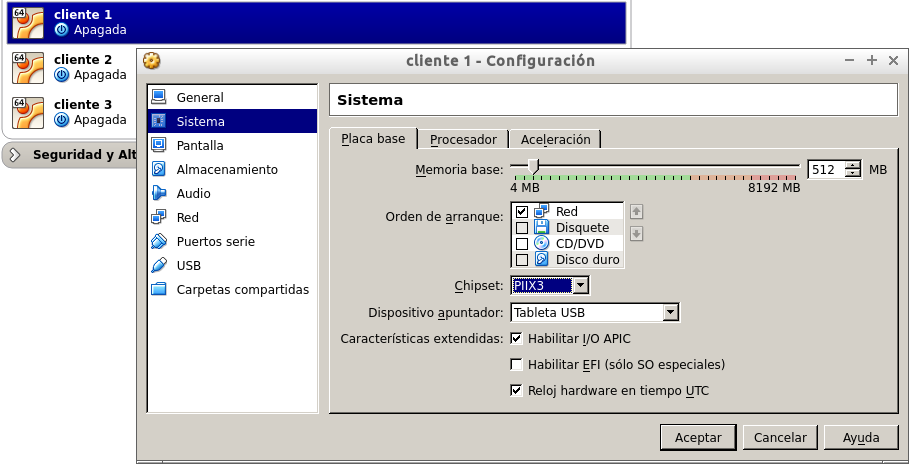
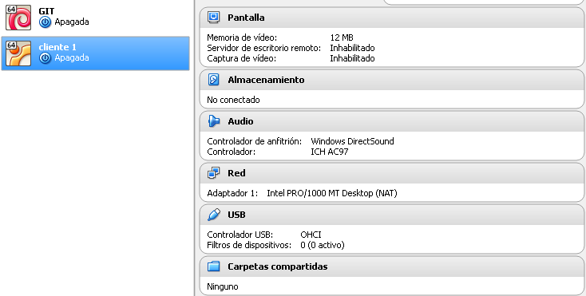
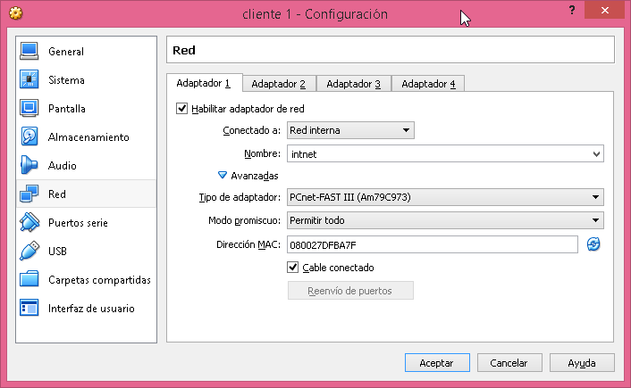
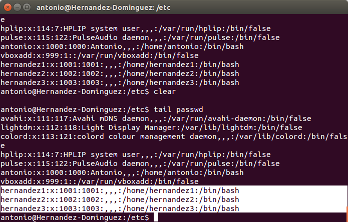
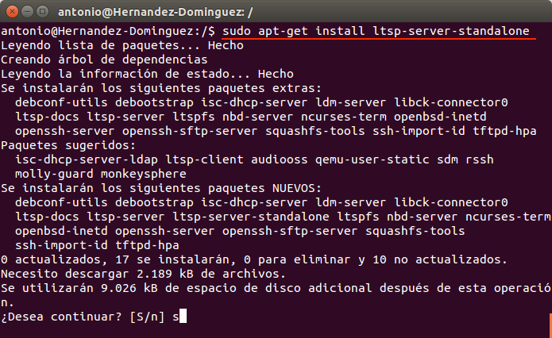

#Clientes ligeros con LTSP (En Linux)
##1. Introducción
En esta tarea hemos visto una herramienta bastante útil para cuando, por las circunstancias que sean, se disponen de varios equipos que carecen de unidades de almacenamiento y de unidades ópticas, que nos posibiliten el arranque por medio de  los mismos de algún sistema operativo. O también porque dichas máquinas no tienen suficientes prestaciones a nivel de rendimiento, ya sea porque están anticuadas u obsoletas. 

Nos referimos a el LTSP (Linux Terminal Server Project), en linux, o lo que también se conoce de forma más genérica como "clientes ligeros". 

##2. Configuraciones previas

Antes de comenzar esta práctica, configuraremos 3 máquinas virtulas: 2 máquinas clientes y 1 servidora del LTSP. De manera que las máquinas clientes no tengan ni unidad de almacenamiento ni unidad para discos, puesto que iniciarán vía red (PXE).  A su vez, la máquina que servirá el sistema operativo a los clientes tendrá 2 tarjetas de red de manera que una se configurará para que de salida hacia internet y otra para el servicio propio del LTSP.

En el cliente seleccionamos que inicie por red:

Quitamos unidades de almacenamiento:

Ponemos el adaptador en red interna:

##3. Instalación del sistema operativo (Ubuntu 64 bits)

En este apartado realizaremos la instalación del sistema operativo, así como la configuración de las tarjetas de red y el nombre de equipo, dominio, usuario...También crearemos 3 usuarios, uno para cada cliente ligero, dentro del sistema.
	

	
##4. Instalar servicio LTSP
##5. Arranque de los clientes ligeros
Vídeo:

